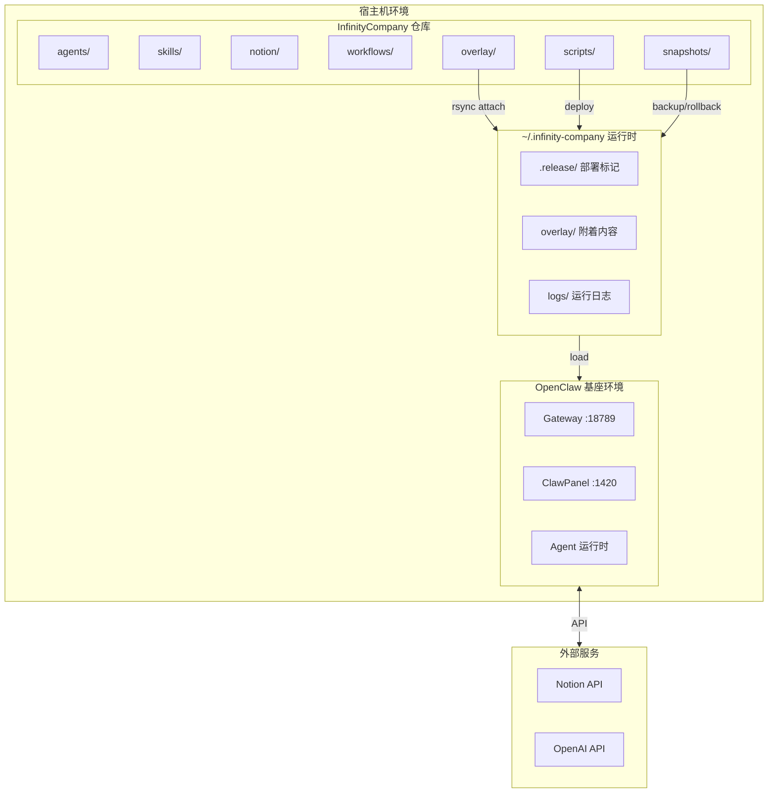

# InfinityCompany 管理员操作指南

> **版本**: v1.0  
> **更新日期**: 2026-03-27  
> **适用对象**: 系统管理员、运维工程师（周勃）

---

## 目录

1. [文档概述](#1-文档概述)
2. [系统架构概览](#2-系统架构概览)
3. [环境准备](#3-环境准备)
4. [日常操作流程](#4-日常操作流程)
5. [运维检查清单](#5-运维检查清单)
6. [故障排查指南](#6-故障排查指南)
7. [演示路径](#7-演示路径)
8. [验收清单](#8-验收清单)
9. [附录](#9-附录)

---

## 1. 文档概述

### 1.1 目标读者

本文档主要面向以下角色：

| 角色 | 职责 | 使用场景 |
|------|------|----------|
| **系统管理员** | 负责 InfinityCompany 整体部署与维护 | 首次部署、环境配置、系统升级 |
| **运维工程师（周勃）** | 负责日常运维检查与故障响应 | 每日检查、发布准备、回滚操作 |
| **技术负责人（萧何）** | 负责技术架构与运维决策 | 容量规划、架构调整、故障处理 |

### 1.2 文档用途

本文档提供 InfinityCompany 虚拟 AI 公司的完整运维操作指南，包括：

- **首次部署**：从源码到运行的完整初始化流程
- **日常运维**：标准化检查清单与操作流程
- **故障处理**：常见问题诊断与解决方案
- **流程演示**：各角色功能演示路径

### 1.3 相关文档索引

| 文档 | 路径 | 说明 |
|------|------|------|
| 项目 README | `README.md` | 项目概览与快速开始 |
| Phase 4 报告 | `PHASE4_KNOWLEDGE_BOARD_IMPLEMENTATION_REPORT.md` | 知识与看板体系 |
| Phase 5 报告 | `PHASE5_COLLABORATION_WORKFLOW_IMPLEMENTATION_REPORT.md` | 协作流程与技能接入 |
| 看板 Schema | `notion/schema_definition.md` | Notion 数据库结构定义 |
| 关联规则 | `notion/relation_rules.md` | 状态流转与关联约束 |
| 迭代规范 | `notion/iteration_tracking_spec.md` | Token/工时记录规范 |
| 外部助理流程 | `workflows/external_assistant_workflow.md` | 郦食其工作流程 |
| 私人助理流程 | `workflows/personal_assistant_workflow.md` | 夏侯婴工作流程 |
| 内部交付流程 | `workflows/internal_delivery_workflow.md` | 全团队交付流程 |
| OpenViking 安装 | `skills/openviking/INSTALL.md` | 知识库技能安装指南 |
| 技能接入规范 | `skills/README.md` | 技能体系与接入规范 |
| 仓库治理 | `governance/REPOSITORY_POLICY.md` | 分仓审批与治理规则 |

---

## 2. 系统架构概览

### 2.1 部署架构图



### 2.2 组件说明

| 组件 | 类型 | 职责 | 端口/路径 |
|------|------|------|----------|
| **OpenClaw Gateway** | 核心服务 | Agent 注册、消息路由、状态管理 | `:18789` |
| **ClawPanel** | Web UI | 可视化管理界面 | `:1420` |
| **InfinityCompany 仓库** | Git 仓库 | 配置、流程、技能定义 | `$WORKSPACE/InfinityCompany` |
| **overlay/** | 运行时资产 | 可附着到 OpenClaw 的配置与数据 | `overlay/` → `~/.infinity-company` |
| **scripts/** | 运维脚本 | 部署、回滚、验证 | `scripts/*.sh` |
| **snapshots/** | 备份快照 | 用于回滚的版本快照 | `snapshots/` |
| **Notion API** | 外部服务 | 看板数据存储与同步 | `api.notion.com` |

### 2.3 数据流向

```
┌─────────────────────────────────────────────────────────────────┐
│                        数据流向总览                              │
├─────────────────────────────────────────────────────────────────┤
│                                                                 │
│   1. 配置流向                                                    │
│   ───────────────────────────────────────                       │
│   overlay/  ──rsync──►  ~/.infinity-company  ──load──►  Agents  │
│                                                                 │
│   2. 状态流向                                                    │
│   ───────────────────────────────────────                       │
│   Notion API ◄──sync──►  Agents ◄──state──►  OpenClaw Gateway  │
│                                                                 │
│   3. 知识流向                                                    │
│   ───────────────────────────────────────                       │
│   复盘/Bug分析 ──►  OpenViking  ──►  知识库检索  ──►  Agent决策  │
│                                                                 │
└─────────────────────────────────────────────────────────────────┘
```

---

## 3. 环境准备

### 3.1 硬件/软件要求

#### 最低要求

| 组件 | 最低配置 | 说明 |
|------|---------|------|
| **操作系统** | macOS 12+ / Linux (Ubuntu 20.04+) | Windows 需使用 WSL2 |
| **CPU** | 4 核 | 用于运行 Docker 容器 |
| **内存** | 8 GB | Gateway + ClawPanel + Agents |
| **磁盘** | 10 GB 可用空间 | 代码、数据、日志 |
| **网络** | 可访问 Notion API | 用于看板同步 |

#### 推荐配置

| 组件 | 推荐配置 | 说明 |
|------|---------|------|
| **操作系统** | macOS 14+ / Ubuntu 22.04+ | 更好的 Docker 支持 |
| **CPU** | 8 核以上 | 支持多 Agent 并行 |
| **内存** | 16 GB | 流畅运行完整环境 |
| **磁盘** | 50 GB SSD | 充足空间用于快照存储 |

### 3.2 依赖安装

#### 步骤 1：安装 Docker

```bash
# macOS (使用 Homebrew)
brew install --cask docker

# Ubuntu
sudo apt-get update
sudo apt-get install -y docker.io docker-compose-plugin

# 验证安装
docker --version
docker compose version
```

#### 步骤 2：安装 OpenClaw CLI

```bash
# 按照 OpenClaw 官方文档安装
# 参考：https://github.com/OpenClaw/openclaw

# 验证安装
openclaw --version
```

#### 步骤 3：安装必备工具

```bash
# macOS
brew install rsync curl python3

# Ubuntu
sudo apt-get install -y rsync curl python3 python3-pip

# 验证安装
which rsync curl python3
```

#### 步骤 4：配置 Python 依赖（用于 OpenViking）

```bash
# 安装 OpenViking 依赖
pip3 install notion-client>=2.0.0 pyyaml>=6.0 schedule>=1.2.0

# 可选：向量数据库
pip3 install chromadb>=0.4.0

# 日志与工具
pip3 install python-dotenv>=1.0.0 click>=8.0.0
```

### 3.3 初始配置步骤

#### 步骤 1：获取代码

```bash
# 克隆仓库（如尚未克隆）
git clone <repository-url> /Users/wangrenzhu/work/MetaClaw/InfinityCompany
cd /Users/wangrenzhu/work/MetaClaw/InfinityCompany
```

#### 步骤 2：准备 OpenClaw 环境

确保 `~/.openclaw/openclaw.json` 已配置：

```bash
# 检查 OpenClaw 配置
ls -la ~/.openclaw/openclaw.json

# 如果不存在，使用 openclaw CLI 初始化
openclaw init
```

#### 步骤 3：配置环境变量

```bash
# 首次运行会自动生成，或手动复制配置
cp configs/openclaw-target.example.env configs/openclaw-target.local.env

# 编辑配置（根据实际环境调整路径）
vi configs/openclaw-target.local.env
```

**配置示例**：

```bash
# OpenClaw 基座配置
OPENCLAW_BASE_DIR=/Users/wangrenzhu/work/MetaClaw/runtime/openclaw-base
OPENCLAW_USER_HOME=/Users/wangrenzhu/.openclaw
OPENCLAW_GATEWAY_URL=http://127.0.0.1:18789

# ClawPanel 配置
CLAWPANEL_URL=http://127.0.0.1:1420/
CLAWPANEL_DIR=/Users/wangrenzhu/work/MetaClaw/clawpanel

# Overlay 配置
OVERLAY_SOURCE_DIR=/Users/wangrenzhu/work/MetaClaw/InfinityCompany/overlay
RUNTIME_OVERLAY_DIR=/Users/wangrenzhu/work/MetaClaw/runtime/openclaw-base/.infinity-company

# 备份配置
BACKUP_ROOT=/Users/wangrenzhu/work/MetaClaw/InfinityCompany/snapshots
```

#### 步骤 4：验证配置

```bash
# 验证配置文件
./scripts/validate-overlay.sh configs/openclaw-target.local.env

# 预期输出：
# env_file=configs/openclaw-target.local.env
# openclaw_base_dir=...
# ... (所有必需变量)
```

---

## 4. 日常操作流程

### 4.1 首次部署

使用初始化入口脚本一键完成首次部署：

```bash
# 进入仓库目录
cd /Users/wangrenzhu/work/MetaClaw/InfinityCompany

# 执行初始化（自动生成配置、部署 overlay、启动服务）
./Init-InfinityCompany.command

# 或使用命令行（跳过 GUI 弹窗）
INFINITYCOMPANY_NO_DIALOG=1 ./Init-InfinityCompany.command
```

**初始化流程**：

```
┌─────────────────────────────────────────────────────────┐
│                    首次部署流程                          │
├─────────────────────────────────────────────────────────┤
│  1. 检查/生成配置 configs/openclaw-target.local.env    │
│  2. 验证配置完整性                                      │
│  3. 部署 overlay 到运行时目录                           │
│  4. 检查并启动 OpenClaw Gateway                         │
│  5. 检查并启动 ClawPanel                                │
│  6. 弹出访问信息对话框                                  │
└─────────────────────────────────────────────────────────┘
```

**预期输出**：

```
[ok] 使用配置: configs/openclaw-target.local.env
[info] 检查 OpenClaw Gateway
[ok] OpenClaw Gateway 已启动
[info] 检查 ClawPanel
[ok] ClawPanel 已启动

InfinityCompany 已就绪
ClawPanel: http://127.0.0.1:1420/
Gateway:   http://127.0.0.1:18789
Dashboard: http://127.0.0.1:18789/#token=xxx
Token:     xxxxxx
配置:      configs/openclaw-target.local.env
```

### 4.2 日常启动

日常使用启动入口：

```bash
# 启动日常环境
./Open-InfinityCompany.command

# 命令行模式（无弹窗）
INFINITYCOMPANY_NO_DIALOG=1 ./Open-InfinityCompany.command
```

**启动流程**：

```
┌─────────────────────────────────────────────────────────┐
│                    日常启动流程                          │
├─────────────────────────────────────────────────────────┤
│  1. 验证配置                                            │
│  2. 检查 Gateway 健康状态                               │
│     └── 如未就绪，自动尝试启动                          │
│  3. 检查 ClawPanel 健康状态                             │
│     └── 如未就绪，自动重建并启动                        │
│  4. 获取 Gateway Token                                  │
│  5. 复制 Token 到剪贴板                                 │
│  6. 弹出访问对话框                                      │
└─────────────────────────────────────────────────────────┘
```

### 4.3 手动操作

#### Attach 操作（附着 overlay）

```bash
# 验证后附着 overlay 到运行时目录
./scripts/attach-openclaw.sh configs/openclaw-target.local.env

# 预期输出：
# snapshot=snapshots/attach-20260327-143052
# attached_from=/Users/.../InfinityCompany/overlay
# attached_to=/Users/.../.infinity-company
```

**说明**：
- 自动创建当前运行时目录的快照
- 使用 `rsync --delete` 同步 overlay 内容
- 可用于手动更新运行时配置

#### Deploy 操作（部署）

```bash
# 完整部署：验证 + 附着 + 标记发布
./scripts/deploy-overlay.sh configs/openclaw-target.local.env

# 预期输出：
# deployed_overlay=/Users/.../.infinity-company
# gateway_url=http://127.0.0.1:18789
```

**说明**：
- 执行 attach 操作
- 创建 `.release/` 目录标记部署
- 记录部署时间和 Gateway URL

#### Rollback 操作（回滚）

```bash
# 回滚到最新快照
./scripts/rollback-overlay.sh configs/openclaw-target.local.env

# 回滚到指定快照
./scripts/rollback-overlay.sh configs/openclaw-target.local.env snapshots/attach-20260327-143052

# 预期输出：
# rolled_back_from=snapshots/attach-20260327-143052
# rolled_back_to=/Users/.../.infinity-company
```

**说明**：
- 默认回滚到最新的 attach 快照
- 支持指定快照目录回滚
- 使用 `rsync --delete` 恢复

### 4.4 配置更新流程

```
┌─────────────────────────────────────────────────────────┐
│                    配置更新流程                          │
├─────────────────────────────────────────────────────────┤
│  1. 编辑配置文件                                        │
│     vi configs/openclaw-target.local.env               │
│                                                         │
│  2. 验证配置                                            │
│     ./scripts/validate-overlay.sh configs/...          │
│                                                         │
│  3. 执行部署（自动创建快照）                            │
│     ./scripts/deploy-overlay.sh configs/...            │
│                                                         │
│  4. 重启 Gateway/ClawPanel（如必要）                    │
│     openclaw gateway restart                           │
│     (cd clawpanel && docker compose restart)           │
│                                                         │
│  5. 验证更新结果                                        │
│     curl http://127.0.0.1:18789/health                 │
│     curl http://127.0.0.1:1420/                        │
└─────────────────────────────────────────────────────────┘
```

---

## 5. 运维检查清单

### 5.1 每日 18:00 检查项（周勃职责）

```bash
#!/bin/bash
# daily-check.sh - 每日运维检查脚本
# 由周勃（运维工程师）每日 18:00 执行

echo "=== InfinityCompany 每日运维检查 ==="
echo "检查时间: $(date '+%Y-%m-%d %H:%M:%S')"
echo ""

# 1. 附着环境检查
echo "[1/4] 附着环境检查..."
if [ -d "$RUNTIME_OVERLAY_DIR/.release" ]; then
    echo "  ✓ 运行时目录已部署"
    echo "    最后部署: $(cat $RUNTIME_OVERLAY_DIR/.release/last-deploy.txt 2>/dev/null || echo '未知')"
else
    echo "  ✗ 运行时目录未标记部署"
fi

# 2. 发布准备检查
echo "[2/4] 发布准备检查..."
# 检查是否有未部署的 overlay 变更
# 检查 Git 工作区状态
# 检查 Notion 看板待发布项

# 3. 回滚条件检查
echo "[3/4] 回滚条件检查..."
SNAPSHOT_COUNT=$(find snapshots/ -mindepth 1 -maxdepth 1 -type d 2>/dev/null | wc -l)
echo "  可用快照数量: $SNAPSHOT_COUNT"
if [ $SNAPSHOT_COUNT -eq 0 ]; then
    echo "  ⚠ 警告: 无可用回滚快照"
fi

# 4. 备份快照管理
echo "[4/4] 备份快照管理..."
# 清理超过 30 天的快照
find snapshots/ -mindepth 1 -maxdepth 1 -type d -mtime +30 -exec rm -rf {} \; 2>/dev/null
echo "  已清理超过 30 天的旧快照"

echo ""
echo "=== 检查完成 ==="
```

#### 详细检查清单

| 序号 | 检查项 | 命令/方法 | 正常标准 | 异常处理 |
|------|--------|----------|----------|----------|
| 1 | Gateway 健康检查 | `curl http://127.0.0.1:18789/health` | HTTP 200 | 执行 `openclaw gateway restart` |
| 2 | ClawPanel 健康检查 | `curl http://127.0.0.1:1420/` | HTTP 200 | `docker compose up -d --build` |
| 3 | 运行时目录检查 | `ls ~/.infinity-company` | 目录存在且有内容 | 执行 deploy |
| 4 | 部署标记检查 | `cat ~/.infinity-company/.release/last-deploy.txt` | 有日期内容 | 执行 deploy |
| 5 | 快照数量检查 | `ls snapshots/ | wc -l` | ≥ 1 | 执行 attach 创建快照 |
| 6 | 磁盘空间检查 | `df -h` | 可用空间 > 20% | 清理旧快照/日志 |
| 7 | Docker 状态检查 | `docker ps` | clawpanel 运行中 | `docker compose up -d` |
| 8 | Token 有效性检查 | `cat ~/.openclaw/openclaw.json` | 文件存在且有效 | 执行 `openclaw init` |

### 5.2 每周检查项

| 检查项 | 频率 | 负责人 | 操作说明 |
|--------|------|--------|----------|
| 快照存储清理 | 每周一 | 周勃 | 删除超过 30 天的快照 |
| 日志轮转检查 | 每周一 | 周勃 | 检查日志大小，必要时清理 |
| 依赖版本检查 | 每周五 | 萧何 | 检查 OpenClaw/ClawPanel 更新 |
| 性能基线检查 | 每周五 | 周勃 | 记录 Gateway/ClawPanel 响应时间 |
| 备份验证 | 每周五 | 周勃 | 随机恢复快滚验证流程 |

### 5.3 迭代末检查项

在每次迭代结束前执行：

| 检查项 | 负责人 | 完成标准 |
|--------|--------|----------|
| 知识库归档 | 陆贾 | 复盘文档已入 OpenViking |
| 看板状态清理 | 曹参 | 已关闭 Task/Bug 归档 |
| 部署标记更新 | 周勃 | 创建迭代快照 |
| 文档更新检查 | 陆贾 | 关键流程文档已更新 |
| 技能配置检查 | 周勃 | 技能配置与环境匹配 |

---

## 6. 故障排查指南

### 6.1 常见问题及解决方案

#### 问题 1：Gateway 无法启动

**症状**：
```
[error] OpenClaw Gateway 启动失败
```

**排查步骤**：
```bash
# 1. 检查端口占用
lsof -i :18789

# 2. 检查 OpenClaw 配置
cat ~/.openclaw/openclaw.json

# 3. 尝试手动启动
openclaw gateway start

# 4. 重新安装 Gateway
openclaw gateway install --force --port 18789
openclaw gateway start
```

#### 问题 2：ClawPanel 启动失败

**症状**：
```
[error] ClawPanel 启动失败: http://127.0.0.1:1420/
```

**排查步骤**：
```bash
# 1. 进入 ClawPanel 目录
cd /Users/wangrenzhu/work/MetaClaw/clawpanel

# 2. 检查 Docker 状态
docker compose ps
docker compose logs

# 3. 重建并启动
docker compose down
docker compose up -d --build

# 4. 检查端口占用
lsof -i :1420
```

#### 问题 3：Token 无法读取

**症状**：
```
[error] 无法读取 gateway token
```

**排查步骤**：
```bash
# 1. 检查配置文件
ls -la ~/.openclaw/openclaw.json

# 2. 验证 JSON 格式
python3 -c "import json; json.load(open('~/.openclaw/openclaw.json'))"

# 3. 重新初始化
openclaw init
```

#### 问题 4：部署验证失败

**症状**：
```
missing required variable: OPENCLAW_BASE_DIR
```

**排查步骤**：
```bash
# 1. 检查配置文件存在
ls -la configs/openclaw-target.local.env

# 2. 检查必需变量
cat configs/openclaw-target.local.env | grep -E '^(OPENCLAW_|CLAWPANEL_|OVERLAY_|RUNTIME_|BACKUP_)'

# 3. 从示例重新生成
cp configs/openclaw-target.example.env configs/openclaw-target.local.env
# 然后编辑配置
```

#### 问题 5：Attach 后变更未生效

**症状**：overlay 内容已更新，但运行时未生效

**排查步骤**：
```bash
# 1. 验证运行时目录内容
ls -la ~/.infinity-company/

# 2. 对比 overlay 内容
diff -r overlay/ ~/.infinity-company/

# 3. 重新执行 attach
./scripts/attach-openclaw.sh configs/openclaw-target.local.env

# 4. 重启 Gateway
openclaw gateway restart
```

### 6.2 日志查看位置

| 日志类型 | 位置 | 查看命令 |
|----------|------|----------|
| **Gateway 日志** | `~/.openclaw/logs/` | `ls ~/.openclaw/logs/` |
| **ClawPanel 日志** | Docker 日志 | `docker logs clawpanel` |
| **脚本执行日志** | 终端输出 | 重定向到文件执行 |
| **Agent 日志** | `~/.infinity-company/logs/` | `cat ~/.infinity-company/logs/agent.log` |

### 6.3 诊断命令速查

```bash
# 系统健康检查
./scripts/validate-overlay.sh configs/openclaw-target.local.env

# 网络连通性
curl -v http://127.0.0.1:18789/health
curl -v http://127.0.0.1:1420/

# Docker 状态
docker ps
docker compose -f /Users/wangrenzhu/work/MetaClaw/clawpanel/docker-compose.yml ps

# 端口占用
lsof -i :18789
lsof -i :1420

# 磁盘空间
df -h
du -sh snapshots/
du -sh ~/.infinity-company/

# 配置检查
cat configs/openclaw-target.local.env
cat ~/.openclaw/openclaw.json | python3 -m json.tool

# 快照列表
ls -lt snapshots/

# 进程检查
ps aux | grep -E 'openclaw|docker'
```

### 6.4 紧急联系方式

| 场景 | 联系人 | 联系方式 | 响应时间 |
|------|--------|----------|----------|
| **生产故障** | 周勃（运维） | 即时消息 | 5 分钟内 |
| **架构问题** | 萧何（架构师） | 即时消息 | 30 分钟内 |
| **流程阻塞** | 曹参（PMO） | 即时消息 | 30 分钟内 |
| **外部紧急需求** | 郦食其（外部助理） | 即时消息 | 5 分钟内 |
| **技术决策** | Owner（刘邦） | 邮件/会议 | 按需 |

---

## 7. 演示路径

### 7.1 完整演示脚本

```bash
#!/bin/bash
# demo-full.sh - 完整演示脚本
# 从初始化到验证的全流程演示

set -e

echo "=========================================="
echo "    InfinityCompany 完整演示脚本"
echo "=========================================="

# 步骤 1: 环境检查
echo ""
echo "[步骤 1/7] 环境检查"
echo "----------------------------------------"
command -v docker >/dev/null 2>&1 && echo "✓ Docker 已安装" || echo "✗ Docker 未安装"
command -v openclaw >/dev/null 2>&1 && echo "✓ OpenClaw 已安装" || echo "✗ OpenClaw 未安装"
ls ~/.openclaw/openclaw.json >/dev/null 2>&1 && echo "✓ OpenClaw 配置存在" || echo "✗ OpenClaw 配置缺失"

# 步骤 2: 初始化
echo ""
echo "[步骤 2/7] 执行初始化"
echo "----------------------------------------"
INFINITYCOMPANY_NO_DIALOG=1 ./Init-InfinityCompany.command

# 步骤 3: 验证部署
echo ""
echo "[步骤 3/7] 验证部署"
echo "----------------------------------------"
./scripts/validate-overlay.sh configs/openclaw-target.local.env

# 步骤 4: 健康检查
echo ""
echo "[步骤 4/7] 健康检查"
echo "----------------------------------------"
curl -fsS http://127.0.0.1:18789/health && echo "✓ Gateway 健康" || echo "✗ Gateway 异常"
curl -fsS http://127.0.0.1:1420/ >/dev/null 2>&1 && echo "✓ ClawPanel 健康" || echo "✗ ClawPanel 异常"

# 步骤 5: 快照检查
echo ""
echo "[步骤 5/7] 快照检查"
echo "----------------------------------------"
SNAPSHOT_COUNT=$(find snapshots/ -mindepth 1 -maxdepth 1 -type d 2>/dev/null | wc -l)
echo "可用快照数量: $SNAPSHOT_COUNT"
ls -lt snapshots/ | head -5

# 步骤 6: 查看角色配置
echo ""
echo "[步骤 6/7] 角色配置概览"
echo "----------------------------------------"
echo "已配置角色:"
for agent in agents/*/; do
    name=$(basename "$agent")
    echo "  - $name"
done

# 步骤 7: 演示完成
echo ""
echo "[步骤 7/7] 演示完成"
echo "----------------------------------------"
echo "✓ InfinityCompany 已就绪"
echo ""
echo "访问信息:"
echo "  ClawPanel: http://127.0.0.1:1420/"
echo "  Gateway:   http://127.0.0.1:18789"
echo "=========================================="
```

### 7.2 各角色功能演示路径

#### 张良（产品经理）演示

```bash
# 1. 打开 ClawPanel
open http://127.0.0.1:1420/

# 2. 验证产品需求流程
echo "演示路径: 外部需求 → Story → PRD → 验收"
echo ""
echo "步骤:"
echo "  1. 查看 Notion 外部需求看板"
echo "  2. 创建/更新 Story"
echo "  3. 编写 PRD 文档"
echo "  4. 触发设计流程（叔孙通）"
```

#### 萧何（架构师）演示

```bash
# 演示技术架构流程
echo "演示路径: PRD 评审 → 技术方案 → Task 拆解"
echo ""
echo "步骤:"
echo "  1. 评审张良的 PRD"
echo "  2. 输出技术方案文档"
echo "  3. 创建 Task 并分配给韩信"
echo "  4. 技术方案入 OpenViking"
```

#### 韩信（全栈研发）演示

```bash
# 演示开发流程
echo "演示路径: Task 领取 → 开发实现 → 代码提交"
echo ""
echo "步骤:"
echo "  1. 从 Notion 领取 Task"
echo "  2. 开发实现并记录 Token 开销"
echo "  3. 代码提交并更新 Task 状态"
echo "  4. 提交测试（陈平）"
```

#### 周勃（运维工程师）演示

```bash
# 演示部署运维流程
echo "演示路径: 发布准备 → 部署附着 → 监控告警"
echo ""
echo "步骤:"
echo "  1. 执行每日 18:00 检查"
echo "  2. 创建部署快照"
echo "  3. 执行 deploy-overlay"
echo "  4. 验证部署结果"
echo "  5. 配置监控告警"
```

### 7.3 关键流程演示示例

#### 外部需求处理流程

```
┌─────────────────────────────────────────────────────────┐
│              外部需求处理演示（郦食其 → 张良）            │
├─────────────────────────────────────────────────────────┤
│                                                         │
│  1. 郦食其接收外部消息                                  │
│     → 渠道识别（邮件/IM/其他）                          │
│     → 垃圾信息过滤                                      │
│     → 消息分类（产品/技术/商务/其他）                   │
│                                                         │
│  2. 知识库检索                                          │
│     → OpenViking 查询历史相似问题                       │
│     → 匹配度判断（≥80% 直接答复 / <80% 登记）          │
│                                                         │
│  3. 数字分身答复 或 登记看板                            │
│     ├── 能回答 → 直接回复外部用户                       │
│     └── 不能回答 → 写入 Notion 外部需求看板            │
│                                                         │
│  4. 夏侯婴 09:15 读取看板                               │
│     → 意图识别                                          │
│     → 分类整理                                          │
│     → 路由给张良（产品需求）                            │
│                                                         │
│  5. 张良处理需求                                        │
│     → 需求确认                                          │
│     → 创建 Story                                        │
│     → 进入交付流程                                      │
│                                                         │
└─────────────────────────────────────────────────────────┘
```

#### 内部交付闭环流程

```
┌─────────────────────────────────────────────────────────┐
│              内部交付演示（Story → 上线）                 │
├─────────────────────────────────────────────────────────┤
│                                                         │
│  Story 创建（曹参）                                     │
│      ↓                                                  │
│  PRD 输出（张良） ──评审通过──┐                         │
│      ↓                       │                         │
│  设计输出（叔孙通） ──评审──┐ │                         │
│      ↓                     │ │                         │
│  技术方案（萧何） ──评审──┐ │ │                         │
│      ↓                   │ │ │                         │
│  Task 创建（萧何）        │ │ │                         │
│      ↓                   │ │ │                         │
│  研发实现（韩信） ←──代码评审──┘                         │
│      ↓                                                  │
│  测试验证（陈平） ──Bug 修复循环                        │
│      ↓                                                  │
│  产品验收（张良）                                        │
│      ↓                                                  │
│  部署上线（周勃）                                        │
│      ↓                                                  │
│  知识归档（陆贾） ──复盘/技术方案入 OpenViking         │
│                                                         │
└─────────────────────────────────────────────────────────┘
```

---

## 8. 验收清单

### 8.1 部署验收检查项

| 序号 | 检查项 | 检查方法 | 通过标准 | 检查结果 |
|------|--------|----------|----------|----------|
| 1 | 配置文件生成 | `ls configs/openclaw-target.local.env` | 文件存在 | ☐ |
| 2 | 配置验证通过 | `./scripts/validate-overlay.sh` | 无错误输出 | ☐ |
| 3 | 运行时目录创建 | `ls ~/.infinity-company` | 目录存在 | ☐ |
| 4 | 部署标记创建 | `ls ~/.infinity-company/.release/` | 文件存在 | ☐ |
| 5 | 快照自动创建 | `ls snapshots/` | 有 attach 快照 | ☐ |
| 6 | Gateway 启动 | `curl http://127.0.0.1:18789/health` | HTTP 200 | ☐ |
| 7 | ClawPanel 启动 | `curl http://127.0.0.1:1420/` | HTTP 200 | ☐ |
| 8 | Token 可读取 | 检查脚本输出 | Token 显示 | ☐ |

### 8.2 功能验收检查项

| 序号 | 检查项 | 检查方法 | 通过标准 | 检查结果 |
|------|--------|----------|----------|----------|
| 1 | Attach 操作 | 执行 attach 脚本 | 成功并创建快照 | ☐ |
| 2 | Deploy 操作 | 执行 deploy 脚本 | 成功并更新标记 | ☐ |
| 3 | Rollback 操作 | 执行 rollback 脚本 | 成功恢复 | ☐ |
| 4 | 日常启动 | 执行 Open-InfinityCompany | 服务正常 | ☐ |
| 5 | 配置热更新 | 修改配置后 deploy | 配置生效 | ☐ |

### 8.3 角色验收检查项

| 角色 | 检查项 | 通过标准 | 检查结果 |
|------|--------|----------|----------|
| **张良** | 可访问 ClawPanel | 正常访问 | ☐ |
| **萧何** | 可读取 OpenViking | 正常检索 | ☐ |
| **韩信** | 可接收 Task 通知 | 消息可达 | ☐ |
| **陈平** | 可更新 Bug 状态 | 状态同步 | ☐ |
| **周勃** | 可执行部署操作 | 部署成功 | ☐ |
| **曹参** | 可访问 Notion 看板 | 数据同步 | ☐ |
| **陆贾** | 可写入 OpenViking | 知识沉淀 | ☐ |

### 8.4 流程验收检查项

| 流程 | 检查项 | 通过标准 | 检查结果 |
|------|--------|----------|----------|
| **外部需求** | 郦食其可登记需求 | 需求进入 Notion | ☐ |
| **私人助理** | 夏侯婴可分发需求 | 路由正确 | ☐ |
| **Story 创建** | 曹参可创建 Story | 看板更新 | ☐ |
| **技术方案** | 萧何可输出方案 | 文档生成 | ☐ |
| **代码提交** | 韩信可提交代码 | Git 更新 | ☐ |
| **Bug 跟踪** | 陈平可跟踪 Bug | 状态流转 | ☐ |
| **部署上线** | 周勃可部署上线 | 服务更新 | ☐ |
| **知识归档** | 陆贾可归档知识 | OpenViking 更新 | ☐ |

### 8.5 签字确认模板

```
┌─────────────────────────────────────────────────────────┐
│               InfinityCompany 部署验收确认               │
├─────────────────────────────────────────────────────────┤
│                                                         │
│  项目名称: InfinityCompany 虚拟 AI 公司                  │
│  验收日期: _______________                              │
│  验收版本: _______________                              │
│                                                         │
│  验收结果:                                              │
│  ☐ 全部通过                                             │
│  ☐ 部分通过（备注：____________________________）      │
│  ☐ 不通过                                               │
│                                                         │
│  签字确认:                                              │
│                                                         │
│  系统管理员: _______________    日期: _______________  │
│                                                         │
│  运维工程师(周勃): _______________  日期: ___________  │
│                                                         │
│  技术负责人(萧何): _______________  日期: ___________  │
│                                                         │
│  PMO(曹参): _______________    日期: _______________  │
│                                                         │
│  备注:                                                  │
│  ____________________________________________________  │
│  ____________________________________________________  │
│                                                         │
└─────────────────────────────────────────────────────────┘
```

---

## 9. 附录

### 9.1 环境变量参考

#### 必需变量

| 变量名 | 说明 | 示例值 |
|--------|------|--------|
| `OPENCLAW_BASE_DIR` | OpenClaw 安装目录 | `/Users/.../openclaw-base` |
| `OPENCLAW_USER_HOME` | OpenClaw 用户配置目录 | `/Users/.../.openclaw` |
| `OPENCLAW_GATEWAY_URL` | Gateway 访问地址 | `http://127.0.0.1:18789` |
| `CLAWPANEL_URL` | ClawPanel 访问地址 | `http://127.0.0.1:1420/` |
| `CLAWPANEL_DIR` | ClawPanel 代码目录 | `/Users/.../clawpanel` |
| `OVERLAY_SOURCE_DIR` | Overlay 源码目录 | `/Users/.../InfinityCompany/overlay` |
| `RUNTIME_OVERLAY_DIR` | Overlay 运行时目录 | `/Users/.../.infinity-company` |
| `BACKUP_ROOT` | 快照存储根目录 | `/Users/.../InfinityCompany/snapshots` |

#### Notion 相关变量

| 变量名 | 说明 | 示例值 |
|--------|------|--------|
| `NOTION_API_KEY` | Notion API Key | `ntn_...` |
| `NOTION_STORY_DB_ID` | Story 数据库 ID | `...` |
| `NOTION_TASK_DB_ID` | Task 数据库 ID | `...` |
| `NOTION_BUG_DB_ID` | Bug 数据库 ID | `...` |
| `NOTION_ITERATION_DB_ID` | 迭代数据库 ID | `...` |

#### OpenAI 相关变量（可选）

| 变量名 | 说明 | 示例值 |
|--------|------|--------|
| `OPENAI_API_KEY` | OpenAI API Key | `sk-...` |
| `OPENAI_BASE_URL` | 自定义 API 地址 | `https://...` |

### 9.2 脚本参考

| 脚本 | 用途 | 参数 | 示例 |
|------|------|------|------|
| `validate-overlay.sh` | 验证配置 | `<env-file>` | `./scripts/validate-overlay.sh configs/...` |
| `attach-openclaw.sh` | 附着 overlay | `<env-file>` | `./scripts/attach-openclaw.sh configs/...` |
| `deploy-overlay.sh` | 部署 overlay | `<env-file>` | `./scripts/deploy-overlay.sh configs/...` |
| `rollback-overlay.sh` | 回滚 overlay | `<env-file> [snapshot]` | `./scripts/rollback-overlay.sh configs/...` |

### 9.3 配置文件示例

#### openclaw-target.local.env

```bash
# ============================================
# InfinityCompany 本地环境配置
# ============================================

# OpenClaw 基座配置
OPENCLAW_BASE_DIR=/Users/wangrenzhu/work/MetaClaw/runtime/openclaw-base
OPENCLAW_USER_HOME=/Users/wangrenzhu/.openclaw
OPENCLAW_GATEWAY_URL=http://127.0.0.1:18789

# ClawPanel 配置
CLAWPANEL_URL=http://127.0.0.1:1420/
CLAWPANEL_DIR=/Users/wangrenzhu/work/MetaClaw/clawpanel

# Overlay 配置
OVERLAY_SOURCE_DIR=/Users/wangrenzhu/work/MetaClaw/InfinityCompany/overlay
RUNTIME_OVERLAY_DIR=/Users/wangrenzhu/work/MetaClaw/runtime/openclaw-base/.infinity-company

# 备份配置
BACKUP_ROOT=/Users/wangrenzhu/work/MetaClaw/InfinityCompany/snapshots

# ============================================
# Notion 配置（用于看板同步）
# ============================================
# NOTION_API_KEY=ntn_xxx
# NOTION_STORY_DB_ID=xxx
# NOTION_TASK_DB_ID=xxx
```

### 9.4 术语表

| 术语 | 英文 | 说明 |
|------|------|------|
| **Overlay** | Overlay | 可附着到 OpenClaw 的运行时资产目录 |
| **Attach** | Attach | 将 overlay 内容同步到运行时目录的操作 |
| **Snapshot** | Snapshot | 部署前的备份快照，用于回滚 |
| **Gateway** | Gateway | OpenClaw 的核心服务，负责 Agent 管理 |
| **ClawPanel** | ClawPanel | OpenClaw 的可视化管理界面 |
| **OpenViking** | OpenViking | 知识库与记忆增强技能 |
| **看板** | Kanban | Notion 中的数据库视图 |
| **Story** | Story | 用户故事，产品需求单元 |
| **Task** | Task | 开发任务单元 |
| **Token** | Token | AI 模型调用的计费单位 |

---

## 文档版本历史

| 版本 | 日期 | 更新内容 | 作者 |
|------|------|----------|------|
| v1.0 | 2026-03-27 | 初始版本 | InfinityCompany 技术团队 |

---

**文档维护**: 陆贾（知识库管理员）  
**技术审核**: 萧何（架构师）  
**运维审核**: 周勃（运维工程师）  
**最后更新**: 2026-03-27
