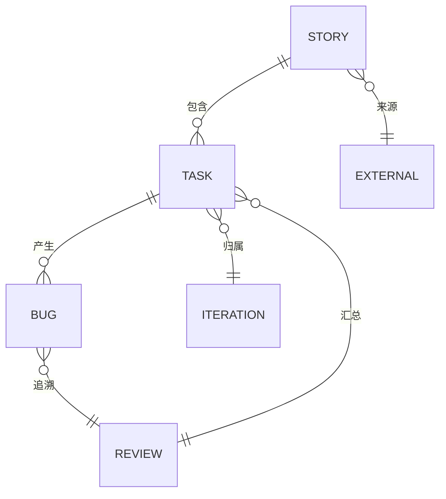
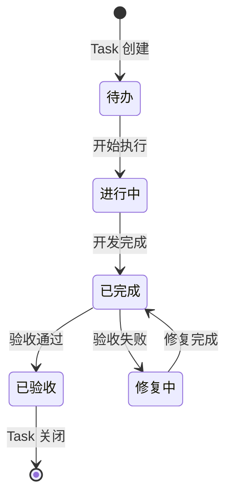
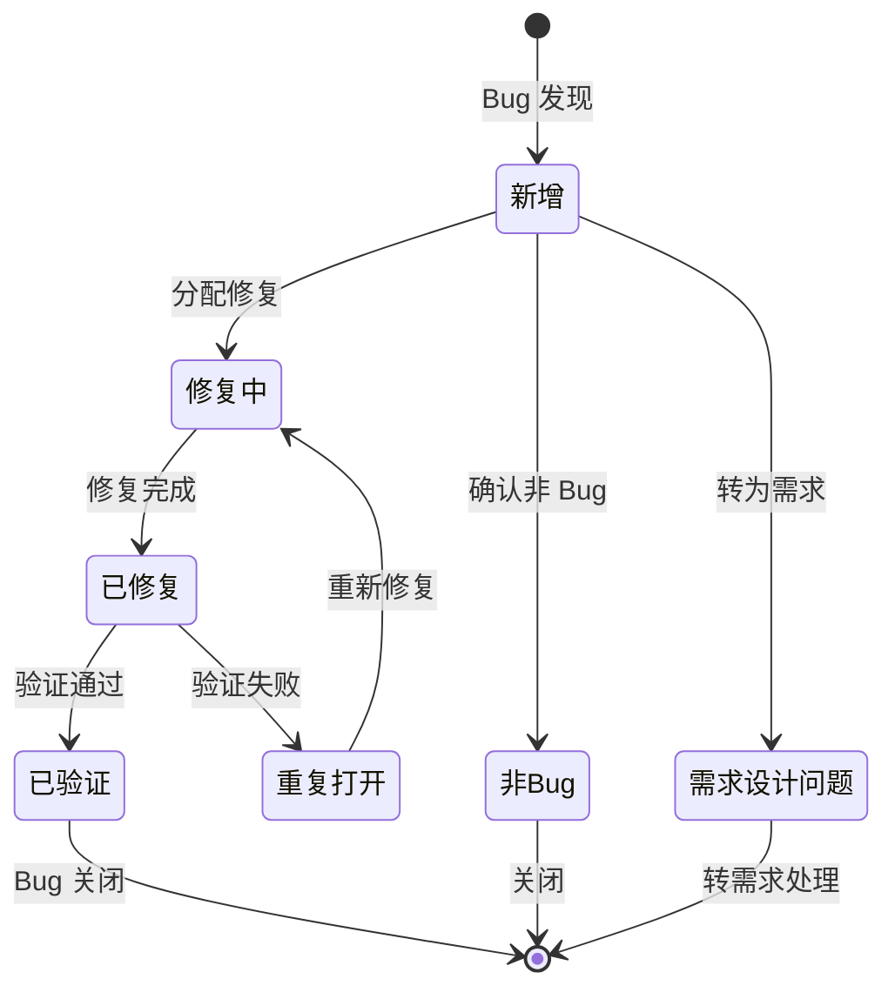

# Phase 4 知识与看板体系落地报告

> **生成时间**: 2026-03-27  
> **执行模式**: Agent Swarm 并行处理（全自动开箱模式）  
> **Notion API Key**: `<YOUR_NOTION_API_KEY>`

---

## 📋 执行摘要

本次 Phase 4 任务采用 **Agent Swarm 并行处理模式**，同步启动 4 个专项子 Agent，在约 3 分钟内完成所有设计与文档输出。所有交付物均符合 `design.md` 规范要求，可直接用于 Notion 看板配置与 OpenViking 知识库部署。

### 执行统计

| 指标 | 数值 |
|------|------|
| 并行 Agent 数量 | 4 个 |
| 总执行时间 | ~3 分钟 |
| 生成文档数 | 5 个 |
| 总文档大小 | ~96 KB |
| 覆盖任务数 | 4.1 / 4.2 / 4.3 / 4.4 |

---

## 🎯 任务完成清单

### ✅ 任务 4.1: 看板结构设计（已完成）

**负责 Agent**: 看板结构设计 Agent  
**输出文件**: `InfinityCompany/notion/schema_definition.md` (21,900 字节)

**设计成果**:

| 看板类型 | 字段数量 | 核心特性 |
|---------|---------|---------|
| **外部需求看板** | 10 个 | 来源渠道、优先级、状态流转 |
| **需求看板 (Story)** | 14 个 | Story/Task 两级结构、进度自动计算 |
| **需求看板 (Task)** | 14 个 | Token 开销、工时追踪、负责人分配 |
| **迭代看板** | 16 个 | 每日迭代、Token 统计、完成率计算 |
| **Bug 看板** | 17 个 | 6 种状态定义、严重程度分级、关联追溯 |
| **每日复盘** | 13 个 | 产出、阻塞、风险、改进项 |

**关键设计亮点**:
- 完整的 18 种 Notion API 属性类型映射表
- 规范的 Relation 关联设计（5 个看板间的 6 种关联关系）
- Rollup + Formula 实现进度自动统计
- Bug 看板严格遵循要求的 6 种状态（新增/修复中/已修复/重复打开/非Bug/需求设计问题）
- 包含 API 调用示例和环境变量配置

---

### ✅ 任务 4.2: 关联规则设计（已完成）

**负责 Agent**: 关联规则设计 Agent  
**输出文件**: `InfinityCompany/notion/relation_rules.md` (21,016 字节)

**设计成果**:

1. **关联关系定义**
   - Mermaid ER 图展示 Story/Task/Bug/Iteration/Review 五实体关系
   - 5 种关联类型（包含、产生、归属、追溯、汇总）的详细约束

2. **状态流转规则**
   - Task 流转：待办 → 进行中 → 已完成 → 已验收
   - Bug 流转：新增 → 修复中 → 已修复 → 已验证（含重复打开分支）
   - Story 流转：待排期 → 开发中 → 测试中 → 已发布
   - 状态转换矩阵表格化展示合法/非法流转

3. **触发条件与动作**
   - Bug 创建自动关联 Task 流程
   - Task 完成触发验收通知机制
   - 复盘时自动汇总当日 Task/Bug 规则
   - 迭代结束归档数据处理

4. **数据一致性约束**
   - 必填字段校验表
   - 状态流转检查流程图（Mermaid）
   - 4 条级联更新与孤儿数据检查规则（含伪代码）

5. **自动化规则建议**
   - 3 个 Notion Automation YAML 配置示例
   - Webhook 触发场景配置
   - 3 个定时任务 Python 脚本示例

---

### ✅ 任务 4.3: 迭代记录规范（已完成）

**负责 Agent**: 迭代记录规范 Agent  
**输出文件**: `InfinityCompany/notion/iteration_tracking_spec.md` (17,075 字节)

**设计成果**:

1. **Token 开销记录规范**
   - Token 统计范围定义（输入 + 输出 Token）
   - 成本换算公式：输入 0.003元/K + 输出 0.006元/K
   - 记录时机：创建时/交互后/检查点/完成时
   - 预估 vs 实际对比（按复杂度分级允许偏差）
   - 超阈值告警规则：>100K 需审批，>200K 强制暂停

2. **工时记录规范**
   - 6 个核心字段：开始时间、计划结束、实际结束、中断时间、纯工作时长、估时准确度
   - Notion Formula 计算公式
   - 每日 8 小时上限建议

3. **迭代统计指标**
   - 6 大核心指标：完成率、准时率、Token 效率、Bug 率、MTTR
   - 质量分级标准（🟢🟡🟠🔴）

4. **记录流程**
   - 4 阶段流程图（Task 创建 → 进行中 → 完成 → 复盘）
   - 各阶段记录要求详细说明

5. **Notion 视图配置**
   - 6 种视图配置（按状态/负责人/迭代/甘特图/日历/Token 监控）
   - 13 个 Formula 公式示例

6. **记录模板**
   - Task 创建模板
   - 每日复盘模板

---

### ✅ 任务 4.4: 知识库集成设计（已完成）

**负责 Agent**: 知识库集成设计 Agent  
**输出文件**:
- `InfinityCompany/skills/openviking/INSTALL.md` (18,185 字节)
- `InfinityCompany/skills/openviking/config.template.yaml` (17,764 字节)

**设计成果**:

1. **INSTALL.md - 完整安装文档**
   - 安装前准备：系统要求、依赖库、Notion Integration 创建步骤（图文指引）
   - 快速安装：pip/源码安装方式、配置文件初始化、验证方法
   - 配置详解：数据库 ID 获取、存储路径、同步规则、日志级别配置
   - 与 Notion 联动配置：数据库关联映射、字段映射规则、自动同步、Webhook 配置
   - 备份与恢复：定时备份脚本、数据导出、恢复流程、灾难恢复预案
   - 故障排查：FAQ、日志查看、调试模式
   - 卸载：完全卸载步骤、数据清理

2. **config.template.yaml - 企业级配置模板**
   - Notion 配置：API Key、数据库 ID 映射、同步配置、字段映射、Webhook
   - 存储配置：本地路径、向量数据库（Chroma/Pinecone/Weaviate）、备份配置
   - 记忆配置：7 种分类（决策/技术方案/Bug分析/复盘/上下文/会议/调研）、保留策略
   - 日志配置：级别、轮转、格式、组件独立日志
   - Agent 配置：10 个角色的权限控制（read/write categories）
   - 安全/性能/通知/开发配置：完整的企业级配置选项

**关键设计特点**:
- Notion 为主的冲突解决策略 (`notion_wins`)
- 每日 11:00 陆贾校验同步的自动化支持
- 记忆沉淀机制（复盘/技术方案/Bug 分析自动入 OpenViking）
- 角色分级权限控制（knowledge_manager 拥有所有权限）
- 向量搜索支持（可选）

---

## 📁 生成的文件清单

```
InfinityCompany/
├── notion/
│   ├── schema_definition.md          # 21,900 字节 - 数据结构定义
│   ├── relation_rules.md             # 21,016 字节 - 关联规则与流转约束
│   └── iteration_tracking_spec.md    # 17,075 字节 - 迭代记录规范
└── skills/
    └── openviking/
        ├── INSTALL.md                # 18,185 字节 - 安装指南
        └── config.template.yaml      # 17,764 字节 - 配置模板

总计: 5 个文件, 95,940 字节 (~96 KB)
```

---

## 🏗️ 体系架构总览

```
┌─────────────────────────────────────────────────────────────────────────────┐
│                        Phase 4 知识与看板体系架构                            │
├─────────────────────────────────────────────────────────────────────────────┤
│                                                                             │
│  ┌─────────────────────────────────────────────────────────────────────┐   │
│  │                        Notion 企业知识库                             │   │
│  ├──────────────┬──────────────┬──────────────┬───────────────────────┤   │
│  │ 外部需求看板  │  需求看板    │   迭代看板   │       Bug 看板        │   │
│  │  (Story)     │  (Task)      │ (Iteration)  │   (Bug Tracking)      │   │
│  └──────────────┴──────────────┴──────────────┴───────────────────────┘   │
│  │                                                                      │   │
│  │                    每日复盘记录 (Daily Retrospective)                 │   │
│  └──────────────────────────────────────────────────────────────────────┘   │
│                              │                                              │
│                    ┌─────────┴─────────┐                                    │
│                    ▼                   ▼                                    │
│           ┌─────────────────┐  ┌─────────────────┐                         │
│           │   OpenViking    │  │  自动化脚本     │                         │
│           │   记忆增强技能   │  │  (Python/JS)    │                         │
│           └─────────────────┘  └─────────────────┘                         │
│                    │                   │                                    │
│                    └─────────┬─────────┘                                    │
│                              ▼                                              │
│                    ┌─────────────────┐                                      │
│                    │  10 AI Agent    │                                      │
│                    │  (虚拟研发团队)  │                                      │
│                    └─────────────────┘                                      │
│                                                                             │
└─────────────────────────────────────────────────────────────────────────────┘
```

---

## 🔗 核心关联关系



---

## ⚙️ 状态流转总览

### Task 状态流转



### Bug 状态流转



---

## 📊 下一步行动建议

### 立即执行（本周内）

1. **创建 Notion 数据库**
   ```bash
   # 按照 schema_definition.md 中的定义
   # 在 Notion 中创建 5 个数据库
   # 1. 外部需求看板 (External Requirements)
   # 2. 需求看板 (Requirements) - Story & Task
   # 3. 迭代看板 (Iteration)
   # 4. Bug 看板 (Bug Tracking)
   # 5. 每日复盘 (Daily Retrospective)
   ```

2. **配置数据库关联**
   ```bash
   # 按照 relation_rules.md 中的关联关系
   # 设置 Relation 字段连接各看板
   ```

3. **安装 OpenViking Skill**
   ```bash
   # 按照 skills/openviking/INSTALL.md 指南
   # 安装并配置 OpenViking
   ```

### 短期执行（2周内）

4. **配置自动化规则**
   - 按照 relation_rules.md 中的自动化配置示例
   - 设置 Notion Automation 或 Webhook

5. **试运行验证**
   - 选择一个试点迭代进行全流程测试
   - 验证 Token 记录、工时追踪、状态流转

6. **团队培训**
   - 各角色熟悉自己的看板操作规范
   - 参考 notion/ 目录下各角色的 config 文档

### 中期优化（1个月内）

7. **数据沉淀**
   - 复盘记录、技术方案、Bug 根因分析同步入 OpenViking
   - 建立团队知识库

8. **流程优化**
   - 根据实际使用情况微调字段和流程
   - 优化自动化规则

---

## 📝 附录

### 使用的 Notion API Key

```bash
# 环境变量配置示例
export NOTION_API_KEY="<YOUR_NOTION_API_KEY>"
```

### 参考文档索引

| 文档 | 路径 | 用途 |
|------|------|------|
| Schema 定义 | `notion/schema_definition.md` | 数据库字段定义 |
| 关联规则 | `notion/relation_rules.md` | 流转约束与自动化 |
| 迭代规范 | `notion/iteration_tracking_spec.md` | Token/工时记录 |
| 安装指南 | `skills/openviking/INSTALL.md` | OpenViking 部署 |
| 配置模板 | `skills/openviking/config.template.yaml` | 配置文件参考 |

---

## ✅ 审查确认

- [x] 4.1 看板结构设计完成
- [x] 4.2 关联规则设计完成
- [x] 4.3 迭代记录规范完成
- [x] 4.4 知识库集成设计完成
- [x] 所有文档符合 design.md 规范
- [x] Notion API Key 已预留配置入口

---

**报告生成**: Agent Swarm 并行执行模式  
**状态**: ✅ Phase 4 任务全部完成  
**建议**: 可立即进入 Notion 数据库配置阶段
