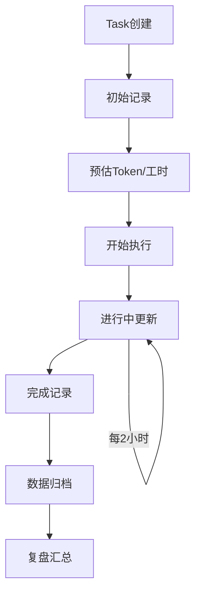

# 迭代 Task 记录规范

> 版本: v1.0  
> 更新日期: 2026-03-27  
> 适用范围: InfinityCompany 所有迭代 Task  

---

## 1. Token 开销记录规范

### 1.1 Token 统计范围定义

| 统计项 | 定义 | 说明 |
|--------|------|------|
| **输入 Token** | 发送给 AI 的 Prompt 文本 Token 数 | 包含系统提示、上下文、用户输入 |
| **输出 Token** | AI 返回的响应文本 Token 数 | 包含思考过程、代码、说明 |
| **总 Token** | 输入 Token + 输出 Token | 单次交互的总消耗 |
| **Task Token** | 完成整个 Task 的累计 Token | 所有交互轮次之和 |

### 1.2 Token 单位换算

```yaml
# Token 成本配置 (以 Kimi API 为例)
token_pricing:
  input_token_cost: 0.003   # 元 / 1K tokens (输入)
  output_token_cost: 0.006  # 元 / 1K tokens (输出)
  
# 成本计算公式
cost_formula: |
  总成本(元) = (输入Token数 × 0.003 + 输出Token数 × 0.006) / 1000

# 示例
example:
  input_tokens: 50000
  output_tokens: 30000
  total_cost: "(50000×0.003 + 30000×0.006)/1000 = 0.33元"
```

### 1.3 Token 记录时机

| 时机 | 记录内容 | 备注 |
|------|----------|------|
| **Task 创建时** | 预估 Token 数 | 基于 Task 复杂度评估 |
| **每次交互后** | 本次交互 Token 数 | 自动记录或手动填报 |
| **阶段性检查点** | 累计 Token 数 | 建议每 2 小时检查 |
| **Task 完成时** | 最终 Token 总数 | 必须记录 |

### 1.4 Token 预估 vs 实际对比

| Task 复杂度 | 预估 Token 范围 | 允许偏差 |
|-------------|-----------------|----------|
| P3 - 简单 | 5K - 20K | ±30% |
| P2 - 中等 | 20K - 50K | ±25% |
| P1 - 复杂 | 50K - 100K | ±20% |
| P0 - 紧急 | 100K+ | 需审批 |

### 1.5 Token 超阈值告警规则

```yaml
alert_rules:
  # 单次交互告警
  single_interaction:
    warning: 20000     # 20K Token 单次交互，黄色警告
    danger: 50000      # 50K Token 单次交互，红色警告
    
  # 单次 Task 告警
  single_task:
    warning: 50000     # 50K Token 累计，需关注
    danger: 100000     # 100K Token 累计，必须审批
    block: 200000      # 200K Token 累计，强制暂停
    
  # 每日告警
  daily_limit:
    warning: 200000    # 单 Agent 日累计 200K，需说明
    danger: 500000     # 单 Agent 日累计 500K，需复盘
```

---

## 2. 工时记录规范

### 2.1 记录字段定义

| 字段名 | 类型 | 说明 | 必填 |
|--------|------|------|------|
| `开始时间` | DateTime | Task 实际开始时间 | 是 |
| `计划结束时间` | DateTime | 预计完成时间 | 是 |
| `实际结束时间` | DateTime | 实际完成时间 | 完成时填 |
| `中断次数` | Number | 工作中断次数 | 否 |
| `中断时长(分钟)` | Number | 累计中断时间 | 否 |
| `状态` | Select | 待开始/进行中/已完成/已取消 | 是 |

### 2.2 工时计算公式

```javascript
// Notion Formula 字段示例

// 1. 计划时长(小时)
prop("计划时长") = dateBetween(prop("计划结束时间"), prop("开始时间"), "hours")

// 2. 实际总时长(小时)
prop("实际总时长") = dateBetween(prop("实际结束时间"), prop("开始时间"), "hours")

// 3. 纯工作时长(小时) = 实际结束 - 开始 - 中断
prop("纯工作时长") = prop("实际总时长") - prop("中断时长") / 60

// 4. 估时准确度 = 计划时长 / 实际纯工作时长 (越接近1越准确)
prop("估时准确度") = prop("计划时长") / prop("纯工作时长")

// 5. 进度状态
prop("进度状态") = 
  if(prop("状态") == "已完成",
    if(prop("估时准确度") <= 1.2, "准时", "延期"),
    if(prop("状态") == "已取消", "取消",
      if(now() > prop("计划结束时间"), "已超时", "进行中")
    )
  )
```

### 2.3 每日工时上限建议

| 角色 | 每日有效工时上限 | 备注 |
|------|------------------|------|
| 开发 Agent | 8 小时 | 包含编码、测试、文档 |
| 架构 Agent | 6 小时 | 高强度思考工作 |
| 评审 Agent | 4 小时 | 专注质量把控 |
| 运维 Agent | 按需 | 应急响应除外 |

```yaml
# 工时健康度检查
daily_health_check:
  healthy: "<= 8小时"      # 绿色，正常范围
  warning: "8-10小时"      # 黄色，需关注疲劳度
  danger: "> 10小时"       # 红色，强制休息建议
```

### 2.4 工时记录模板

```markdown
## Task 工时记录

**Task**: [Task名称]
**负责人**: [Agent名称]

### 时间记录
| 阶段 | 时间 | 备注 |
|------|------|------|
| 开始时间 | 2026-03-27 09:00 | |
| 计划结束 | 2026-03-27 12:00 | 预估3小时 |
| 实际结束 | 2026-03-27 12:30 | |

### 中断记录
| 时间 | 时长 | 原因 |
|------|------|------|
| 10:30-10:45 | 15分钟 | 会议中断 |

### 计算结果
- 计划时长: 3 小时
- 实际总时长: 3.5 小时
- 纯工作时长: 3.25 小时
- 估时准确度: 0.92 (优秀)
```

---

## 3. 迭代统计指标

### 3.1 核心指标定义

| 指标名 | 公式 | 目标值 | 说明 |
|--------|------|--------|------|
| **完成率** | 已完成 Task / 计划 Task × 100% | ≥ 90% | 迭代交付能力 |
| **准时率** | 准时完成 Task / 已完成 Task × 100% | ≥ 80% | 估时准确性 |
| **Token 效率** | 产出代码行数 / Token 消耗 × 1000 | ≥ 5 | 单位 Token 产出 |
| **功能点效率** | 功能点数 / Token 消耗(万) | ≥ 2 | 业务价值产出 |
| **Bug 率** | 产生 Bug 数 / 完成 Task 数 | ≤ 0.2 | 质量指标 |
| **平均修复时间(MTTR)** | 所有 Bug 修复时间总和 / Bug 数 | ≤ 2小时 | 响应速度 |

### 3.2 Notion Formula 实现

```javascript
// 完成率 (在迭代汇总数据库中)
prop("完成率") = prop("已完成Task数") / prop("计划Task数") * 100

// 准时率
prop("准时率") = prop("准时完成数") / prop("已完成Task数") * 100

// Token 效率 (行/千Token)
prop("Token效率") = prop("产出代码行数") / prop("总Token消耗") * 1000

// Bug 率
prop("Bug率") = prop("产生Bug数") / prop("已完成Task数")

// 平均修复时间(小时)
prop("MTTR") = prop("Bug修复总时长") / prop("Bug数")
```

### 3.3 质量分级标准

| 等级 | 完成率 | 准时率 | Bug 率 | 评价 |
|------|--------|--------|--------|------|
| 🟢 优秀 | ≥ 95% | ≥ 90% | ≤ 0.1 | 超出预期 |
| 🟡 良好 | 85-95% | 75-90% | 0.1-0.2 | 符合预期 |
| 🟠 待改进 | 70-85% | 60-75% | 0.2-0.3 | 需要关注 |
| 🔴 预警 | < 70% | < 60% | > 0.3 | 立即复盘 |

---

## 4. 记录流程

### 4.1 Task 生命周期记录流程



### 4.2 各阶段记录要求

#### 阶段 1: Task 创建时 (Initial)

| 字段 | 填写要求 | 示例 |
|------|----------|------|
| Task 名称 | 清晰描述任务 | "实现用户登录接口" |
| 负责人 | 指定 Agent | "Dev-Agent-1" |
| 优先级 | P0/P1/P2/P3 | "P1" |
| 预估 Token | 基于复杂度估算 | "30000" |
| 计划工时 | 预估所需时间 | "4小时" |
| 计划结束时间 | 开始时间 + 计划工时 | "2026-03-27 16:00" |

#### 阶段 2: 进行中更新 (Ongoing)

更新频率：**每 2 小时** 或 **每次阶段性交付**

| 更新项 | 说明 |
|--------|------|
| 当前 Token 累计 | 更新已消耗 Token |
| 进度百分比 | 更新完成进度 |
| 中断记录 | 如有中断，记录时长和原因 |
| 风险标记 | 如有延期风险，标记并说明 |

#### 阶段 3: 完成时 (Final)

必须完整记录：

| 字段 | 必填 |
|------|------|
| 实际结束时间 | ✅ |
| 实际 Token 消耗 | ✅ |
| 产出代码行数 | ✅ |
| 中断总时长 | ✅ |
| 产生的 Bug 数 | ✅ |
| 关联代码提交 | ✅ |
| 经验总结 | 建议填写 |

#### 阶段 4: 复盘时 (Review)

每日复盘需汇总：

| 汇总项 | 来源 |
|--------|------|
| 当日完成 Task 列表 | 迭代看板筛选 |
| 当日总 Token 消耗 | 所有 Task 求和 |
| 当日总工时 | 纯工作时长求和 |
| 产生 Bug 列表 | Bug 看板关联 |
| 改进项记录 | 复盘会议产出 |

---

## 5. 数据报表设计

### 5.1 日报表字段

| 字段名 | 类型 | 说明 |
|--------|------|------|
| 日期 | Date | 报表日期 |
| Agent | Relation | 关联 Agent |
| 计划 Task 数 | Rollup | 当日计划 |
| 完成 Task 数 | Rollup | 当日完成 |
| 完成率 | Formula | 计算公式 |
| 准时完成数 | Rollup | 准时完成计数 |
| 准时率 | Formula | 计算公式 |
| Token 消耗 | Rollup | 当日累计 |
| 产出代码行数 | Rollup | 代码产出 |
| Token 效率 | Formula | 计算公式 |
| 有效工时 | Rollup | 纯工作时长 |
| 产生 Bug 数 | Rollup | Bug 计数 |
| 修复 Bug 数 | Rollup | 修复计数 |
| 阻塞项 | Text | 阻塞说明 |
| 改进项 | Text | 改进建议 |

### 5.2 周汇总字段

| 字段名 | 计算方式 |
|--------|----------|
| 周开始日期 | 每周一 |
| 周 Task 完成数 | 本周累计 |
| 周 Token 消耗 | 本周累计 |
| 周代码产出 | 本周累计 |
| 周平均 Token 效率 | 周代码产出 / 周 Token 消耗 |
| 周 Bug 产生数 | 本周累计 |
| 周 Bug 修复数 | 本周累计 |
| 周 MTTR | 平均修复时间 |
| 周估时准确度 | 平均估时准确度 |
| 周工时分布 | 每日工时饼图 |

### 5.3 月度趋势分析

| 分析维度 | 图表类型 | 用途 |
|----------|----------|------|
| Token 消耗趋势 | 折线图 | 观察 Token 使用规律 |
| 完成率趋势 | 柱状图 | 交付能力变化 |
| Token 效率分布 | 箱线图 | 效率波动分析 |
| Bug 率趋势 | 折线图 | 质量趋势监控 |
| 工时分布热力图 | 热力图 | 工作负荷分布 |

---

## 6. Notion 视图配置建议

### 6.1 数据库结构

建议创建以下数据库：

1. **迭代 Task 数据库** (主库)
2. **每日复盘数据库**
3. **Bug 追踪数据库**
4. **迭代汇总数据库**

### 6.2 迭代 Task 数据库 - 视图配置

#### 视图 1: 按状态分组

```yaml
名称: "按状态看板"
类型: Board
分组字段: 状态
分组值:
  - 待开始 (To Do)
  - 进行中 (In Progress)
  - 审核中 (In Review)
  - 已完成 (Done)
  - 已取消 (Cancelled)
排序: 优先级降序
```

#### 视图 2: 按负责人分组

```yaml
名称: "负责人视图"
类型: Table
分组字段: 负责人
显示字段:
  - Task 名称
  - 优先级
  - 状态
  - 进度%
  - Token消耗/预估
  - 计划结束时间
筛选: 状态 != 已取消
排序: 优先级降序
```

#### 视图 3: 按迭代分组

```yaml
名称: "迭代看板"
类型: Board
分组字段: 所属迭代
属性:
  - 迭代名称 (如: "Iteration-2026-03-27")
  - 迭代日期
显示字段:
  - Task 名称
  - 负责人
  - 状态
  - Token消耗
```

#### 视图 4: 甘特图视图

```yaml
名称: "时间线"
类型: Timeline
时间字段:
  开始: 开始时间
  结束: 计划结束时间
显示字段:
  - Task 名称
  - 负责人
  - 进度%
分组: 负责人
颜色标记: 优先级
```

#### 视图 5: 日历视图

```yaml
名称: "日历视图"
类型: Calendar
日期字段: 计划结束时间
显示字段:
  - Task 名称
  - 负责人
  - 状态
筛选: 状态 != 已取消
```

#### 视图 6: Token 监控视图

```yaml
名称: "Token 监控"
类型: Table
显示字段:
  - Task 名称
  - 负责人
  - 预估Token
  - 实际Token
  - Token使用率% (Formula)
  - Token效率
筛选: 实际Token > 0
排序: Token使用率% 降序
颜色标记:
  - 红色: 实际Token > 预估Token × 1.5
  - 黄色: 实际Token > 预估Token
  - 绿色: 实际Token <= 预估Token
```

### 6.3 Notion Formula 公式集合

```javascript
// ============================================
// 基础字段公式
// ============================================

// 1. 计划时长(小时)
round(dateBetween(prop("计划结束时间"), prop("开始时间"), "minutes") / 60 * 100) / 100

// 2. 实际总时长(小时)
if(empty(prop("实际结束时间")), 0, round(dateBetween(prop("实际结束时间"), prop("开始时间"), "minutes") / 60 * 100) / 100)

// 3. 纯工作时长(小时)
prop("实际总时长") - prop("中断时长") / 60

// 4. 估时准确度 (百分比显示)
round(prop("计划时长") / prop("纯工作时长") * 100) / 100

// 5. Token 使用率 (百分比)
if(prop("预估Token") == 0, 0, round(prop("实际Token") / prop("预估Token") * 100))

// 6. Token 效率 (行/千Token)
if(prop("实际Token") == 0, 0, round(prop("产出代码行数") / prop("实际Token") * 1000 * 100) / 100)

// ============================================
// 状态判断公式
// ============================================

// 7. 进度状态
if(prop("状态") == "已完成",
  if(prop("估时准确度") <= 1.2, "✅ 准时", "⚠️ 延期"),
  if(prop("状态") == "已取消", "🚫 取消",
    if(now() > prop("计划结束时间"), "🔴 已超时", "🟡 进行中")
  )
)

// 8. Token 告警级别
if(prop("实际Token") == 0, "⬜ 未开始",
  if(prop("实际Token") > 100000, "🔴 严重超支",
    if(prop("实际Token") > prop("预估Token") * 1.5, "🟠 超支预警",
      if(prop("实际Token") > prop("预估Token"), "🟡 接近上限", "🟢 正常")
    )
  )
)

// 9. 工时健康度
if(prop("纯工作时长") <= 8, "🟢 健康",
  if(prop("纯工作时长") <= 10, "🟡 偏高", "🔴 超负荷")
)

// ============================================
// 汇总统计公式 (用于汇总表)
// ============================================

// 10. 完成率 (%) - 在迭代汇总表中使用 Rollup
round(prop("已完成Task数") / prop("计划Task数") * 100)

// 11. 准时率 (%)
round(prop("准时完成数") / prop("已完成Task数") * 100)

// 12. Bug 率
round(prop("产生Bug数") / prop("已完成Task数") * 100) / 100

// 13. 平均修复时间(小时)
round(prop("Bug修复总时长") / prop("Bug数") * 100) / 100
```

---

## 7. 记录模板

### 7.1 Task 创建模板

```markdown
## Task 记录卡片

**基本信息**
- Task ID: TASK-YYYYMMDD-XXX
- 名称: [简洁描述任务内容]
- 负责人: [Agent名称]
- 优先级: [P0/P1/P2/P3]
- 所属迭代: [迭代标识]

**预估信息**
- 预估 Token: [数字]
- 计划工时: [小时]
- 开始时间: [DateTime]
- 计划结束时间: [DateTime]

**验收标准**
- [ ] 标准1
- [ ] 标准2

**关联资源**
- 需求文档: [链接]
- 设计图: [链接]
```

### 7.2 每日复盘模板

```markdown
## 每日复盘 - YYYY-MM-DD

### 当日产出
| Task ID | 名称 | 完成时间 | Token消耗 | 代码行数 |
|---------|------|----------|-----------|----------|
| | | | | |

### 当日数据汇总
- 完成 Task 数: [N]
- 总 Token 消耗: [N]
- 总代码产出: [N] 行
- 总有效工时: [N] 小时
- 产生 Bug 数: [N]
- 修复 Bug 数: [N]

### 阻塞项
1. [阻塞描述] - [解决方案/需协调]

### 风险预警
1. [风险描述] - [应对措施]

### 改进项
1. [改进描述] - [执行人] - [完成时间]

### 明日计划
1. [Task名称] - [预估工时]
```

---

## 8. Notion API 配置示例

### 8.1 数据库创建脚本

```python
# Notion API 配置示例
NOTION_API_KEY = "<YOUR_NOTION_API_KEY>"
DATABASE_ID = "your-database-id"

# 数据库 Schema 定义
SCHEMA = {
    "名称": {"title": {}},
    "负责人": {"select": {}},
    "状态": {"select": {
        "options": [
            {"name": "待开始", "color": "gray"},
            {"name": "进行中", "color": "blue"},
            {"name": "审核中", "color": "yellow"},
            {"name": "已完成", "color": "green"},
            {"name": "已取消", "color": "red"}
        ]
    }},
    "优先级": {"select": {
        "options": [
            {"name": "P0", "color": "red"},
            {"name": "P1", "color": "orange"},
            {"name": "P2", "color": "yellow"},
            {"name": "P3", "color": "green"}
        ]
    }},
    "开始时间": {"date": {}},
    "计划结束时间": {"date": {}},
    "实际结束时间": {"date": {}},
    "预估Token": {"number": {"format": "number"}},
    "实际Token": {"number": {"format": "number"}},
    "产出代码行数": {"number": {"format": "number"}},
    "中断次数": {"number": {"format": "number"}},
    "中断时长": {"number": {"format": "number", "unit": "minutes"}},
    "所属迭代": {"relation": {"database_id": "iteration-db-id"}}
}
```

---

## 9. 附录

### 9.1 术语表

| 术语 | 定义 |
|------|------|
| Token | AI 模型处理的文本单元 |
| MTTR | Mean Time To Repair，平均修复时间 |
| P0/P1/P2/P3 | 优先级分级，P0最高 |
| 估时准确度 | 计划时长与实际时长的比值 |
| Token 效率 | 单位 Token 产生的代码行数 |

### 9.2 更新记录

| 版本 | 日期 | 更新内容 | 作者 |
|------|------|----------|------|
| v1.0 | 2026-03-27 | 初始版本 | 迭代记录规范Agent |

---

> 💡 **使用提示**: 建议将此规范与 Notion 模板配合使用，定期复盘数据，持续优化团队效率。
