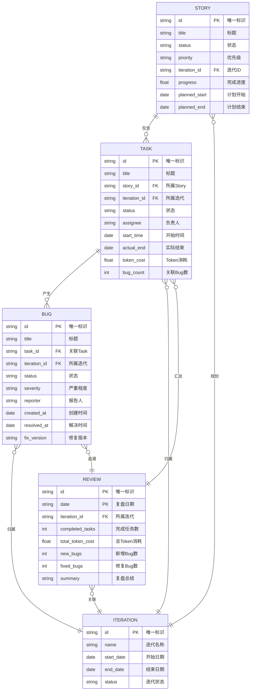
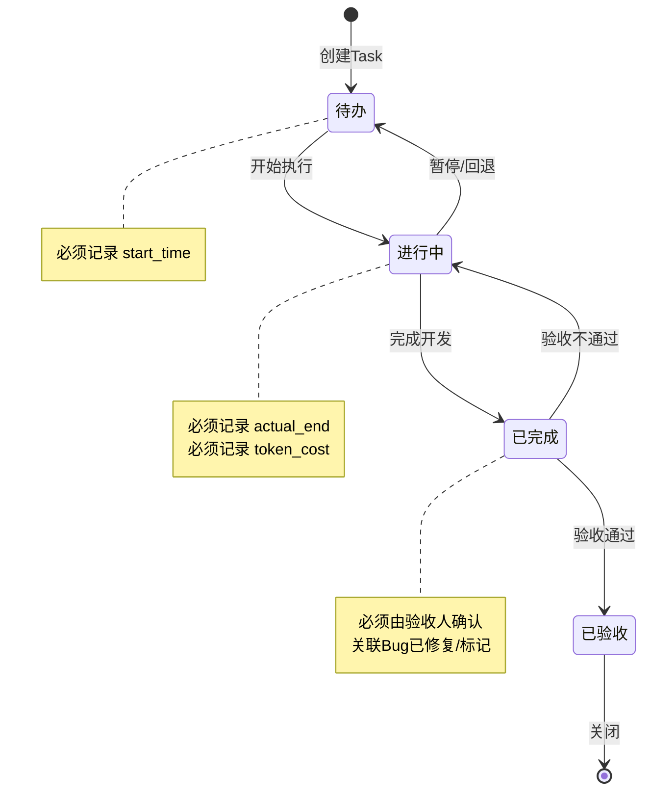
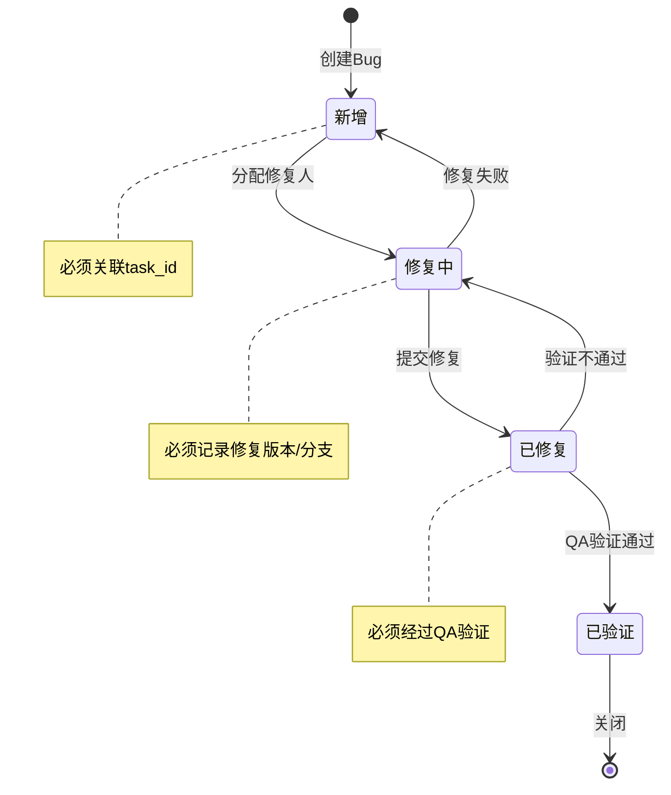
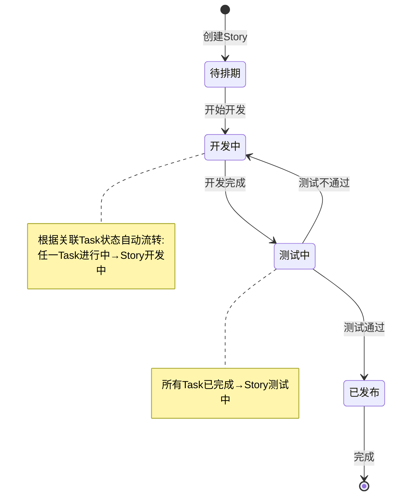

# Notion 看板关联规则与流转约束

本文档定义 InfinityCompany 项目中 Story、Task、Bug 与复盘记录之间的关联规则与流转约束。

---

## 1. 关联关系定义

### 1.1 实体关系图（Mermaid ER Diagram）



### 1.2 关联关系明细表

| 关联类型 | 源实体 | 目标实体 | 关联字段 | 关系类型 | 约束说明 |
|:---------|:-------|:---------|:---------|:---------|:---------|
| 包含 | Story | Task | story_id | 一对多 (1:N) | Story必须存在，Task创建时必须指定Story |
| 产生 | Task | Bug | task_id | 一对多 (1:N) | Bug必须关联到具体Task，自动继承iteration_id |
| 归属 | Task | Iteration | iteration_id | 多对一 (N:1) | Task必须归属某个迭代 |
| 归属 | Bug | Iteration | iteration_id | 多对一 (N:1) | Bug继承Task的iteration_id |
| 规划 | Story | Iteration | iteration_id | 多对一 (N:1) | Story可跨迭代，但需指定主迭代 |
| 追溯 | Bug | Review | review_id | 多对一 (N:1) | Bug在复盘时关联到当日Review |
| 汇总 | Task | Review | review_id | 多对一 (N:1) | 当日完成的Task汇总到当日Review |
| 关联 | Review | Iteration | iteration_id | 多对一 (N:1) | Review必须归属具体迭代 |

---

## 2. 状态流转规则

### 2.1 Task 状态流转



#### 流转规则明细

| 当前状态 | 目标状态 | 触发条件 | 必填字段 | 约束检查 |
|:---------|:---------|:---------|:---------|:---------|
| 待办 | 进行中 | 手动开始 | start_time | - |
| 进行中 | 已完成 | 开发完成 | actual_end, token_cost | - |
| 进行中 | 待办 | 暂停/回退 | - | 记录回退原因 |
| 已完成 | 已验收 | 验收人确认 | reviewer, review_time | 关联Bug已修复或标记为延期 |
| 已完成 | 进行中 | 验收不通过 | reject_reason | - |
| 已验收 | - | 终态 | - | 不可再流转 |

### 2.2 Bug 状态流转



#### 流转规则明细

| 当前状态 | 目标状态 | 触发条件 | 必填字段 | 约束检查 |
|:---------|:---------|:---------|:---------|:---------|
| 新增 | 修复中 | 分配修复人 | assignee, fix_branch | task_id必须存在 |
| 修复中 | 已修复 | 提交修复 | fix_version, fix_commit | - |
| 修复中 | 新增 | 修复失败 | fail_reason | - |
| 已修复 | 已验证 | QA验证通过 | verifier, verify_time | - |
| 已修复 | 修复中 | 验证不通过 | reject_reason | - |
| 已验证 | - | 终态 | - | 不可再流转 |

### 2.3 Story 状态流转



#### Story 自动流转规则

| Story当前状态 | 关联Task状态条件 | 自动流转至 |
|:--------------|:-----------------|:-----------|
| 待排期 | 任一Task状态为"进行中" | 开发中 |
| 开发中 | 所有Task状态为"已完成"或"已验收" | 测试中 |
| 测试中 | 所有Task状态为"已验收" | 已发布 |
| 开发中 | 所有Task回退至"待办" | 待排期 |
| 测试中 | 任一Task回退至"进行中" | 开发中 |

---

## 3. 触发条件与动作

### 3.1 Bug 创建时关联 Task

#### 触发条件
- 事件：Bug被创建
- 状态："新增"
- 优先级：P1（必须处理）

#### 执行动作
1. **检查task_id关联**
   - 验证task_id是否存在
   - 若未指定，阻止创建并提示

2. **同步iteration_id**
   - 从关联Task读取iteration_id
   - 自动填充到Bug记录

3. **更新Task统计**
   - Task.bug_count += 1
   - 更新Story的总bug计数

4. **发送通知**
   - 通知Task负责人有新Bug
   - 通知Story负责人

#### 伪代码实现
```python
def on_bug_created(bug):
    if not bug.task_id:
        raise ValidationError("Bug必须关联到具体Task")
    
    task = get_task(bug.task_id)
    bug.iteration_id = task.iteration_id
    
    task.bug_count += 1
    task.save()
    
    notify(task.assignee, f"Task有新的Bug: {bug.title}")
    notify_story_owner(task.story_id)
```

### 3.2 Task 完成时触发验收

#### 触发条件
- 事件：Task状态变更
- 从："进行中"
- 至："已完成"

#### 执行动作
1. **通知验收人**
   - 发送验收提醒（Slack/邮件）
   - 包含Task详情和链接

2. **检查关联Bug状态**
   - 查询该Task的所有Bug
   - 检查是否存在未修复Bug
   - 生成Bug状态报告

3. **更新Story进度**
   - 重新计算Story完成百分比
   - 更新Story.progress字段

4. **记录完成数据**
   - 确保actual_end已记录
   - 确保token_cost已记录

#### 伪代码实现
```python
def on_task_completed(task):
    # 记录完成数据
    task.actual_end = now()
    task.save()
    
    # 通知验收人
    send_review_notification(task)
    
    # 检查关联Bug
    bugs = get_bugs_by_task(task.id)
    open_bugs = [b for b in bugs if b.status != "已验证"]
    
    if open_bugs:
        warn(f"Task有{len(open_bugs)}个未关闭Bug")
    
    # 更新Story进度
    update_story_progress(task.story_id)
```

### 3.3 复盘时汇总当日 Task/Bug

#### 触发条件
- 事件：Review记录被创建
- 条件：date字段为当天日期
- 触发方式：自动（定时任务）或手动

#### 执行动作
1. **查询当日Iteration数据**
   - 获取当前活跃Iteration
   - 查询该Iteration下所有Task

2. **统计Task完成情况**
   - 已完成Task数量
   - 总Token消耗
   - 按Story分组统计

3. **统计Bug情况**
   - 当日新建Bug数
   - 当日修复Bug数
   - 严重Bug列表

4. **自动填充Review记录**
   - 将统计数据写入Review字段
   - 生成复盘摘要

#### 汇总规则表

| Review字段 | 数据来源 | 统计规则 | 计算公式 |
|:-----------|:---------|:---------|:---------|
| completed_tasks | Task表 | 当日状态为"已验收"的Task数 | COUNT(task WHERE status='已验收' AND actual_end=Today) |
| total_token_cost | Task表 | 当日完成Task的Token总和 | SUM(token_cost WHERE actual_end=Today) |
| new_bugs | Bug表 | 当日创建的Bug数 | COUNT(bug WHERE created_at=Today) |
| fixed_bugs | Bug表 | 当日状态变为"已验证"的Bug数 | COUNT(bug WHERE resolved_at=Today AND status='已验证') |
| pending_bugs | Bug表 | 未修复的Bug数 | COUNT(bug WHERE status!='已验证') |
| task_by_story | Task+Story表 | 按Story分组的完成Task | GROUP_BY(story_id, COUNT(task)) |
| bug_severity | Bug表 | 按严重级别统计 | GROUP_BY(severity, COUNT(bug)) |

#### 伪代码实现
```python
def on_daily_review_created(review):
    today = review.date
    iteration = get_active_iteration(today)
    
    # 统计当日完成任务
    completed = query_tasks(
        iteration_id=iteration.id,
        status='已验收',
        actual_end=today
    )
    
    review.completed_tasks = len(completed)
    review.total_token_cost = sum(t.token_cost for t in completed)
    
    # 统计当日Bug
    new_bugs = query_bugs(
        iteration_id=iteration.id,
        created_at=today
    )
    review.new_bugs = len(new_bugs)
    
    fixed_bugs = query_bugs(
        iteration_id=iteration.id,
        resolved_at=today,
        status='已验证'
    )
    review.fixed_bugs = len(fixed_bugs)
    
    # 生成摘要
    review.summary = generate_review_summary(review)
    review.save()
```

### 3.4 迭代结束时归档数据

#### 触发条件
- 自动触发：Iteration.end_date到达
- 手动触发：点击"迭代归档"按钮
- 事件类型：迭代结束

#### 执行动作
1. **统计迭代数据**
   - 总Task数、完成Task数
   - 总Bug数、修复Bug数
   - 平均Token消耗
   - 延期Task列表

2. **生成迭代报告**
   - 创建迭代总结文档
   - 包含统计数据和图表
   - 导出为PDF/Markdown

3. **归档数据**
   - 将已完成Task标记为"已归档"
   - 将已验证Bug标记为"已归档"
   - 保留活跃Story到下一迭代

4. **创建复盘记录**
   - 生成迭代整体Review
   - 关联所有迭代内Review

#### 伪代码实现
```python
def on_iteration_closed(iteration):
    # 统计数据
    stats = {
        'total_tasks': count_tasks(iteration.id),
        'completed_tasks': count_tasks(iteration.id, status='已验收'),
        'total_bugs': count_bugs(iteration.id),
        'fixed_bugs': count_bugs(iteration.id, status='已验证'),
        'total_tokens': sum_token_cost(iteration.id),
        'delayed_tasks': get_delayed_tasks(iteration.id)
    }
    
    # 生成报告
    report = generate_iteration_report(iteration, stats)
    
    # 归档数据
    archive_tasks(iteration.id)
    archive_bugs(iteration.id)
    
    # 创建迭代复盘
    create_iteration_review(iteration, stats)
```

---

## 4. 数据一致性约束

### 4.1 必填字段校验

#### Task 必填字段

| 字段名 | 类型 | 必填时机 | 校验规则 |
|:-------|:-----|:---------|:---------|
| title | string | 创建时 | 长度1-200字符 |
| story_id | relation | 创建时 | 必须关联存在的Story |
| status | select | 创建时 | 必须为有效状态值 |
| iteration_id | relation | 创建时 | 必须关联存在的Iteration |
| start_time | date | 状态变为"进行中"时 | 不能晚于当前时间 |
| actual_end | date | 状态变为"已完成"时 | 必须晚于start_time |
| token_cost | number | 状态变为"已完成"时 | 必须>=0 |
| assignee | person | 创建时 | 必须指定负责人 |

#### Bug 必填字段

| 字段名 | 类型 | 必填时机 | 校验规则 |
|:-------|:-----|:---------|:---------|
| title | string | 创建时 | 长度1-200字符 |
| task_id | relation | 创建时 | 必须关联存在的Task |
| status | select | 创建时 | 必须为有效状态值 |
| severity | select | 创建时 | 必须为P0/P1/P2/P3 |
| reporter | person | 创建时 | 必须指定报告人 |
| created_at | datetime | 创建时 | 自动填充 |
| resolved_at | datetime | 状态变为"已修复"时 | 必须晚于created_at |
| fix_version | string | 状态变为"已修复"时 | 不能为空 |

#### Story 必填字段

| 字段名 | 类型 | 必填时机 | 校验规则 |
|:-------|:-----|:---------|:---------|
| title | string | 创建时 | 长度1-200字符 |
| status | select | 创建时 | 必须为有效状态值 |
| priority | select | 创建时 | 必须为P0/P1/P2/P3 |
| iteration_id | relation | 创建时 | 推荐填写 |
| planned_start | date | 状态变为"待排期"时 | - |
| planned_end | date | 状态变为"待排期"时 | 必须晚于planned_start |

### 4.2 状态转换合法性检查

#### Task 状态转换矩阵

| 当前状态 \ 目标状态 | 待办 | 进行中 | 已完成 | 已验收 |
|:--------------------|:----:|:------:|:------:|:------:|
| **待办** | - | ✅ | ❌ | ❌ |
| **进行中** | ✅ | - | ✅ | ❌ |
| **已完成** | ❌ | ✅ | - | ✅ |
| **已验收** | ❌ | ❌ | ❌ | - |

#### Bug 状态转换矩阵

| 当前状态 \ 目标状态 | 新增 | 修复中 | 已修复 | 已验证 |
|:--------------------|:----:|:------:|:------:|:------:|
| **新增** | - | ✅ | ❌ | ❌ |
| **修复中** | ✅ | - | ✅ | ❌ |
| **已修复** | ❌ | ✅ | - | ✅ |
| **已验证** | ❌ | ❌ | ❌ | - |

#### Story 状态转换矩阵

| 当前状态 \ 目标状态 | 待排期 | 开发中 | 测试中 | 已发布 |
|:--------------------|:------:|:------:|:------:|:------:|
| **待排期** | - | ✅ | ❌ | ❌ |
| **开发中** | ✅ | - | ✅ | ❌ |
| **测试中** | ❌ | ✅ | - | ✅ |
| **已发布** | ❌ | ❌ | ❌ | - |

### 4.3 关联完整性规则

#### 规则1：Task必须归属Story
```
约束：task.story_id IS NOT NULL
触发：创建Task时
动作：阻止创建，提示"必须选择所属Story"
级联：删除Story时，级联删除/归档关联Task
```

#### 规则2：Bug必须关联Task（自动继承iteration_id）
```
约束：bug.task_id IS NOT NULL
触发：创建Bug时
动作：阻止创建，提示"必须关联具体Task"
级联：
  - 自动设置 bug.iteration_id = task.iteration_id
  - Task删除时，提示先处理关联Bug
```

#### 规则3：Review必须关联Iteration
```
约束：review.iteration_id IS NOT NULL
触发：创建Review时
动作：
  - 若未指定，自动关联当前活跃Iteration
  - 若无活跃Iteration，阻止创建
```

#### 规则4：Story状态根据Task状态自动更新
```
触发：Task状态变更
规则：
  IF ANY(task.status == '进行中') THEN story.status = '开发中'
  ELSE IF ALL(task.status IN ['已完成', '已验收']) THEN story.status = '测试中'
  ELSE IF ALL(task.status == '已验收') THEN story.status = '已发布'
  ELSE IF ALL(task.status == '待办') THEN story.status = '待排期'
```

#### 规则5：删除约束
```
删除Story前：
  - 检查是否存在关联Task
  - 提示用户选择：级联删除 / 转移至其他Story / 取消

删除Task前：
  - 检查是否存在关联Bug
  - 提示用户选择：级联删除Bug / 转移至其他Task / 取消

删除Iteration前：
  - 检查是否存在关联Story/Task/Bug/Review
  - 必须为空才能删除，或执行归档操作
```

---

## 5. API 集成参考

### 5.1 Notion API 配置

```python
# API密钥
NOTION_API_KEY = "<YOUR_NOTION_API_KEY>"

# 数据库ID（示例，需替换为实际ID）
DATABASES = {
    "story": "your-story-database-id",
    "task": "your-task-database-id",
    "bug": "your-bug-database-id",
    "iteration": "your-iteration-database-id",
    "review": "your-review-database-id"
}

# API基础URL
NOTION_API_BASE = "https://api.notion.com/v1"
NOTION_VERSION = "2022-06-28"
```

### 5.2 关系配置代码

```python
from notion_client import Client

notion = Client(auth=NOTION_API_KEY)

def create_relation_property(database_id, property_name, related_db_id):
    """创建关系属性"""
    notion.databases.update(
        database_id=database_id,
        properties={
            property_name: {
                "relation": {
                    "database_id": related_db_id,
                    "type": "single_property"
                }
            }
        }
    )

def create_rollup_property(database_id, property_name, relation_name, rollup_key, function="show_original"):
    """创建Rollup属性"""
    notion.databases.update(
        database_id=database_id,
        properties={
            property_name: {
                "rollup": {
                    "relation_property_name": relation_name,
                    "rollup_property_name": rollup_key,
                    "function": function
                }
            }
        }
    )

# 示例：配置Story数据库
config_story_relations()
def config_story_relations():
    # Task -> Story 关系
    create_relation_property(
        DATABASES["task"], 
        "story_relation", 
        DATABASES["story"]
    )
    
    # Story -> Task Rollup（统计Task数量）
    create_rollup_property(
        DATABASES["story"],
        "task_count",
        "task_relation",
        "title",
        function="count"
    )
    
    # Story -> Task Rollup（完成进度）
    create_rollup_property(
        DATABASES["story"],
        "completed_task_count",
        "task_relation",
        "status",
        function="count_values"
    )
```

### 5.3 Rollup 配置示例

```python
ROLLUP_CONFIGS = {
    # Story数据库Rollup
    "story": {
        "task_count": {
            "relation": "task_relation",
            "rollup": "title",
            "function": "count"
        },
        "bug_count": {
            "relation": "bug_relation",
            "rollup": "title",
            "function": "count"
        },
        "progress": {
            "relation": "task_relation",
            "rollup": "status",
            "function": "percent_performed"  # 自定义计算
        }
    },
    
    # Task数据库Rollup
    "task": {
        "bug_count": {
            "relation": "bug_relation",
            "rollup": "title",
            "function": "count"
        },
        "story_title": {
            "relation": "story_relation",
            "rollup": "title",
            "function": "show_original"
        }
    },
    
    # Review数据库Rollup
    "review": {
        "task_completed": {
            "relation": "task_relation",
            "rollup": "status",
            "function": "count_values"
        },
        "total_token_cost": {
            "relation": "task_relation",
            "rollup": "token_cost",
            "function": "sum"
        }
    }
}

def apply_rollup_configs():
    """应用所有Rollup配置"""
    for db_name, configs in ROLLUP_CONFIGS.items():
        for prop_name, config in configs.items():
            create_rollup_property(
                DATABASES[db_name],
                prop_name,
                config["relation"],
                config["rollup"],
                config["function"]
            )
```

### 5.4 常用查询代码

```python
def query_tasks_by_story(story_id):
    """查询Story下的所有Task"""
    return notion.databases.query(
        database_id=DATABASES["task"],
        filter={
            "property": "story_relation",
            "relation": {
                "contains": story_id
            }
        }
    )

def query_bugs_by_task(task_id):
    """查询Task下的所有Bug"""
    return notion.databases.query(
        database_id=DATABASES["bug"],
        filter={
            "property": "task_relation",
            "relation": {
                "contains": task_id
            }
        }
    )

def query_today_completed_tasks(iteration_id):
    """查询当日完成的Task"""
    from datetime import datetime
    today = datetime.now().strftime("%Y-%m-%d")
    
    return notion.databases.query(
        database_id=DATABASES["task"],
        filter={
            "and": [
                {
                    "property": "iteration_relation",
                    "relation": {"contains": iteration_id}
                },
                {
                    "property": "status",
                    "select": {"equals": "已验收"}
                },
                {
                    "property": "actual_end",
                    "date": {"equals": today}
                }
            ]
        }
    )

def query_tasks_by_status(story_id, status):
    """查询Story下特定状态的Task"""
    return notion.databases.query(
        database_id=DATABASES["task"],
        filter={
            "and": [
                {
                    "property": "story_relation",
                    "relation": {"contains": story_id}
                },
                {
                    "property": "status",
                    "select": {"equals": status}
                }
            ]
        }
    )

def update_story_progress(story_id):
    """更新Story完成进度"""
    all_tasks = query_tasks_by_story(story_id)
    total = len(all_tasks["results"])
    
    if total == 0:
        progress = 0
    else:
        completed = len([
            t for t in all_tasks["results"]
            if t["properties"]["status"]["select"]["name"] == "已验收"
        ])
        progress = completed / total * 100
    
    notion.pages.update(
        page_id=story_id,
        properties={
            "progress": {"number": progress}
        }
    )
```

---

## 6. 附录

### 6.1 状态枚举定义（JSON格式）

```json
{
  "status_enums": {
    "task": {
      "values": ["待办", "进行中", "已完成", "已验收"],
      "colors": {
        "待办": "gray",
        "进行中": "blue",
        "已完成": "green",
        "已验收": "purple"
      }
    },
    "bug": {
      "values": ["新增", "修复中", "已修复", "已验证"],
      "colors": {
        "新增": "red",
        "修复中": "yellow",
        "已修复": "blue",
        "已验证": "green"
      }
    },
    "story": {
      "values": ["待排期", "开发中", "测试中", "已发布"],
      "colors": {
        "待排期": "gray",
        "开发中": "blue",
        "测试中": "yellow",
        "已发布": "green"
      }
    },
    "iteration": {
      "values": ["规划中", "进行中", "已结束", "已归档"],
      "colors": {
        "规划中": "gray",
        "进行中": "blue",
        "已结束": "purple",
        "已归档": "brown"
      }
    },
    "priority": {
      "values": ["P0", "P1", "P2", "P3"],
      "colors": {
        "P0": "red",
        "P1": "orange",
        "P2": "yellow",
        "P3": "gray"
      }
    },
    "severity": {
      "values": ["致命", "严重", "一般", "提示"],
      "colors": {
        "致命": "red",
        "严重": "orange",
        "一般": "yellow",
        "提示": "gray"
      }
    }
  }
}
```

### 6.2 字段类型映射表

| 字段名 | Notion类型 | Python类型 | 说明 |
|:-------|:-----------|:-----------|:-----|
| title | title | str | 标题字段 |
| status | select | str | 单选状态 |
| priority | select | str | 优先级 |
| severity | select | str | 严重程度 |
| assignee | people | List[str] | 负责人 |
| reporter | people | str | 报告人 |
| story_id | relation | str | 关联Story |
| task_id | relation | str | 关联Task |
| iteration_id | relation | str | 关联迭代 |
| start_time | date | datetime | 开始时间 |
| actual_end | date | datetime | 实际结束 |
| created_at | created_time | datetime | 创建时间 |
| resolved_at | date | datetime | 解决时间 |
| token_cost | number | float | Token消耗 |
| bug_count | number | int | Bug计数 |
| progress | number | float | 完成进度(%) |
| fix_version | rich_text | str | 修复版本 |
| summary | rich_text | str | 复盘总结 |
| task_count | rollup | int | 关联Task数（自动） |
| completed_task_count | rollup | int | 已完成Task数（自动） |

### 6.3 数据库Schema参考

```json
{
  "story_schema": {
    "properties": {
      "title": {"type": "title"},
      "status": {"type": "select", "options": ["待排期", "开发中", "测试中", "已发布"]},
      "priority": {"type": "select", "options": ["P0", "P1", "P2", "P3"]},
      "iteration_id": {"type": "relation", "database": "iteration"},
      "progress": {"type": "number", "format": "percent"},
      "planned_start": {"type": "date"},
      "planned_end": {"type": "date"},
      "task_count": {"type": "rollup", "relation": "tasks", "function": "count"}
    }
  },
  "task_schema": {
    "properties": {
      "title": {"type": "title"},
      "story_id": {"type": "relation", "database": "story"},
      "iteration_id": {"type": "relation", "database": "iteration"},
      "status": {"type": "select", "options": ["待办", "进行中", "已完成", "已验收"]},
      "assignee": {"type": "people"},
      "start_time": {"type": "date"},
      "actual_end": {"type": "date"},
      "token_cost": {"type": "number", "format": "number"},
      "bug_count": {"type": "rollup", "relation": "bugs", "function": "count"}
    }
  },
  "bug_schema": {
    "properties": {
      "title": {"type": "title"},
      "task_id": {"type": "relation", "database": "task"},
      "iteration_id": {"type": "relation", "database": "iteration"},
      "status": {"type": "select", "options": ["新增", "修复中", "已修复", "已验证"]},
      "severity": {"type": "select", "options": ["致命", "严重", "一般", "提示"]},
      "reporter": {"type": "people"},
      "created_at": {"type": "created_time"},
      "resolved_at": {"type": "date"},
      "fix_version": {"type": "rich_text"}
    }
  },
  "iteration_schema": {
    "properties": {
      "name": {"type": "title"},
      "start_date": {"type": "date"},
      "end_date": {"type": "date"},
      "status": {"type": "select", "options": ["规划中", "进行中", "已结束", "已归档"]}
    }
  },
  "review_schema": {
    "properties": {
      "date": {"type": "title"},
      "iteration_id": {"type": "relation", "database": "iteration"},
      "completed_tasks": {"type": "number"},
      "total_token_cost": {"type": "number"},
      "new_bugs": {"type": "number"},
      "fixed_bugs": {"type": "number"},
      "summary": {"type": "rich_text"}
    }
  }
}
```

---

## 7. 完成报告

### 7.1 文件路径
- **主文件**: `InfinityCompany/notion/relation_rules.md`

### 7.2 定义的关联规则数量

| 类别 | 数量 | 说明 |
|:-----|:-----|:-----|
| 实体关系 | 8个 | Story-Task、Task-Bug、Task-Iteration、Bug-Iteration、Story-Iteration、Bug-Review、Task-Review、Review-Iteration |
| 关联类型 | 8种 | 包含、产生、归属(×3)、规划、追溯、汇总、关联 |

### 7.3 状态流转规则数量

| 实体 | 状态数 | 流转规则数 |
|:-----|:-------|:-----------|
| Task | 4个 | 6条 |
| Bug | 4个 | 6条 |
| Story | 4个 | 4条（自动流转） |

### 7.4 触发器与动作数量

| 触发器 | 动作数 |
|:-------|:-------|
| Bug创建时关联Task | 4个动作 |
| Task完成时触发验收 | 4个动作 |
| 复盘时汇总当日Task/Bug | 4个动作 |
| 迭代结束时归档数据 | 4个动作 |

### 7.5 数据一致性约束

| 约束类型 | 数量 |
|:---------|:-----|
| 必填字段校验 | Task 8个 + Bug 8个 + Story 5个 = 21个 |
| 状态转换矩阵 | 3个（Task/Bug/Story各1个） |
| 关联完整性规则 | 5条 |

### 7.6 交付清单

- [x] Mermaid ER图（实体关系图）
- [x] 关联关系明细表
- [x] Task/Bug/Story状态流转图
- [x] 状态转换矩阵表
- [x] 4个触发器定义及伪代码
- [x] 数据一致性约束定义
- [x] Notion API集成参考（含API Key）
- [x] Python代码示例（关系配置、Rollup、常用查询）
- [x] 状态枚举定义（JSON格式）
- [x] 字段类型映射表
- [x] 数据库Schema参考

---

*文档版本: v1.0*  
*最后更新: 2026-03-27*  
*作者: 关联规则设计Agent*
