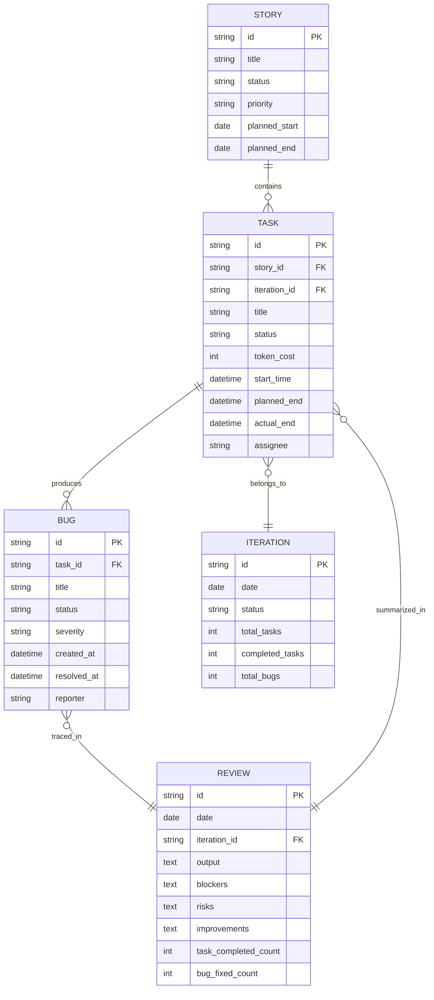
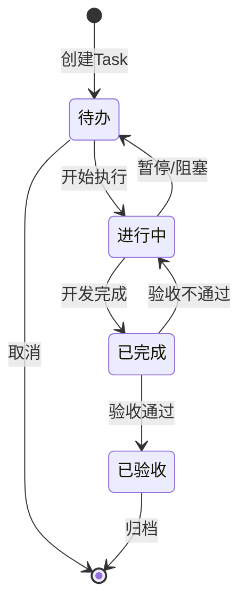
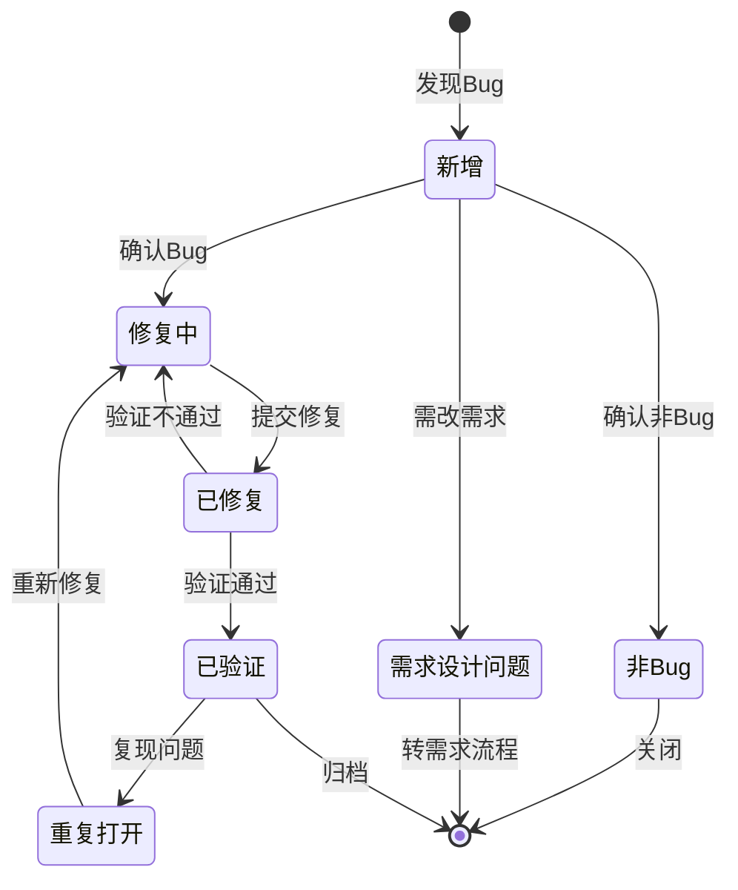
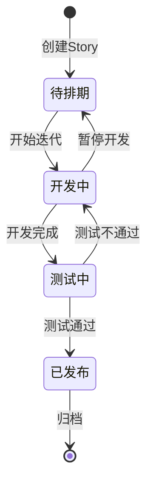
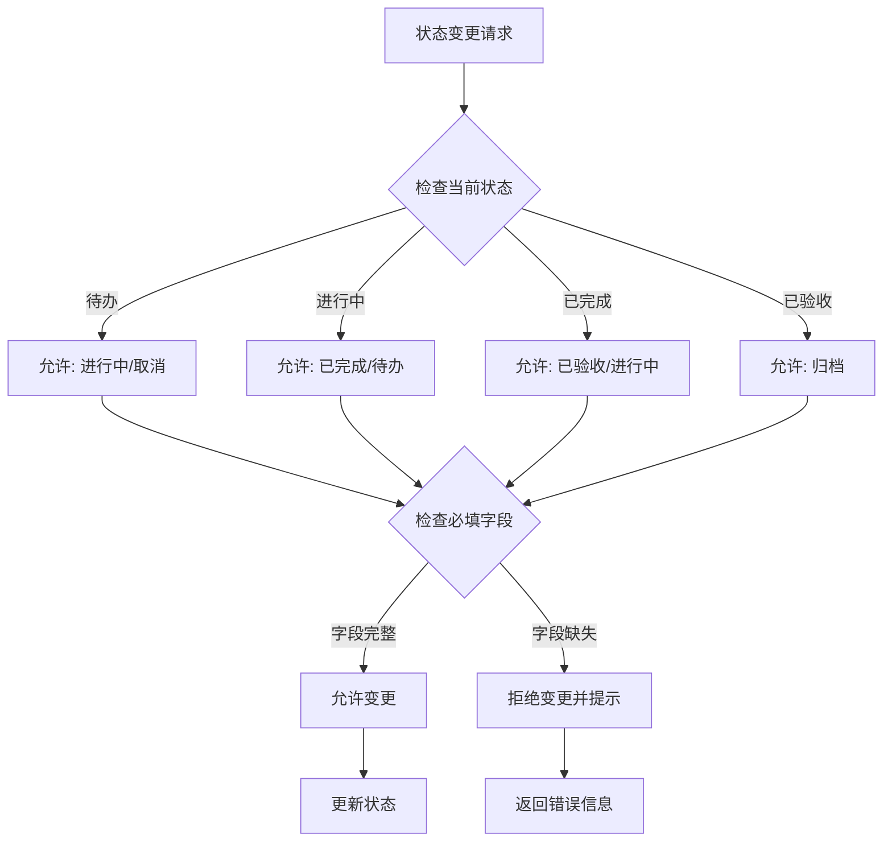

# Story/Task/Bug/复盘关联规则与流转约束

> 本文档定义看板间的关联规则与流转约束，作为开发自动化脚本的参考规范。

---

## 1. 关联关系定义

### 1.1 实体关系概览



### 1.2 关联关系明细表

| 关联类型 | 源实体 | 目标实体 | 关联字段 | 关系类型 | 约束说明 |
|---------|--------|---------|---------|---------|---------|
| 包含关系 | Story | Task | `story_id` | 1:N | 一个Story可包含多个Task，Task必须归属一个Story |
| 产生关系 | Task | Bug | `task_id` | 1:N | 一个Task可产生多个Bug，Bug必须关联到具体Task |
| 归属关系 | Task | Iteration | `iteration_id` | N:1 | 一个Task属于一个迭代，迭代可包含多个Task |
| 追溯关系 | Bug | Review | `review_id` | N:1 | Bug在复盘中追溯处理情况，一个复盘可包含多个Bug |
| 汇总关系 | Task | Review | `review_id` | N:1 | 已完成的Task在复盘中汇总，一个复盘汇总当日多个Task |

---

## 2. 状态流转规则

### 2.1 Task 状态流转



**状态说明**：

| 状态 | 说明 | 准入条件 | 退出动作 |
|------|------|---------|---------|
| 待办 | Task待开始 | Story已排期 | 记录开始时间 |
| 进行中 | Task正在执行 | 已开始执行 | 记录token开销 |
| 已完成 | 开发完成待验收 | 代码提交/自测通过 | 记录实际结束时间 |
| 已验收 | 验收通过可发布 | 验收人确认通过 | 关联到复盘 |

**流转规则**：
- 从「待办」到「进行中」：必须记录 `start_time`
- 从「进行中」到「已完成」：必须记录 `actual_end` 和 `token_cost`
- 从「已完成」到「已验收」：必须由验收人确认，且关联的Bug已修复或已标记

### 2.2 Bug 状态流转



**状态说明**：

| 状态 | 说明 | 准入条件 | 处理人 |
|------|------|---------|--------|
| 新增 | 刚发现的Bug | 测试或开发发现 | QA/开发 |
| 修复中 | 正在修复的Bug | 确认为有效Bug | 开发 |
| 已修复 | 代码已提交待验证 | 修复代码已合并 | 开发 |
| 已验证 | 验证通过已关闭 | QA验收通过 | QA |
| 重复打开 | 修复后再次复现 | QA验证发现未修复 | QA |
| 非Bug | 确认为非缺陷 | 经确认非系统问题 | QA/产品 |
| 需求设计问题 | 需修改需求设计 | 确认为设计问题 | 产品 |

**流转规则**：
- 从「新增」到「修复中」：必须关联到具体 `task_id`
- 从「修复中」到「已修复」：必须记录修复版本/分支
- 从「已修复」到「已验证」：必须经过QA验证
- 「重复打开」状态必须记录复现原因

### 2.3 Story 状态流转



**状态说明**：

| 状态 | 说明 | 准入条件 |
|------|------|---------|
| 待排期 | Story待排期 | 已创建，优先级已确定 |
| 开发中 | Story正在开发 | 已排入迭代，有Task进行中 |
| 测试中 | Story开发完成待测试 | 所有Task已完成 |
| 已发布 | Story已发布上线 | 测试通过，已上线 |

**流转规则**：
- Story状态根据关联Task状态自动流转
- 所有Task完成 → Story自动变为「测试中」
- 有Task进行中 → Story保持「开发中」

---

## 3. 触发条件与动作

### 3.1 Bug 创建时关联 Task

**触发条件**：
- Bug 被创建时
- Bug 状态为「新增」

**执行动作**：
1. 检查 Bug 是否已关联 `task_id`
2. 若未关联，提示创建者选择关联 Task
3. 获取关联 Task 的 `iteration_id`，同步到 Bug
4. 更新关联 Task 的 `bug_count` 字段

**API 调用示例**：
```json
{
  "event": "bug.created",
  "condition": {
    "status": "新增",
    "task_id": null
  },
  "action": {
    "type": "prompt_relation",
    "field": "task_id",
    "required": true
  }
}
```

### 3.2 Task 完成时触发验收

**触发条件**：
- Task 状态从「进行中」变为「已完成」
- Task 已记录 `actual_end` 时间

**执行动作**：
1. 自动通知验收人（Story负责人或PM）
2. 检查关联 Bug 状态，如有未修复Bug，标记阻塞
3. 发送验收提醒到相关频道
4. 更新 Story 的完成进度

**API 调用示例**：
```json
{
  "event": "task.status_changed",
  "condition": {
    "from": "进行中",
    "to": "已完成"
  },
  "actions": [
    {
      "type": "notify",
      "target": "reviewer",
      "message": "Task {title} 已完成，请验收"
    },
    {
      "type": "check_bugs",
      "block_if_unresolved": true
    },
    {
      "type": "update_story_progress",
      "story_id": "{story_id}"
    }
  ]
}
```

### 3.3 复盘时汇总当日 Task/Bug

**触发条件**：
- 每日复盘记录被创建
- 日期为当天

**执行动作**：
1. 查询当日 Iteration 的所有 Task
2. 统计已完成 Task 数量、token 开销总计
3. 查询当日新建和修复的 Bug
4. 自动填充到复盘记录对应字段
5. 识别阻塞状态的 Task，自动填入「阻塞」栏

**汇总规则**：

| 复盘字段 | 数据来源 | 统计规则 |
|---------|---------|---------|
| 当日产出 | Task（已完成/已验收） | 列出所有已完成的Task标题 |
| token开销 | Task.token_cost | 求和当日已完成Task的token_cost |
| 完成数量 | Task | 统计当日状态变为「已完成」或「已验收」的Task数 |
| 新建Bug | Bug | 统计当日创建的Bug数 |
| 修复Bug | Bug | 统计当日状态变为「已验证」的Bug数 |
| 阻塞项 | Task（状态=进行中但有阻塞） | 列出有阻塞标记的Task |
| 风险项 | Bug（高优先级未修复） | 列出P0/P1级别未修复Bug |

### 3.4 迭代结束时归档数据

**触发条件**：
- Iteration 日期结束（次日0点）
- 或手动触发「迭代归档」

**执行动作**：
1. 统计迭代期间所有 Task 完成情况
2. 统计迭代期间所有 Bug 产生与修复情况
3. 生成迭代报告
4. 将已完成的 Task/Bug 标记为「已归档」
5. 未完成的 Task 自动转入下一个迭代（可选）

---

## 4. 数据一致性约束

### 4.1 必填字段校验

#### Task 必填字段

| 字段名 | 必填时机 | 校验规则 |
|--------|---------|---------|
| title | 创建时 | 非空，长度1-200字符 |
| story_id | 创建时 | 必须存在对应Story |
| status | 创建时 | 枚举值：待办/进行中/已完成/已验收 |
| iteration_id | 创建时 | 必须存在对应Iteration |
| start_time | 状态变为「进行中」时 | 有效时间戳 |
| actual_end | 状态变为「已完成」时 | 有效时间戳，且晚于start_time |
| token_cost | 状态变为「已完成」时 | 非负整数 |

#### Bug 必填字段

| 字段名 | 必填时机 | 校验规则 |
|--------|---------|---------|
| title | 创建时 | 非空，长度1-200字符 |
| task_id | 创建时 | 必须存在对应Task |
| status | 创建时 | 枚举值：新增/修复中/已修复/已验证/重复打开/非Bug/需求设计问题 |
| severity | 创建时 | 枚举值：P0/P1/P2/P3 |
| reporter | 创建时 | 非空 |
| created_at | 创建时 | 自动填充当前时间 |
| resolved_at | 状态变为「已验证」时 | 有效时间戳 |

#### Story 必填字段

| 字段名 | 必填时机 | 校验规则 |
|--------|---------|---------|
| title | 创建时 | 非空，长度1-200字符 |
| status | 创建时 | 枚举值：待排期/开发中/测试中/已发布 |
| priority | 创建时 | 枚举值：P0/P1/P2/P3 |

### 4.2 状态转换合法性检查



**状态转换矩阵**：

| 当前状态\目标状态 | 待办 | 进行中 | 已完成 | 已验收 | 取消/归档 |
|-----------------|------|--------|--------|--------|----------|
| 待办 | ✓ | ✓ | ✗ | ✗ | ✓ |
| 进行中 | ✓ | ✓ | ✓ | ✗ | ✗ |
| 已完成 | ✗ | ✓ | ✓ | ✓ | ✗ |
| 已验收 | ✗ | ✗ | ✗ | ✓ | ✓ |

### 4.3 关联完整性规则

**规则1：Task 必须归属 Story**
```python
# 伪代码
def validate_task(task):
    if not task.story_id:
        raise ValidationError("Task 必须关联到 Story")
    if not Story.exists(task.story_id):
        raise ValidationError("关联的 Story 不存在")
```

**规则2：Bug 必须关联 Task**
```python
def validate_bug(bug):
    if not bug.task_id:
        raise ValidationError("Bug 必须关联到 Task")
    if not Task.exists(bug.task_id):
        raise ValidationError("关联的 Task 不存在")
    # 自动继承 iteration_id
    task = Task.get(bug.task_id)
    bug.iteration_id = task.iteration_id
```

**规则3：Review 必须关联 Iteration**
```python
def validate_review(review):
    if not review.iteration_id:
        # 自动查找或创建当日Iteration
        review.iteration_id = Iteration.get_or_create(review.date)
```

**规则4：级联更新规则**
```python
# Story 状态根据 Task 状态自动更新
def update_story_status(story):
    tasks = Task.get_by_story(story.id)
    if all(t.status == "已验收" for t in tasks):
        story.status = "测试中"
    elif any(t.status in ["进行中", "已完成"] for t in tasks):
        story.status = "开发中"
```

---

## 5. 自动化规则建议

### 5.1 Notion Automation 配置建议

#### 配置1：Task 状态变更自动更新时间

```yaml
automation:
  name: "Task自动记录时间"
  trigger:
    type: "status_changed"
    database: "Task"
  conditions:
    - field: "status"
      from: "待办"
      to: "进行中"
  actions:
    - type: "set_property"
      field: "start_time"
      value: "now()"
```

#### 配置2：Bug 创建自动通知负责人

```yaml
automation:
  name: "Bug创建通知"
  trigger:
    type: "page_created"
    database: "Bug"
  conditions: []
  actions:
    - type: "send_slack_notification"
      channel: "#dev-bugs"
      message: "🔴 新Bug: {title}\n关联Task: {task.title}\n报告人: {reporter}"
```

#### 配置3：每日复盘自动汇总

```yaml
automation:
  name: "每日复盘数据汇总"
  trigger:
    type: "scheduled"
    schedule: "0 18 * * *"  # 每天18:00
  actions:
    - type: "query_database"
      database: "Task"
      filter:
        iteration.date: "today"
        status: "已验收"
      save_to: "completed_tasks"
    - type: "query_database"
      database: "Bug"
      filter:
        created_at: "today"
      save_to: "new_bugs"
    - type: "create_page"
      database: "Review"
      properties:
        date: "today"
        task_completed_count: "{completed_tasks.count}"
        bug_fixed_count: "{new_bugs.count}"
        output: "{completed_tasks.list}"
```

### 5.2 Webhook 触发场景

#### 场景1：Task 状态变更 Webhook

```json
{
  "webhook": {
    "url": "https://api.infinity.company/webhooks/task-status",
    "events": ["task.created", "task.updated", "task.status_changed"],
    "payload": {
      "event": "{event_type}",
      "task_id": "{task.id}",
      "story_id": "{task.story_id}",
      "old_status": "{old_status}",
      "new_status": "{new_status}",
      "timestamp": "{timestamp}"
    }
  }
}
```

#### 场景2：Bug 状态变更 Webhook

```json
{
  "webhook": {
    "url": "https://api.infinity.company/webhooks/bug-status",
    "events": ["bug.created", "bug.status_changed", "bug.resolved"],
    "payload": {
      "event": "{event_type}",
      "bug_id": "{bug.id}",
      "task_id": "{bug.task_id}",
      "severity": "{bug.severity}",
      "status": "{bug.status}",
      "timestamp": "{timestamp}"
    }
  }
}
```

### 5.3 定时同步任务

#### 任务1：每日数据同步

```python
# sync_daily.py
def daily_sync():
    """每日18:00执行的数据同步任务"""
    # 1. 同步当日Task完成情况
    today_tasks = query_tasks(date=today, status=["已完成", "已验收"])
    
    # 2. 同步当日Bug情况
    today_bugs_created = query_bugs(created_at=today)
    today_bugs_resolved = query_bugs(resolved_at=today)
    
    # 3. 更新或创建复盘记录
    review = get_or_create_review(date=today)
    review.task_completed_count = len(today_tasks)
    review.bug_fixed_count = len(today_bugs_resolved)
    review.output = format_task_list(today_tasks)
    review.save()
    
    # 4. 发送日报通知
    send_daily_report(review)
```

#### 任务2：迭代归档任务

```python
# archive_iteration.py
def archive_iteration(iteration_id):
    """迭代结束时执行归档"""
    iteration = get_iteration(iteration_id)
    
    # 1. 统计迭代数据
    stats = {
        "total_tasks": count_tasks(iteration_id=iteration_id),
        "completed_tasks": count_tasks(iteration_id=iteration_id, status="已验收"),
        "total_bugs": count_bugs(iteration_id=iteration_id),
        "fixed_bugs": count_bugs(iteration_id=iteration_id, status="已验证"),
        "total_token_cost": sum_token_cost(iteration_id=iteration_id)
    }
    
    # 2. 生成迭代报告
    report = generate_iteration_report(iteration, stats)
    
    # 3. 归档已完成的Task和Bug
    archive_completed_items(iteration_id)
    
    # 4. 更新迭代状态
    iteration.status = "已归档"
    iteration.stats = stats
    iteration.save()
```

#### 任务3：数据一致性检查

```python
# consistency_check.py
def consistency_check():
    """每小时执行一次的数据一致性检查"""
    issues = []
    
    # 检查1: 孤儿Task（无Story关联）
    orphan_tasks = query_tasks(story_id=None)
    for task in orphan_tasks:
        issues.append(f"Task {task.id} 未关联Story")
    
    # 检查2: 孤儿Bug（无Task关联）
    orphan_bugs = query_bugs(task_id=None)
    for bug in orphan_bugs:
        issues.append(f"Bug {bug.id} 未关联Task")
    
    # 检查3: 状态不一致（已完成但未记录时间）
    invalid_tasks = query_tasks(status="已完成", actual_end=None)
    for task in invalid_tasks:
        issues.append(f"Task {task.id} 状态已完成但未记录实际结束时间")
    
    # 检查4: Story状态与Task状态不一致
    for story in query_stories():
        expected_status = calculate_expected_story_status(story)
        if story.status != expected_status:
            issues.append(f"Story {story.id} 状态应为 {expected_status}，实际为 {story.status}")
    
    # 发送检查报告
    if issues:
        send_alert("数据一致性检查发现问题", issues)
```

### 5.4 自动化配置汇总表

| 自动化规则 | 触发方式 | 执行频率 | 优先级 |
|-----------|---------|---------|--------|
| Task自动记录时间 | 状态变更 | 实时 | P0 |
| Bug创建自动通知 | 页面创建 | 实时 | P0 |
| 每日复盘数据汇总 | 定时触发 | 每日18:00 | P1 |
| 迭代结束自动归档 | 定时触发/手动 | 每日00:00 | P1 |
| 数据一致性检查 | 定时触发 | 每小时 | P2 |
| Story状态自动更新 | 关联Task变更 | 实时 | P2 |
| 未完成任务提醒 | 定时触发 | 每日17:00 | P2 |
| Bug逾期未修复提醒 | 定时触发 | 每日09:00 | P2 |

---

## 6. API 集成参考

### 6.1 Notion API 配置示例

```python
# notion_config.py
NOTION_API_KEY = "<YOUR_NOTION_API_KEY>"

DATABASE_IDS = {
    "story": "xxxxxxxx-xxxx-xxxx-xxxx-xxxxxxxxxxxx",
    "task": "xxxxxxxx-xxxx-xxxx-xxxx-xxxxxxxxxxxx",
    "bug": "xxxxxxxx-xxxx-xxxx-xxxx-xxxxxxxxxxxx",
    "iteration": "xxxxxxxx-xxxx-xxxx-xxxx-xxxxxxxxxxxx",
    "review": "xxxxxxxx-xxxx-xxxx-xxxx-xxxxxxxxxxxx"
}

# 关联属性配置
RELATION_PROPERTIES = {
    "task": {
        "story_relation": "Story",
        "iteration_relation": "Iteration"
    },
    "bug": {
        "task_relation": "Task"
    },
    "review": {
        "iteration_relation": "Iteration"
    }
}

# Rollup 属性配置
ROLLUP_PROPERTIES = {
    "story": {
        "task_count": {
            "relation": "Tasks",
            "function": "count"
        },
        "completed_task_count": {
            "relation": "Tasks",
            "filter": {"status": "已验收"},
            "function": "count"
        }
    },
    "iteration": {
        "total_token_cost": {
            "relation": "Tasks",
            "property": "token_cost",
            "function": "sum"
        },
        "bug_count": {
            "relation": "Bugs",
            "function": "count"
        }
    }
}
```

### 6.2 常用查询示例

```python
# 查询当日需要复盘的Task
async def get_today_completed_tasks():
    return await notion.databases.query(
        database_id=DATABASE_IDS["task"],
        filter={
            "and": [
                {"property": "Iteration", "relation": {"contains": today_iteration_id}},
                {"property": "Status", "select": {"equals": "已验收"}}
            ]
        }
    )

# 查询指定Task关联的所有Bug
async def get_task_bugs(task_id: str):
    return await notion.databases.query(
        database_id=DATABASE_IDS["bug"],
        filter={
            "property": "Task", "relation": {"contains": task_id}
        }
    )
```

---

## 7. 附录

### 7.1 状态枚举定义

```json
{
  "story_status": ["待排期", "开发中", "测试中", "已发布"],
  "task_status": ["待办", "进行中", "已完成", "已验收"],
  "bug_status": ["新增", "修复中", "已修复", "已验证", "重复打开", "非Bug", "需求设计问题"],
  "priority": ["P0", "P1", "P2", "P3"],
  "severity": ["P0", "P1", "P2", "P3"]
}
```

### 7.2 字段类型映射

| 实体 | 字段 | Notion类型 | 说明 |
|------|------|-----------|------|
| Story | title | Title | 需求标题 |
| Story | status | Select | 需求状态 |
| Story | priority | Select | 优先级 |
| Task | title | Title | 任务标题 |
| Task | status | Select | 任务状态 |
| Task | story_id | Relation | 关联Story |
| Task | iteration_id | Relation | 关联迭代 |
| Task | token_cost | Number | Token开销 |
| Task | start_time | Date | 开始时间 |
| Task | actual_end | Date | 实际结束时间 |
| Bug | title | Title | Bug标题 |
| Bug | status | Select | Bug状态 |
| Bug | task_id | Relation | 关联Task |
| Bug | severity | Select | 严重级别 |
| Iteration | date | Date | 迭代日期 |
| Review | date | Date | 复盘日期 |
| Review | iteration_id | Relation | 关联迭代 |

---

> **文档版本**: v1.0  
> **最后更新**: 2026-03-27  
> **维护者**: 关联规则设计Agent
