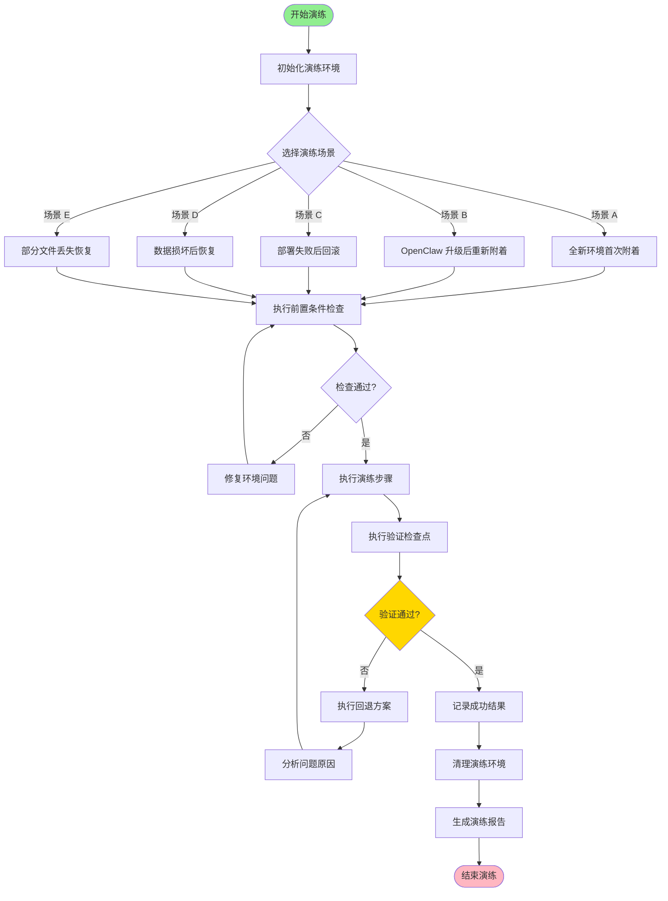
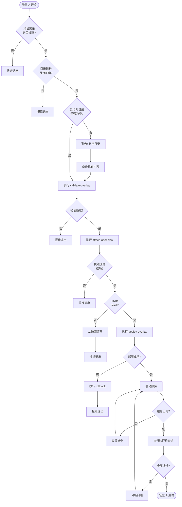
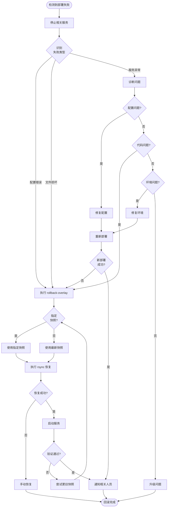

# InfinityCompany 恢复能力演练手册

> **文档版本**: v1.0  
> **适用范围**: InfinityCompany Overlay/Attach 部署模式  
> **最后更新**: 2026-03-27

---

## 1. 演练目标与范围

### 1.1 演练目标

| 目标编号 | 目标描述 | 优先级 |
|---------|---------|-------|
| DR-001 | 验证新 OpenClaw 版本上的 attach 能力 | P0 |
| DR-002 | 验证 deploy 流程的可靠性 | P0 |
| DR-003 | 验证 rollback 恢复能力 | P0 |
| DR-004 | 验证数据一致性和服务可用性 | P0 |
| DR-005 | 验证快照备份机制的有效性 | P1 |
| DR-006 | 验证环境变量和配置的正确性 | P1 |

### 1.2 演练范围

```
包含范围:
├── 部署脚本验证 (validate-overlay.sh, attach-openclaw.sh, deploy-overlay.sh, rollback-overlay.sh)
├── 运行时环境验证 (OpenClaw Gateway, ClawPanel)
├── 配置一致性验证 (环境变量, overlay 文件)
├── 快照备份与恢复机制
└── 服务可用性验证

不包含范围:
├── OpenClaw 基座本身的升级过程
├── ClawPanel 容器内部的数据持久化
└── 网络基础设施故障
```

### 1.3 关键术语

| 术语 | 定义 |
|-----|------|
| **Attach** | 将 InfinityCompany overlay 内容同步到 OpenClaw 运行时目录 |
| **Deploy** | 执行 attach 并记录发布元数据的过程 |
| **Rollback** | 从快照恢复之前状态的回滚操作 |
| **Snapshot** | 每次 attach 前自动创建的备份目录 |
| **Overlay** | InfinityCompany 仓库中的覆盖层内容 |

---

## 2. 演练场景设计

### 2.1 场景总览

```
┌─────────────────────────────────────────────────────────────────────────┐
│                        恢复能力演练场景矩阵                               │
├──────────┬─────────────────┬─────────────┬───────────────────────────────┤
│   场景    │     触发条件     │   恢复策略   │           预期结果            │
├──────────┼─────────────────┼─────────────┼───────────────────────────────┤
│ 场景 A    │ 全新环境         │ 首次 Attach │ 成功附着，服务正常              │
│ 场景 B    │ OpenClaw 升级    │ 重新 Attach │ 平滑迁移，零数据丢失            │
│ 场景 C    │ 部署失败         │ Rollback    │ 快速回滚，服务恢复              │
│ 场景 D    │ 数据损坏         │ 快照恢复     │ 数据一致性验证通过              │
│ 场景 E    │ 部分文件丢失      │ 增量恢复     │ 缺失文件补齐，服务正常          │
└──────────┴─────────────────┴─────────────┴───────────────────────────────┘
```

### 2.2 场景 A：全新 OpenClaw 环境首次附着

**场景描述**: 在全新部署的 OpenClaw 环境中首次附着 InfinityCompany overlay。

**触发条件**:
- 新开发环境搭建
- 灾难重建后的首次部署
- 新成员 onboarding

### 2.3 场景 B：OpenClaw 升级后的重新附着

**场景描述**: OpenClaw 基座升级后，重新执行 attach/deploy 流程。

**触发条件**:
- OpenClaw 版本升级
- 基座环境重构
- 周勃每日 18:00 例行检查时发现基座变更

### 2.4 场景 C：部署失败后的回滚恢复

**场景描述**: 部署过程中发生错误，需要回滚到上一个稳定版本。

**触发条件**:
- Deploy 脚本执行失败
- 附着后服务无法正常启动
- 配置验证失败

### 2.5 场景 D：数据损坏后的快照恢复

**场景描述**: RUNTIME_OVERLAY_DIR 中的数据被意外修改或损坏，需要从快照恢复。

**触发条件**:
- 人工误操作导致文件修改
- 程序 Bug 导致数据损坏
- 恶意修改检测

### 2.6 场景 E：部分文件丢失的增量恢复

**场景描述**: 部分 overlay 文件被意外删除，需要增量恢复。

**触发条件**:
- 误删除部分文件
- 同步中断导致的文件缺失
- 权限问题导致的文件不可访问

---

## 3. 详细演练步骤

### 3.0 通用前置条件

```bash
# 1. 确认所有必要的环境变量
export INFINITYCOMPANY_ROOT=/Users/wangrenzhu/work/MetaClaw/InfinityCompany
export OPENCLAW_BASE_DIR=/Users/wangrenzhu/work/MetaClaw/runtime/openclaw-base
export CONFIG_FILE=${INFINITYCOMPANY_ROOT}/configs/openclaw-target.local.env

# 2. 确认脚本可执行
chmod +x ${INFINITYCOMPANY_ROOT}/scripts/*.sh

# 3. 确认必要工具已安装
command -v rsync >/dev/null 2>&1 || echo "ERROR: rsync not found"
command -v curl >/dev/null 2>&1 || echo "ERROR: curl not found"
```

### 3.1 场景 A：全新 OpenClaw 环境首次附着

#### 前置条件

| 检查项 | 命令 | 预期结果 |
|-------|------|---------|
| 环境配置文件存在 | `test -f ${CONFIG_FILE}` | 返回 0 |
| OpenClaw 基座目录存在 | `test -d ${OPENCLAW_BASE_DIR}` | 返回 0 |
| RUNTIME_OVERLAY_DIR 为空或不存在 | `test -z "$(ls -A ${RUNTIME_OVERLAY_DIR} 2>/dev/null)"` | 返回 0 |
| rsync 已安装 | `command -v rsync` | 显示路径 |

#### 环境准备

```bash
# 步骤 A-1: 创建演练专用目录
DRILL_TIMESTAMP=$(date +"%Y%m%d-%H%M%S")
DRILL_LOG_DIR=${INFINITYCOMPANY_ROOT}/snapshots/drill-${DRILL_TIMESTAMP}
mkdir -p ${DRILL_LOG_DIR}

# 步骤 A-2: 备份当前配置
cp ${CONFIG_FILE} ${DRILL_LOG_DIR}/env-backup.txt 2>/dev/null || true

# 步骤 A-3: 记录初始状态
echo "=== 场景 A 初始状态 ===" > ${DRILL_LOG_DIR}/drill-log.txt
echo "时间: $(date)" >> ${DRILL_LOG_DIR}/drill-log.txt
echo "用户: $(whoami)" >> ${DRILL_LOG_DIR}/drill-log.txt
ls -la ${OPENCLAW_BASE_DIR} >> ${DRILL_LOG_DIR}/drill-log.txt 2>&1 || true
```

#### 执行步骤

| 步骤 | 操作 | 命令 | 预期结果 |
|-----|------|------|---------|
| A-4 | 验证 overlay | `./scripts/validate-overlay.sh ${CONFIG_FILE}` | 输出所有配置变量，返回 0 |
| A-5 | 执行 attach | `./scripts/attach-openclaw.sh ${CONFIG_FILE}` | 创建 snapshot，完成同步 |
| A-6 | 执行 deploy | `./scripts/deploy-overlay.sh ${CONFIG_FILE}` | 创建 .release 目录和元数据文件 |
| A-7 | 验证文件同步 | `diff -r overlay/ ${RUNTIME_OVERLAY_DIR}/` | 无差异输出（排除 .release） |
| A-8 | 验证元数据 | `cat ${RUNTIME_OVERLAY_DIR}/.release/last-deploy.txt` | 显示部署时间 |
| A-9 | 启动 Gateway | `openclaw gateway start` | Gateway 服务启动成功 |
| A-10 | 验证 Gateway | `curl -fsS ${OPENCLAW_GATEWAY_URL}` | 返回 HTTP 200 |
| A-11 | 启动 ClawPanel | `cd ${CLAWPANEL_DIR} && docker compose up -d` | 容器启动成功 |
| A-12 | 验证 ClawPanel | `curl -fsS ${CLAWPANEL_URL}` | 返回 HTTP 200 |

#### 验证检查点

```bash
# 检查点 A-CP1: 文件完整性
echo "=== 检查点 A-CP1: 文件完整性 ==="
find ${OVERLAY_SOURCE_DIR} -type f | while read f; do
    rel_path="${f#${OVERLAY_SOURCE_DIR}/}"
    if [[ ! -f "${RUNTIME_OVERLAY_DIR}/${rel_path}" ]]; then
        echo "FAIL: 缺失文件 ${rel_path}"
    fi
done
echo "PASS: 文件完整性检查完成"

# 检查点 A-CP2: 服务可用性
echo "=== 检查点 A-CP2: 服务可用性 ==="
curl -fsS ${OPENCLAW_GATEWAY_URL} >/dev/null && echo "Gateway: PASS" || echo "Gateway: FAIL"
curl -fsS ${CLAWPANEL_URL} >/dev/null && echo "ClawPanel: PASS" || echo "ClawPanel: FAIL"

# 检查点 A-CP3: 快照创建
echo "=== 检查点 A-CP3: 快照创建 ==="
LATEST_SNAPSHOT=$(ls -1t ${BACKUP_ROOT}/attach-* 2>/dev/null | head -1)
[[ -n "${LATEST_SNAPSHOT}" ]] && echo "Snapshot: PASS (${LATEST_SNAPSHOT})" || echo "Snapshot: FAIL"
```

#### 回退方案

如果演练失败，执行以下清理步骤：

```bash
# 回退 A-RB1: 停止服务
cd ${CLAWPANEL_DIR} && docker compose down 2>/dev/null || true
openclaw gateway stop 2>/dev/null || true

# 回退 A-RB2: 清理 runtime overlay
rm -rf ${RUNTIME_OVERLAY_DIR}/*

# 回退 A-RB3: 恢复配置（如有必要）
cp ${DRILL_LOG_DIR}/env-backup.txt ${CONFIG_FILE} 2>/dev/null || true

echo "场景 A 回退完成"
```

---

### 3.2 场景 B：OpenClaw 升级后的重新附着

#### 前置条件

| 检查项 | 命令 | 预期结果 |
|-------|------|---------|
| 已有成功的部署 | `test -f ${RUNTIME_OVERLAY_DIR}/.release/last-deploy.txt` | 返回 0 |
| 存在历史快照 | `ls ${BACKUP_ROOT}/attach-* 2>/dev/null` | 显示目录列表 |
| OpenClaw 已升级 | `openclaw --version` | 显示新版本号 |

#### 环境准备

```bash
# 步骤 B-1: 创建演练目录
DRILL_TIMESTAMP=$(date +"%Y%m%d-%H%M%S")
DRILL_LOG_DIR=${INFINITYCOMPANY_ROOT}/snapshots/drill-${DRILL_TIMESTAMP}
mkdir -p ${DRILL_LOG_DIR}

# 步骤 B-2: 记录升级前状态
echo "=== 场景 B 升级前状态 ===" > ${DRILL_LOG_DIR}/drill-log.txt
echo "时间: $(date)" >> ${DRILL_LOG_DIR}/drill-log.txt
echo "OpenClaw 版本: $(openclaw --version 2>/dev/null || echo 'unknown')" >> ${DRILL_LOG_DIR}/drill-log.txt
echo "当前部署时间: $(cat ${RUNTIME_OVERLAY_DIR}/.release/last-deploy.txt 2>/dev/null || echo 'none')" >> ${DRILL_LOG_DIR}/drill-log.txt

# 步骤 B-3: 创建升级前完整备份
UPGRADE_BACKUP=${DRILL_LOG_DIR}/pre-upgrade-backup
mkdir -p ${UPGRADE_BACKUP}
rsync -a ${RUNTIME_OVERLAY_DIR}/ ${UPGRADE_BACKUP}/
echo "升级前备份完成: ${UPGRADE_BACKUP}"
```

#### 执行步骤

| 步骤 | 操作 | 命令 | 预期结果 |
|-----|------|------|---------|
| B-4 | 升级 OpenClaw | `openclaw upgrade` 或手动升级 | 升级成功 |
| B-5 | 停止服务 | `openclaw gateway stop && cd ${CLAWPANEL_DIR} && docker compose down` | 服务停止 |
| B-6 | 验证 overlay | `./scripts/validate-overlay.sh ${CONFIG_FILE}` | 配置验证通过 |
| B-7 | 记录当前快照数 | `ls ${BACKUP_ROOT}/attach-* 2>/dev/null | wc -l` | 记录数字 |
| B-8 | 执行重新 attach | `./scripts/attach-openclaw.sh ${CONFIG_FILE}` | 创建新 snapshot，完成同步 |
| B-9 | 执行 deploy | `./scripts/deploy-overlay.sh ${CONFIG_FILE}` | 更新部署元数据 |
| B-10 | 启动 Gateway | `openclaw gateway start` | Gateway 启动成功 |
| B-11 | 启动 ClawPanel | `cd ${CLAWPANEL_DIR} && docker compose up -d --build` | 重建并启动 |
| B-12 | 验证服务 | `curl -fsS ${OPENCLAW_GATEWAY_URL} && curl -fsS ${CLAWPANEL_URL}` | 两个服务都返回 200 |

#### 验证检查点

```bash
# 检查点 B-CP1: 新快照创建
echo "=== 检查点 B-CP1: 新快照创建 ==="
NEW_SNAPSHOT_COUNT=$(ls ${BACKUP_ROOT}/attach-* 2>/dev/null | wc -l)
echo "升级前快照数: ${PRE_UPGRADE_SNAPSHOT_COUNT}"
echo "升级后快照数: ${NEW_SNAPSHOT_COUNT}"
[[ ${NEW_SNAPSHOT_COUNT} -gt ${PRE_UPGRADE_SNAPSHOT_COUNT} ]] && echo "PASS: 新快照已创建" || echo "FAIL: 快照未创建"

# 检查点 B-CP2: 数据一致性
echo "=== 检查点 B-CP2: 数据一致性 ==="
# 排除 .release 目录进行比较
diff -rq ${OVERLAY_SOURCE_DIR} ${RUNTIME_OVERLAY_DIR} --exclude=.release | grep -v "Only in ${RUNTIME_OVERLAY_DIR}" && echo "FAIL: 数据不一致" || echo "PASS: 数据一致"

# 检查点 B-CP3: 部署时间更新
echo "=== 检查点 B-CP3: 部署时间更新 ==="
NEW_DEPLOY_TIME=$(cat ${RUNTIME_OVERLAY_DIR}/.release/last-deploy.txt)
OLD_DEPLOY_TIME=$(cat ${DRILL_LOG_DIR}/pre-upgrade-backup/.release/last-deploy.txt 2>/dev/null || echo 'none')
echo "旧部署时间: ${OLD_DEPLOY_TIME}"
echo "新部署时间: ${NEW_DEPLOY_TIME}"
[[ "${NEW_DEPLOY_TIME}" != "${OLD_DEPLOY_TIME}" ]] && echo "PASS: 部署时间已更新" || echo "FAIL: 部署时间未更新"
```

#### 回退方案

```bash
# 回退 B-RB1: 停止服务
openclaw gateway stop 2>/dev/null || true
cd ${CLAWPANEL_DIR} && docker compose down 2>/dev/null || true

# 回退 B-RB2: 恢复升级前备份
rsync -a --delete ${DRILL_LOG_DIR}/pre-upgrade-backup/ ${RUNTIME_OVERLAY_DIR}/

# 回退 B-RB3: 降级 OpenClaw（如需要）
# openclaw downgrade <version>  # 根据实际情况执行

# 回退 B-RB4: 重启服务
openclaw gateway start
cd ${CLAWPANEL_DIR} && docker compose up -d

echo "场景 B 回退完成"
```

---

### 3.3 场景 C：部署失败后的回滚恢复

#### 前置条件

| 检查项 | 命令 | 预期结果 |
|-------|------|---------|
| 存在至少一个成功的快照 | `ls ${BACKUP_ROOT}/attach-* 2>/dev/null | head -1` | 返回目录路径 |
| 当前有部署状态 | `test -d ${RUNTIME_OVERLAY_DIR}` | 返回 0 |

#### 环境准备

```bash
# 步骤 C-1: 创建演练目录
DRILL_TIMESTAMP=$(date +"%Y%m%d-%H%M%S")
DRILL_LOG_DIR=${INFINITYCOMPANY_ROOT}/snapshots/drill-${DRILL_TIMESTAMP}
mkdir -p ${DRILL_LOG_DIR}

# 步骤 C-2: 记录当前稳定状态
echo "=== 场景 C 演练开始 ===" > ${DRILL_LOG_DIR}/drill-log.txt
echo "时间: $(date)" >> ${DRILL_LOG_DIR}/drill-log.txt
STABLE_SNAPSHOT=$(ls -1t ${BACKUP_ROOT}/attach-* 2>/dev/null | head -1)
echo "稳定快照: ${STABLE_SNAPSHOT}" >> ${DRILL_LOG_DIR}/drill-log.txt

# 步骤 C-3: 备份当前运行状态
cp -r ${RUNTIME_OVERLAY_DIR} ${DRILL_LOG_DIR}/runtime-before-failure/
```

#### 执行步骤

| 步骤 | 操作 | 命令 | 预期结果 |
|-----|------|------|---------|
| C-4 | 模拟部署失败 | 手动修改 overlay 添加错误配置 | 配置验证失败或部署异常 |
| C-5 | 执行有问题的 attach | `./scripts/attach-openclaw.sh ${CONFIG_FILE}` 2>&1 | 执行完成但服务异常 |
| C-6 | 检测部署失败 | `curl -fsS ${OPENCLAW_GATEWAY_URL}` | 返回非 200 或超时 |
| C-7 | 停止服务 | `openclaw gateway stop` | 服务停止 |
| C-8 | 执行 rollback | `./scripts/rollback-overlay.sh ${CONFIG_FILE}` | 恢复到最新快照 |
| C-9 | 重新启动服务 | `openclaw gateway start` | Gateway 启动成功 |
| C-10 | 验证恢复 | `curl -fsS ${OPENCLAW_GATEWAY_URL}` | 返回 HTTP 200 |
| C-11 | 验证数据一致性 | `diff -r ${STABLE_SNAPSHOT} ${RUNTIME_OVERLAY_DIR}` | 无差异（排除 .release） |

#### 验证检查点

```bash
# 检查点 C-CP1: 回滚前状态标记
echo "=== 检查点 C-CP1: 回滚前状态 ==="
ROLLBACK_RESULT=$(./scripts/rollback-overlay.sh ${CONFIG_FILE} 2>&1)
echo "${ROLLBACK_RESULT}"
echo "${ROLLBACK_RESULT}" | grep -q "rolled_back_to" && echo "PASS: 回滚成功" || echo "FAIL: 回滚失败"

# 检查点 C-CP2: 服务恢复
echo "=== 检查点 C-CP2: 服务恢复 ==="
sleep 5  # 等待服务启动
curl -fsS ${OPENCLAW_GATEWAY_URL} >/dev/null && echo "Gateway: PASS" || echo "Gateway: FAIL"

# 检查点 C-CP3: 回滚速度
echo "=== 检查点 C-CP3: 回滚性能 ==="
START_TIME=$(date +%s)
./scripts/rollback-overlay.sh ${CONFIG_FILE} >/dev/null 2>&1
END_TIME=$(date +%s)
ROLLBACK_DURATION=$((END_TIME - START_TIME))
echo "回滚耗时: ${ROLLBACK_DURATION} 秒"
[[ ${ROLLBACK_DURATION} -lt 30 ]] && echo "PASS: 回滚性能满足要求" || echo "WARN: 回滚较慢"
```

#### 回退方案

如果 rollback 本身失败：

```bash
# 回退 C-RB1: 手动恢复
rsync -a --delete ${DRILL_LOG_DIR}/runtime-before-failure/ ${RUNTIME_OVERLAY_DIR}/

# 回退 C-RB2: 重启服务
openclaw gateway stop 2>/dev/null || true
openclaw gateway start
cd ${CLAWPANEL_DIR} && docker compose up -d

echo "场景 C 手动回退完成"
```

---

### 3.4 场景 D：数据损坏后的快照恢复

#### 前置条件

| 检查项 | 命令 | 预期结果 |
|-------|------|---------|
| 存在已知完好的快照 | `ls ${BACKUP_ROOT}/attach-* 2>/dev/null` | 显示多个快照 |
| 当前运行环境正常 | `curl -fsS ${OPENCLAW_GATEWAY_URL}` | 返回 200 |

#### 环境准备

```bash
# 步骤 D-1: 创建演练目录
DRILL_TIMESTAMP=$(date +"%Y%m%d-%H%M%S")
DRILL_LOG_DIR=${INFINITYCOMPANY_ROOT}/snapshots/drill-${DRILL_TIMESTAMP}
mkdir -p ${DRILL_LOG_DIR}

# 步骤 D-2: 选择用于恢复的快照（选择第二个最新的）
RECOVERY_SNAPSHOT=$(ls -1t ${BACKUP_ROOT}/attach-* 2>/dev/null | sed -n '2p')
[[ -z "${RECOVERY_SNAPSHOT}" ]] && RECOVERY_SNAPSHOT=$(ls -1t ${BACKUP_ROOT}/attach-* 2>/dev/null | head -1)
echo "恢复目标快照: ${RECOVERY_SNAPSHOT}"
echo "恢复目标快照: ${RECOVERY_SNAPSHOT}" > ${DRILL_LOG_DIR}/drill-log.txt

# 步骤 D-3: 记录当前文件的校验和
cd ${RUNTIME_OVERLAY_DIR} && find . -type f ! -path './.release/*' -exec md5sum {} \; > ${DRILL_LOG_DIR}/current-checksums.txt
```

#### 执行步骤

| 步骤 | 操作 | 命令 | 预期结果 |
|-----|------|------|---------|
| D-4 | 模拟数据损坏 | `echo "corrupted" > ${RUNTIME_OVERLAY_DIR}/some-important-file` | 文件被修改 |
| D-5 | 停止服务 | `openclaw gateway stop && cd ${CLAWPANEL_DIR} && docker compose down` | 服务停止 |
| D-6 | 执行指定快照恢复 | `./scripts/rollback-overlay.sh ${CONFIG_FILE} ${RECOVERY_SNAPSHOT}` | 从指定快照恢复 |
| D-7 | 验证文件恢复 | `cat ${RUNTIME_OVERLAY_DIR}/some-important-file` | 显示原始内容 |
| D-8 | 启动服务 | `openclaw gateway start && cd ${CLAWPANEL_DIR} && docker compose up -d` | 服务启动 |
| D-9 | 验证服务 | `curl -fsS ${OPENCLAW_GATEWAY_URL}` | 返回 200 |

#### 验证检查点

```bash
# 检查点 D-CP1: 文件完整性
echo "=== 检查点 D-CP1: 文件完整性 ==="
cd ${RECOVERY_SNAPSHOT} && find . -type f ! -path './.release/*' -exec md5sum {} \; > ${DRILL_LOG_DIR}/snapshot-checksums.txt 2>/dev/null || true

if [[ -f ${DRILL_LOG_DIR}/snapshot-checksums.txt ]]; then
    diff ${DRILL_LOG_DIR}/snapshot-checksums.txt <(cd ${RUNTIME_OVERLAY_DIR} && find . -type f ! -path './.release/*' -exec md5sum {} \;) && echo "PASS: 文件完整性验证通过" || echo "FAIL: 文件完整性验证失败"
else
    echo "SKIP: 无可用的快照校验和"
fi

# 检查点 D-CP2: 服务可用性
echo "=== 检查点 D-CP2: 服务可用性 ==="
sleep 3
curl -fsS ${OPENCLAW_GATEWAY_URL} >/dev/null && echo "Gateway: PASS" || echo "Gateway: FAIL"

# 检查点 D-CP3: 恢复正确性
echo "=== 检查点 D-CP3: 恢复正确性 ==="
echo "恢复来源: ${RECOVERY_SNAPSHOT}"
echo "恢复目标: ${RUNTIME_OVERLAY_DIR}"
[[ "$(cat ${RUNTIME_OVERLAY_DIR}/some-important-file 2>/dev/null)" != "corrupted" ]] && echo "PASS: 损坏数据已恢复" || echo "FAIL: 损坏数据仍存在"
```

#### 回退方案

```bash
# 回退 D-RB1: 使用最新的快照恢复
LATEST_SNAPSHOT=$(ls -1t ${BACKUP_ROOT}/attach-* 2>/dev/null | head -1)
./scripts/rollback-overlay.sh ${CONFIG_FILE} ${LATEST_SNAPSHOT}

# 回退 D-RB2: 重启服务
openclaw gateway stop 2>/dev/null || true
openclaw gateway start
cd ${CLAWPANEL_DIR} && docker compose up -d

echo "场景 D 回退完成"
```

---

### 3.5 场景 E：部分文件丢失的增量恢复

#### 前置条件

| 检查项 | 命令 | 预期结果 |
|-------|------|---------|
| 当前运行环境正常 | `curl -fsS ${OPENCLAW_GATEWAY_URL}` | 返回 200 |
| 存在 overlay 源文件 | `test -d ${OVERLAY_SOURCE_DIR}` | 返回 0 |

#### 环境准备

```bash
# 步骤 E-1: 创建演练目录
DRILL_TIMESTAMP=$(date +"%Y%m%d-%H%M%S")
DRILL_LOG_DIR=${INFINITYCOMPANY_ROOT}/snapshots/drill-${DRILL_TIMESTAMP}
mkdir -p ${DRILL_LOG_DIR}

# 步骤 E-2: 记录当前文件列表
echo "=== 场景 E 演练开始 ===" > ${DRILL_LOG_DIR}/drill-log.txt
find ${RUNTIME_OVERLAY_DIR} -type f ! -path '*/.release/*' > ${DRILL_LOG_DIR}/files-before-deletion.txt
echo "当前文件数: $(wc -l < ${DRILL_LOG_DIR}/files-before-deletion.txt)"
```

#### 执行步骤

| 步骤 | 操作 | 命令 | 预期结果 |
|-----|------|------|---------|
| E-3 | 模拟文件丢失 | `rm -rf ${RUNTIME_OVERLAY_DIR}/some-file` | 文件被删除 |
| E-4 | 验证文件缺失 | `test -f ${RUNTIME_OVERLAY_DIR}/some-file` | 返回 1（文件不存在） |
| E-5 | 执行增量恢复（重新 attach） | `./scripts/attach-openclaw.sh ${CONFIG_FILE}` | 缺失文件被恢复 |
| E-6 | 验证文件恢复 | `test -f ${RUNTIME_OVERLAY_DIR}/some-file` | 返回 0（文件存在） |
| E-7 | 完整同步验证 | `diff -r ${OVERLAY_SOURCE_DIR} ${RUNTIME_OVERLAY_DIR} --exclude=.release` | 无差异 |
| E-8 | 服务验证 | `curl -fsS ${OPENCLAW_GATEWAY_URL}` | 返回 200 |

#### 验证检查点

```bash
# 检查点 E-CP1: 文件恢复
echo "=== 检查点 E-CP1: 文件恢复 ==="
find ${RUNTIME_OVERLAY_DIR} -type f ! -path '*/.release/*' > ${DRILL_LOG_DIR}/files-after-recovery.txt
if diff -q ${DRILL_LOG_DIR}/files-before-deletion.txt ${DRILL_LOG_DIR}/files-after-recovery.txt >/dev/null; then
    echo "PASS: 所有文件已恢复"
else
    echo "FAIL: 文件未完全恢复"
    diff ${DRILL_LOG_DIR}/files-before-deletion.txt ${DRILL_LOG_DIR}/files-after-recovery.txt
fi

# 检查点 E-CP2: 增量恢复性能
echo "=== 检查点 E-CP2: 增量恢复性能 ==="
START_TIME=$(date +%s)
./scripts/attach-openclaw.sh ${CONFIG_FILE} >/dev/null 2>&1
END_TIME=$(date +%s)
RECOVERY_DURATION=$((END_TIME - START_TIME))
echo "增量恢复耗时: ${RECOVERY_DURATION} 秒"
[[ ${RECOVERY_DURATION} -lt 10 ]] && echo "PASS: 增量恢复性能满足要求" || echo "INFO: 恢复耗时较长"
```

#### 回退方案

```bash
# 回退 E-RB1: 使用最新快照完整恢复
LATEST_SNAPSHOT=$(ls -1t ${BACKUP_ROOT}/attach-* 2>/dev/null | head -1)
[[ -n "${LATEST_SNAPSHOT}" ]] && ./scripts/rollback-overlay.sh ${CONFIG_FILE} ${LATEST_SNAPSHOT}

# 回退 E-RB2: 重新 attach
./scripts/attach-openclaw.sh ${CONFIG_FILE}

echo "场景 E 回退完成"
```

---

## 4. 检查点与验证标准

### 4.1 文件完整性检查

```bash
#!/bin/bash
# file-integrity-check.sh

OVERLAY_SOURCE_DIR="${OVERLAY_SOURCE_DIR:-/Users/wangrenzhu/work/MetaClaw/InfinityCompany/overlay}"
RUNTIME_OVERLAY_DIR="${RUNTIME_OVERLAY_DIR:-/Users/wangrenzhu/work/MetaClaw/runtime/openclaw-base/.infinity-company}"

echo "=== 文件完整性检查 ==="
echo "源目录: ${OVERLAY_SOURCE_DIR}"
echo "目标目录: ${RUNTIME_OVERLAY_DIR}"

ERRORS=0

# 检查源目录所有文件是否都在目标目录
while IFS= read -r -d '' src_file; do
    rel_path="${src_file#${OVERLAY_SOURCE_DIR}/}"
    dst_file="${RUNTIME_OVERLAY_DIR}/${rel_path}"
    
    if [[ ! -f "${dst_file}" ]]; then
        echo "[MISSING] ${rel_path}"
        ((ERRORS++))
    else
        src_hash=$(md5sum "${src_file}" | awk '{print $1}')
        dst_hash=$(md5sum "${dst_file}" | awk '{print $1}')
        if [[ "${src_hash}" != "${dst_hash}" ]]; then
            echo "[MISMATCH] ${rel_path}"
            ((ERRORS++))
        fi
    fi
done < <(find "${OVERLAY_SOURCE_DIR}" -type f -print0)

if [[ ${ERRORS} -eq 0 ]]; then
    echo "[PASS] 文件完整性检查通过"
    exit 0
else
    echo "[FAIL] 发现 ${ERRORS} 个问题"
    exit 1
fi
```

### 4.2 配置正确性检查

```bash
#!/bin/bash
# config-validation-check.sh

CONFIG_FILE="${1:-configs/openclaw-target.local.env}"

echo "=== 配置正确性检查 ==="

# 验证必需变量
required_vars=(
    "OPENCLAW_BASE_DIR"
    "OPENCLAW_USER_HOME"
    "OPENCLAW_GATEWAY_URL"
    "CLAWPANEL_DIR"
    "OVERLAY_SOURCE_DIR"
    "RUNTIME_OVERLAY_DIR"
    "BACKUP_ROOT"
)

MISSING=0
for var in "${required_vars[@]}"; do
    if ! grep -q "^${var}=" "${CONFIG_FILE}" 2>/dev/null; then
        echo "[MISSING] ${var}"
        ((MISSING++))
    fi
done

# 验证目录可访问
if [[ -f "${CONFIG_FILE}" ]]; then
    set -a
    source "${CONFIG_FILE}"
    set +a
    
    for dir_var in "OPENCLAW_BASE_DIR" "CLAWPANEL_DIR" "OVERLAY_SOURCE_DIR"; do
        dir_path="${!dir_var}"
        if [[ ! -d "${dir_path}" ]]; then
            echo "[NOT_DIR] ${dir_var}=${dir_path}"
            ((MISSING++))
        fi
    done
    
    # 验证备份目录可写
    if ! mkdir -p "${BACKUP_ROOT}" 2>/dev/null; then
        echo "[NOT_WRITABLE] BACKUP_ROOT=${BACKUP_ROOT}"
        ((MISSING++))
    fi
fi

if [[ ${MISSING} -eq 0 ]]; then
    echo "[PASS] 配置验证通过"
    exit 0
else
    echo "[FAIL] 发现 ${MISSING} 个问题"
    exit 1
fi
```

### 4.3 服务可用性检查

```bash
#!/bin/bash
# service-availability-check.sh

CONFIG_FILE="${1:-configs/openclaw-target.local.env}"
source "${CONFIG_FILE}" 2>/dev/null || true

OPENCLAW_GATEWAY_URL="${OPENCLAW_GATEWAY_URL:-http://127.0.0.1:18789}"
CLAWPANEL_URL="${CLAWPANEL_URL:-http://127.0.0.1:1420/}"

echo "=== 服务可用性检查 ==="
ERRORS=0

# 检查 Gateway
if curl -fsS "${OPENCLAW_GATEWAY_URL}" >/dev/null 2>&1; then
    echo "[PASS] Gateway (${OPENCLAW_GATEWAY_URL})"
else
    echo "[FAIL] Gateway (${OPENCLAW_GATEWAY_URL})"
    ((ERRORS++))
fi

# 检查 ClawPanel
if curl -fsS "${CLAWPANEL_URL}" >/dev/null 2>&1; then
    echo "[PASS] ClawPanel (${CLAWPANEL_URL})"
else
    echo "[FAIL] ClawPanel (${CLAWPANEL_URL})"
    ((ERRORS++))
fi

exit ${ERRORS}
```

### 4.4 数据一致性检查

```bash
#!/bin/bash
# data-consistency-check.sh
# 比较快照和恢复后的目录

SNAPSHOT_DIR="$1"
RUNTIME_DIR="$2"

if [[ -z "${SNAPSHOT_DIR}" || -z "${RUNTIME_DIR}" ]]; then
    echo "用法: $0 <snapshot-dir> <runtime-dir>"
    exit 1
fi

echo "=== 数据一致性检查 ==="
echo "快照: ${SNAPSHOT_DIR}"
echo "运行时: ${RUNTIME_DIR}"

# 使用 rsync 模拟模式检测差异
if rsync -avnc --delete "${SNAPSHOT_DIR}/" "${RUNTIME_DIR}/" 2>/dev/null | grep -q '^[<>ch.]'; then
    echo "[DIFF] 发现差异:"
    rsync -avnc --delete "${SNAPSHOT_DIR}/" "${RUNTIME_DIR}/" 2>/dev/null | grep '^[<>ch.]'
    exit 1
else
    echo "[PASS] 数据一致"
    exit 0
fi
```

---

## 5. 演练执行流程图

### 5.1 整体演练流程



### 5.2 场景 A 详细流程



### 5.3 场景 C 回滚决策流程



---

## 6. 演练计划模板

### 6.1 演练基本信息

```yaml
# drill-plan.yaml
drill_info:
  name: "InfinityCompany 恢复能力演练"
  version: "1.0"
  date: "YYYY-MM-DD"
  
scenarios:
  - id: A
    name: "全新环境首次附着"
    priority: P0
    estimated_duration: "15分钟"
  - id: B
    name: "OpenClaw 升级后重新附着"
    priority: P0
    estimated_duration: "20分钟"
  - id: C
    name: "部署失败后回滚"
    priority: P0
    estimated_duration: "10分钟"
  - id: D
    name: "数据损坏后恢复"
    priority: P1
    estimated_duration: "15分钟"
  - id: E
    name: "部分文件丢失恢复"
    priority: P1
    estimated_duration: "10分钟"
```

### 6.2 演练时间窗口

| 项目 | 内容 |
|-----|------|
| **演练日期** | YYYY-MM-DD |
| **开始时间** | HH:MM |
| **预计结束** | HH:MM |
| **时间窗口** | 建议非业务高峰时段 |
| **超时处理** | 超过预计时间 50% 则中止演练 |

### 6.3 参与人员

| 角色 | 姓名 | 职责 | 联系方式 |
|-----|------|------|---------|
| **演练负责人** | 周勃 | 整体协调、决策 | - |
| **技术执行** | - | 执行演练步骤 | - |
| **观察记录** | - | 记录过程、拍照截屏 | - |
| **回退执行** | - | 必要时执行回退 | - |
| **业务验证** | - | 验证服务可用性 | - |

### 6.4 通知机制

```
演练前通知 (T-24h):
├── 邮件通知相关团队
├── 更新值班日历
└── 准备回退方案

演练中通知 (T-0):
├── 演练开始时发送开始通知
├── 每完成一个场景发送状态更新
└── 出现问题时立即升级通知

演练后通知 (T+1h):
├── 发送演练总结
├── 分享演练报告
└── 安排改进项跟进
```

### 6.5 风险评估

| 风险项 | 可能性 | 影响 | 缓解措施 |
|-------|-------|------|---------|
| 演练导致生产服务中断 | 低 | 高 | 在测试环境先演练 |
| 回滚失败导致数据丢失 | 低 | 高 | 演练前创建完整备份 |
| 演练超时影响其他计划 | 中 | 中 | 预留充足时间窗口 |
| 人员不足无法完成演练 | 低 | 中 | 提前确认参与人员 |

---

## 7. 演练报告模板

### 7.1 执行摘要

```markdown
## 演练执行摘要

| 项目 | 内容 |
|-----|------|
| **演练名称** | InfinityCompany 恢复能力演练 |
| **演练日期** | YYYY-MM-DD |
| **演练时长** | XX 分钟 |
| **执行人员** | XXX |
| **总体结果** | ✅ 通过 / ⚠️ 部分通过 / ❌ 失败 |

### 场景执行汇总

| 场景 | 结果 | 耗时 | 备注 |
|-----|------|-----|------|
| A - 全新环境首次附着 | ✅/⚠️/❌ | X分钟 | - |
| B - OpenClaw 升级后重新附着 | ✅/⚠️/❌ | X分钟 | - |
| C - 部署失败后回滚 | ✅/⚠️/❌ | X分钟 | - |
| D - 数据损坏后恢复 | ✅/⚠️/❌ | X分钟 | - |
| E - 部分文件丢失恢复 | ✅/⚠️/❌ | X分钟 | - |

### 关键发现

1. 
2. 
3. 
```

### 7.2 详细结果记录

```markdown
## 详细结果记录

### 场景 A：全新环境首次附着

#### 执行步骤记录

| 步骤 | 操作 | 预期结果 | 实际结果 | 状态 |
|-----|------|---------|---------|------|
| A-4 | 验证 overlay | 配置验证通过 | | |
| A-5 | 执行 attach | 创建 snapshot | | |
| ... | ... | ... | | |

#### 验证检查点记录

| 检查点 | 检查项 | 预期 | 实际 | 状态 |
|-------|-------|------|------|------|
| A-CP1 | 文件完整性 | 全部匹配 | | |
| A-CP2 | 服务可用性 | Gateway/ClawPanel 正常 | | |
| A-CP3 | 快照创建 | 新快照已创建 | | |

#### 执行日志

```
[粘贴关键日志输出]
```
```

### 7.3 问题与改进建议

```markdown
## 问题与改进建议

### 发现的问题

| 序号 | 问题描述 | 严重程度 | 场景 | 状态 |
|-----|---------|---------|------|------|
| 1 | | P0/P1/P2 | | 已解决/待跟进 |
| 2 | | | | |

### 改进建议

| 序号 | 建议内容 | 优先级 | 负责人 | 截止日期 |
|-----|---------|-------|-------|---------|
| 1 | | | | |
| 2 | | | | |
```

### 7.4 签字确认

```markdown
## 签字确认

| 角色 | 姓名 | 签字 | 日期 |
|-----|------|------|------|
| 演练负责人 | | | |
| 技术执行 | | | |
| 观察记录 | | | |

## 附件清单

- [ ] 完整执行日志
- [ ] 截图/录屏记录
- [ ] 配置文件备份
- [ ] 快照列表
- [ ] 其他补充材料
```

---

## 8. 自动化演练脚本建议

### 8.1 可自动化的检查点

```bash
#!/bin/bash
# automated-drill-checks.sh
# 自动化检查点脚本

set -euo pipefail

CONFIG_FILE="${1:-configs/openclaw-target.local.env}"
RESULT_FILE="${2:-drill-results.json}"

source "${CONFIG_FILE}"

# 初始化结果
init_results() {
    cat > "${RESULT_FILE}" <<EOF
{
    "timestamp": "$(date -u +"%Y-%m-%dT%H:%M:%SZ")",
    "config_file": "${CONFIG_FILE}",
    "checks": {}
}
EOF
}

# 添加检查结果
add_check() {
    local name="$1"
    local status="$2"
    local message="$3"
    local duration="${4:-0}"
    
    jq --arg name "${name}" \
       --arg status "${status}" \
       --arg message "${message}" \
       --arg duration "${duration}" \
       '.checks[$name] = {"status": $status, "message": $message, "duration_ms": $duration}' \
       "${RESULT_FILE}" > "${RESULT_FILE}.tmp" && mv "${RESULT_FILE}.tmp" "${RESULT_FILE}"
}

# 检查点 1: 环境变量
run_env_check() {
    local start=$(date +%s%N)
    local required=(OPENCLAW_BASE_DIR OPENCLAW_USER_HOME OPENCLAW_GATEWAY_URL CLAWPANEL_DIR OVERLAY_SOURCE_DIR RUNTIME_OVERLAY_DIR BACKUP_ROOT)
    local missing=()
    
    for var in "${required[@]}"; do
        [[ -z "${!var:-}" ]] && missing+=("${var}")
    done
    
    local duration=$(( ($(date +%s%N) - start) / 1000000 ))
    
    if [[ ${#missing[@]} -eq 0 ]]; then
        add_check "env_variables" "PASS" "所有必需变量已设置" "${duration}"
    else
        add_check "env_variables" "FAIL" "缺失变量: ${missing[*]}" "${duration}"
    fi
}

# 检查点 2: 目录结构
run_dir_check() {
    local start=$(date +%s%N)
    local issues=()
    
    [[ ! -d "${OPENCLAW_BASE_DIR}" ]] && issues+=("OPENCLAW_BASE_DIR not found")
    [[ ! -d "${CLAWPANEL_DIR}" ]] && issues+=("CLAWPANEL_DIR not found")
    [[ ! -d "${OVERLAY_SOURCE_DIR}" ]] && issues+=("OVERLAY_SOURCE_DIR not found")
    
    local duration=$(( ($(date +%s%N) - start) / 1000000 ))
    
    if [[ ${#issues[@]} -eq 0 ]]; then
        add_check "directory_structure" "PASS" "所有必需目录存在" "${duration}"
    else
        add_check "directory_structure" "FAIL" "${issues[*]}" "${duration}"
    fi
}

# 检查点 3: 服务可用性
run_service_check() {
    local start=$(date +%s%N)
    local issues=()
    
    if ! curl -fsS "${OPENCLAW_GATEWAY_URL}" >/dev/null 2>&1; then
        issues+=("Gateway not responding")
    fi
    
    if ! curl -fsS "${CLAWPANEL_URL}" >/dev/null 2>&1; then
        issues+=("ClawPanel not responding")
    fi
    
    local duration=$(( ($(date +%s%N) - start) / 1000000 ))
    
    if [[ ${#issues[@]} -eq 0 ]]; then
        add_check "service_availability" "PASS" "所有服务正常" "${duration}"
    else
        add_check "service_availability" "WARN" "${issues[*]}" "${duration}"
    fi
}

# 检查点 4: 快照可用性
run_snapshot_check() {
    local start=$(date +%s%N)
    local snapshot_count=$(find "${BACKUP_ROOT}" -name "attach-*" -type d 2>/dev/null | wc -l)
    local duration=$(( ($(date +%s%N) - start) / 1000000 ))
    
    if [[ ${snapshot_count} -gt 0 ]]; then
        add_check "snapshot_availability" "PASS" "找到 ${snapshot_count} 个快照" "${duration}"
    else
        add_check "snapshot_availability" "FAIL" "未找到任何快照" "${duration}"
    fi
}

# 主函数
main() {
    echo "=== 自动化演练检查 ==="
    
    init_results
    run_env_check
    run_dir_check
    run_service_check
    run_snapshot_check
    
    echo "结果已保存到: ${RESULT_FILE}"
    cat "${RESULT_FILE}" | jq .
}

main "$@"
```

### 8.2 自动化演练脚本逻辑大纲

```bash
#!/bin/bash
# auto-drill.sh - 自动化演练脚本大纲

DRILL_SCENARIOS=("A" "B" "C" "D" "E")
CONFIG_FILE="${1:-configs/openclaw-target.local.env}"
DRILL_MODE="${2:-dry-run}"  # dry-run 或 execute

# 场景 A 自动化
run_scenario_a() {
    echo "=== 执行场景 A: 全新环境首次附着 ==="
    
    # 1. 验证前置条件
    check_empty_runtime || return 1
    
    # 2. 执行 validate
    ./scripts/validate-overlay.sh "${CONFIG_FILE}" || return 1
    
    # 3. 执行 attach
    local output=$(./scripts/attach-openclaw.sh "${CONFIG_FILE}")
    local snapshot=$(echo "${output}" | grep "^snapshot=" | cut -d= -f2)
    
    # 4. 执行 deploy
    ./scripts/deploy-overlay.sh "${CONFIG_FILE}" || return 1
    
    # 5. 验证
    verify_file_integrity || return 1
    verify_service_availability || return 1
    
    echo "场景 A 完成，快照: ${snapshot}"
}

# 场景 B 自动化
run_scenario_b() {
    echo "=== 执行场景 B: OpenClaw 升级后重新附着 ==="
    
    # 1. 记录升级前状态
    capture_pre_upgrade_state
    
    # 2. 模拟升级（或等待实际升级）
    simulate_upgrade
    
    # 3. 执行 attach & deploy
    ./scripts/attach-openclaw.sh "${CONFIG_FILE}"
    ./scripts/deploy-overlay.sh "${CONFIG_FILE}"
    
    # 4. 验证
    verify_deployment_timestamp_updated
    verify_data_consistency
}

# 场景 C 自动化
run_scenario_c() {
    echo "=== 执行场景 C: 部署失败后回滚 ==="
    
    # 1. 模拟部署失败
    inject_failure
    
    # 2. 检测失败
    detect_deployment_failure || true
    
    # 3. 执行 rollback
    ./scripts/rollback-overlay.sh "${CONFIG_FILE}"
    
    # 4. 验证恢复
    verify_service_recovery
}

# 主流程
main() {
    for scenario in "${DRILL_SCENARIOS[@]}"; do
        if [[ "${DRILL_MODE}" == "execute" ]]; then
            run_scenario_${scenario,,} || {
                echo "场景 ${scenario} 失败，执行回退"
                run_rollback_${scenario,,}
            }
        else
            echo "[DRY-RUN] 将执行场景 ${scenario}"
        fi
    done
}
```

### 8.3 集成到 CI/CD 的建议

```yaml
# .github/workflows/drills.yml
name: Recovery Drills

on:
  schedule:
    # 每周日凌晨 2 点执行演练
    - cron: '0 2 * * 0'
  workflow_dispatch:
    inputs:
      scenarios:
        description: '要执行的演练场景 (A,B,C,D,E 或 all)'
        default: 'all'
      mode:
        description: '演练模式 (dry-run 或 execute)'
        default: 'dry-run'

jobs:
  drill:
    runs-on: self-hosted
    steps:
      - uses: actions/checkout@v4
      
      - name: Setup Environment
        run: |
          cp configs/openclaw-target.example.env configs/openclaw-target.ci.env
          # 注入 CI 环境变量
      
      - name: Run Pre-checks
        run: |
          ./scripts/validate-overlay.sh configs/openclaw-target.ci.env
      
      - name: Execute Drills
        run: |
          ./scripts/auto-drill.sh configs/openclaw-target.ci.env ${{ github.event.inputs.mode || 'dry-run' }}
      
      - name: Upload Results
        uses: actions/upload-artifact@v4
        with:
          name: drill-results
          path: drill-results.json
      
      - name: Notify
        if: always()
        run: |
          # 发送演练结果通知
```

---

## 附录

### A. 常用命令速查表

| 命令 | 用途 |
|-----|------|
| `./scripts/validate-overlay.sh <env>` | 验证配置 |
| `./scripts/attach-openclaw.sh <env>` | 执行 attach |
| `./scripts/deploy-overlay.sh <env>` | 执行 deploy |
| `./scripts/rollback-overlay.sh <env> [snapshot]` | 执行 rollback |
| `ls -lt snapshots/attach-*` | 查看快照列表 |
| `diff -r overlay/ ${RUNTIME_OVERLAY_DIR}/` | 比较目录差异 |

### B. 故障排查指南

```
问题: validate-overlay.sh 失败
→ 检查环境变量是否全部设置
→ 检查 CLAWPANEL_DIR 是否存在
→ 检查 BACKUP_ROOT 是否可写

问题: attach 后文件未同步
→ 检查 rsync 是否安装
→ 检查 OVERLAY_SOURCE_DIR 内容
→ 查看 snapshot 是否创建成功

问题: rollback 失败
→ 检查指定快照是否存在
→ 检查快照目录权限
→ 尝试使用最新快照

问题: Gateway 无法启动
→ 检查端口是否被占用
→ 检查 openclaw.json 配置
→ 查看 Gateway 日志
```

### C. 参考文档

- [OpenClaw 部署指南](https://...)
- [ClawPanel 运维手册](https://...)
- [InfinityCompany 架构设计](./README.md)

---

**文档结束**
