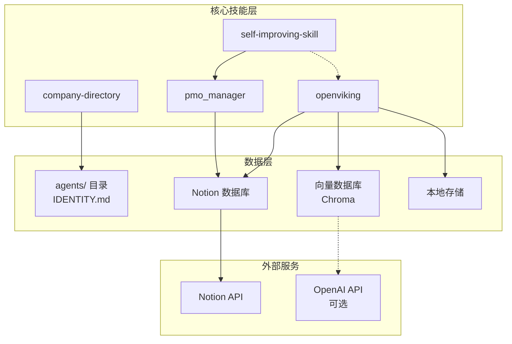
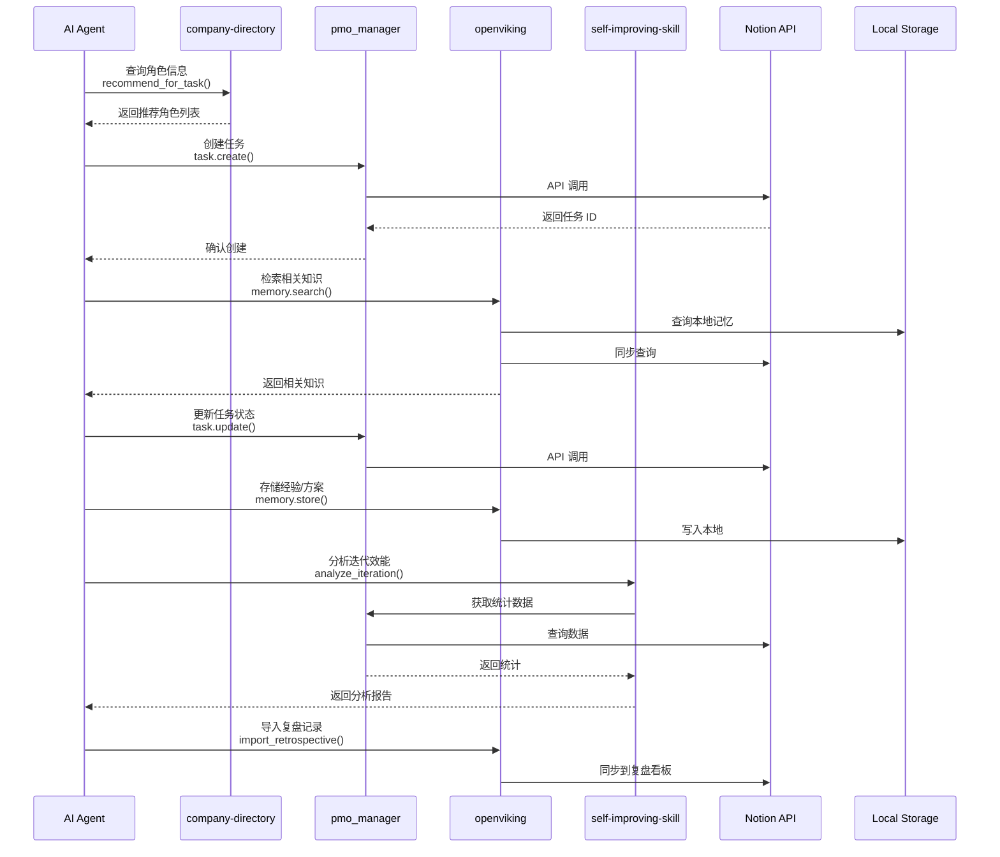
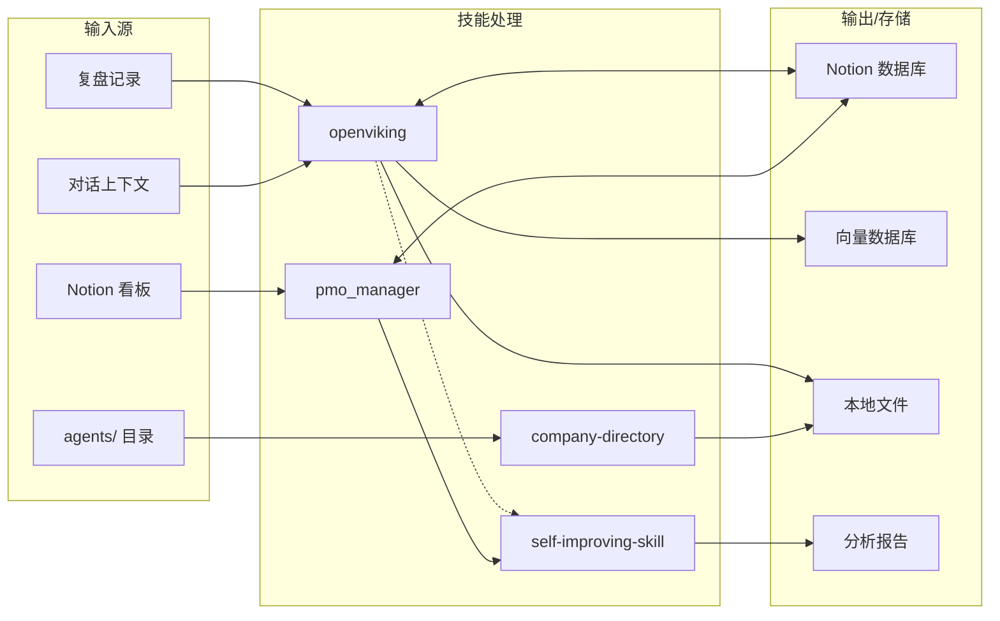

# InfinityCompany 核心技能接入规范

> **文档版本**: v1.0.0  
> **最后更新**: 2026-03-27  
> **维护者**: InfinityCompany Technical Team  
> **适用范围**: InfinityCompany 虚拟研发团队全部 10 个角色

---

## 📋 目录

1. [技能体系概述](#一技能体系概述)
2. [技能总览表](#二技能总览表)
3. [核心技能详细说明](#三核心技能详细说明)
   - 3.1 [company-directory](#31-company-directory)
   - 3.2 [pmo_manager](#32-pmo_manager)
   - 3.3 [openviking](#33-openviking)
   - 3.4 [self-improving-skill](#34-self-improving-skill)
4. [技能协作关系图](#四技能协作关系图)
5. [环境变量总表](#五环境变量总表)
6. [快速开始指南](#六快速开始指南)
7. [扩展开发指南](#七扩展开发指南)
8. [附录](#八附录)

---

## 一、技能体系概述

### 1.1 设计哲学

InfinityCompany 的技能体系遵循 **"能力下沉、场景驱动"** 的设计原则：

- **能力下沉**：将通用能力（知识检索、看板操作、成员查询）沉淀为可复用的技能模块
- **场景驱动**：每个技能都对应明确的业务场景，避免过度设计
- **即插即用**：技能之间松耦合，支持按需启用和组合

### 1.2 架构层级

```
┌─────────────────────────────────────────────────────────────────┐
│                      应用场景层 (Use Cases)                       │
│   跨角色协作 · 任务追踪 · 知识检索 · 效能复盘 · 新人入职引导        │
├─────────────────────────────────────────────────────────────────┤
│                      核心技能层 (Core Skills)                     │
│  ┌──────────────┐  ┌──────────────┐  ┌──────────────┐           │
│  │   company    │  │   pmo_       │  │   openviking │  ┌──────┐ │
│  │  -directory  │  │  manager     │  │              │  │ self │ │
│  └──────────────┘  └──────────────┘  └──────────────┘  │ -imp │ │
│                                                        └──────┘ │
├─────────────────────────────────────────────────────────────────┤
│                      数据/服务层 (Data & APIs)                    │
│    Notion API    │   Local Storage   │   Vector DB   │   Git    │
└─────────────────────────────────────────────────────────────────┘
```

### 1.3 与角色体系的关系

InfinityCompany 有 10 个虚拟角色，每个角色按需接入技能：

| 角色 | 主要职责 | 核心技能组合 |
|------|---------|-------------|
| **萧何 (xiaohe)** | CTO/技术决策 | company-directory + openviking + self-improving-skill |
| **张良 (zhangliang)** | 产品经理 | company-directory + pmo_manager + openviking |
| **韩信 (hanxin)** | 架构师 | company-directory + openviking |
| **曹参 (caocan)** | PMO | **pmo_manager** + company-directory + openviking + self-improving-skill |
| **陈平 (chenping)** | 开发工程师 | company-directory + openviking |
| **陆贾 (lujia)** | 知识管理/QA | **openviking** + company-directory |
| **叔孙通 (shusuntong)** | 设计师 | company-directory |
| **夏侯婴 (xiahouying)** | DevOps | company-directory + openviking |
| **周勃 (zhoubo)** | 外部助手 | company-directory (有限访问) |
| **李斯一 (lishiyi)** | 个人助手 | company-directory + openviking |

---

## 二、技能总览表

| 技能名称 | 功能定位 | 使用场景 | 主要角色 | 数据依赖 | 外部依赖 |
|---------|---------|---------|---------|---------|---------|
| **company-directory** | 公司成员目录查询 | 角色信息检索、汇报关系查询、联系方式获取 | 全体成员 | `agents/*/IDENTITY.md` | 无 |
| **pmo_manager** | PMO 看板管理 | Notion 看板操作、任务创建与更新、迭代管理 | 曹参(PMO) 为主 | Notion 数据库 | Notion API |
| **openviking** | 知识库与记忆增强 | 知识检索、记忆沉淀、向量搜索 | 陆贾、全体成员 | Notion + 本地向量库 | Notion API, OpenAI API(可选) |
| **self-improving-skill** | 自我改进与效能分析 | 提示词优化、流程迭代建议、效能分析 | 曹参、萧何 | 迭代统计数据 | 无 |

### 2.1 功能对比矩阵

| 功能维度 | company-directory | pmo_manager | openviking | self-improving-skill |
|---------|------------------:|------------:|-----------:|-------------------:|
| 成员信息查询 | ✅ 核心 | ❌ | ⚠️ 有限 | ❌ |
| 看板操作 | ❌ | ✅ 核心 | ⚠️ 只读 | ❌ |
| 知识检索 | ❌ | ❌ | ✅ 核心 | ⚠️ 辅助 |
| 记忆存储 | ❌ | ❌ | ✅ 核心 | ❌ |
| 效能分析 | ❌ | ⚠️ 数据 | ⚠️ 数据 | ✅ 核心 |
| 离线可用 | ✅ | ❌ | ✅ 部分 | ✅ |

### 2.2 使用频率建议

| 技能 | 高频使用场景 | 建议使用频率 |
|------|-------------|-------------|
| company-directory | 新成员了解团队、跨角色协作 | 按需使用 |
| pmo_manager | 每日任务更新、迭代规划 | 每日多次 |
| openviking | 技术方案查询、历史决策追溯 | 每日数次 |
| self-improving-skill | 迭代复盘、流程优化建议 | 每周/每迭代一次 |

---

## 三、核心技能详细说明

---

### 3.1 company-directory

#### 3.1.1 功能描述

公司成员目录查询技能，提供 InfinityCompany 10 个虚拟角色的统一信息入口。

**核心功能**：
- 角色信息检索（职责、技能、工作风格）
- 汇报关系查询（组织架构图）
- 联系方式获取（Slack ID、邮箱模板）
- 角色匹配推荐（根据任务类型推荐对接人）

#### 3.1.2 使用场景与示例

**场景 1：新成员了解团队结构**
```bash
# 查询所有角色列表
company-directory list

# 查看特定角色详情
company-directory show 萧何

# 按职责筛选角色
company-directory search --role "架构"
```

**场景 2：跨角色协作时查找对接人**
```bash
# 根据任务类型推荐对接人
company-directory recommend --task "数据库设计评审"
# 输出: 推荐角色: 韩信(架构师), 匹配度: 95%

# 查询汇报关系
company-directory org-chart --depth 2
```

**场景 3：查询角色职责范围**
```bash
# 查询角色的决策权限
company-directory permissions 曹参

# 对比两个角色的职责边界
company-directory compare 张良 萧何
```

#### 3.1.3 适用角色

| 角色 | 使用方式 | 典型场景 |
|------|---------|---------|
| 全体成员 | 查询他人信息 | 协作前了解对方背景 |
| PMO (曹参) | 组织架构管理 | 项目资源协调 |
| 新成员 | 学习团队结构 | 入职熟悉期 |

#### 3.1.4 安装说明

**前置要求**：
- Python 3.9+
- 无需外部 API Key

**安装步骤**：

```bash
# 1. 克隆技能代码（如独立仓库）
git clone https://github.com/infinitycompany/company-directory.git

# 2. 安装依赖
pip install -e .

# 3. 验证安装
company-directory --version
# 预期输出: company-directory v1.0.0
```

**本地数据源配置**：

确保 `agents/` 目录结构完整：
```
InfinityCompany/
├── agents/
│   ├── caocan/
│   │   ├── IDENTITY.md      # 角色身份信息
│   │   └── AGENTS.md        # 角色配置文件
│   ├── hanxin/
│   │   ├── IDENTITY.md
│   │   └── AGENTS.md
│   └── ... (共10个角色)
```

#### 3.1.5 配置参数说明

```yaml
# config/company-directory.yaml
skill:
  name: "company-directory"
  version: "1.0.0"
  
data_source:
  # 角色信息目录
  agents_path: "./agents"
  
  # 支持的身份文件
  identity_files:
    - "IDENTITY.md"
    - "AGENTS.md"
  
  # 自动重载间隔（秒），0 表示禁用
  auto_reload_interval: 300

features:
  # 启用角色匹配推荐
  role_recommendation: true
  
  # 启用组织架构图生成
  org_chart_generation: true
  
  # 模糊搜索阈值 (0-1)
  fuzzy_match_threshold: 0.6

output:
  # 默认输出格式: text, json, markdown
  default_format: "text"
  
  # 是否包含联系方式
  include_contact: true
  
  # 是否包含工作风格
  include_work_style: true
```

#### 3.1.6 依赖清单

| 类型 | 依赖项 | 版本要求 | 说明 |
|------|-------|---------|------|
| 系统依赖 | Python | 3.9+ | 运行环境 |
| Python 库 | click | >=8.0.0 | CLI 框架 |
| Python 库 | pyyaml | >=6.0 | YAML 解析 |
| Python 库 | thefuzz | >=0.20.0 | 模糊匹配（可选） |
| 外部服务 | 无 | - | 纯本地技能 |

#### 3.1.7 使用方法

**命令行接口**：

```bash
# 基础命令
company-directory <command> [options]

# 可用命令
list                # 列出所有角色
show <name>         # 查看角色详情
search <keyword>    # 按关键词搜索
recommend --task    # 任务角色推荐
org-chart           # 生成组织架构图
compare <n1> <n2>   # 对比两个角色
```

**Python API**：

```python
from company_directory import DirectoryClient

# 初始化客户端
client = DirectoryClient(agents_path="./agents")

# 查询角色信息
role = client.get_role("韩信")
print(role.name)           # "韩信"
print(role.title)          # "架构师"
print(role.responsibilities)

# 搜索角色
results = client.search("前端", fuzzy=True)

# 获取组织架构
org_chart = client.get_org_chart()

# 任务推荐
recommendations = client.recommend_for_task("API 设计评审")
```

**Agent 集成示例**：

```python
# 在 Agent 中使用
from skills import company_directory

def handle_collaboration_request(task_description):
    # 查询推荐对接人
    candidates = company_directory.recommend(task=task_description)
    
    # 获取首选角色的联系方式
    primary = candidates[0]
    contact = company_directory.get_contact(primary.name)
    
    return {
        "recommended": primary.name,
        "title": primary.title,
        "contact": contact.slack_id
    }
```

#### 3.1.8 故障排查

| 问题 | 可能原因 | 解决方案 |
|------|---------|---------|
| 角色信息加载失败 | agents/ 目录不存在 | 检查目录路径配置 |
| 搜索无结果 | IDENTITY.md 格式变更 | 更新解析器规则 |
| 组织架构图错误 | 汇报关系未定义 | 检查 AGENTS.md 中的 reports_to 字段 |
| 模糊匹配不准确 | 阈值设置不当 | 调整 fuzzy_match_threshold |

**调试命令**：
```bash
# 验证数据源完整性
company-directory doctor

# 查看加载的角色数量
company-directory stats

# 重新加载数据
company-directory reload --verbose
```

---

### 3.2 pmo_manager

#### 3.2.1 功能描述

PMO 看板管理技能，提供对 Notion 看板的高级操作能力，支持 InfinityCompany 的全部 5 个看板类型。

**核心功能**：
- 看板数据查询与过滤
- 任务创建、更新、状态流转
- 迭代规划与进度追踪
- Token 开销与工时统计
- 自动化工作流触发

#### 3.2.2 使用场景与示例

**场景 1：曹参(PMO)日常使用**
```bash
# 创建新迭代
pmo_manager iteration create \
  --name "Sprint 15" \
  --start 2026-03-28 \
  --end 2026-04-03 \
  --goal "完成用户认证模块"

# 查看迭代统计
pmo_manager iteration status --current
# 输出: 完成率 65%, 剩余 Token 预算 45K
```

**场景 2：各角色更新任务状态**
```bash
# 更新任务状态（自动触发状态流转校验）
pmo_manager task update TASK-123 \
  --status "已完成" \
  --actual-hours 6.5 \
  --actual-tokens 12500

# 批量更新（从每日复盘）
pmo_manager task batch-update --from-review ./daily_review.md
```

**场景 3：迭代规划与复盘**
```bash
# 生成迭代报告
pmo_manager report iteration --name "Sprint 14" \
  --format markdown \
  --output ./reports/sprint14.md

# 导出复盘数据
pmo_manager export retrospective \
  --iteration "Sprint 14" \
  --format json
```

#### 3.2.3 适用角色

| 角色 | 使用方式 | 权限级别 |
|------|---------|---------|
| **曹参 (PMO)** | 全功能使用 | Admin |
| 张良 (PM) | 需求看板操作 | Write |
| 全体成员 | 查询、更新自己的任务 | Read + Limited Write |

#### 3.2.4 安装说明

**前置要求**：
- Python 3.9+
- Notion Integration（Internal 类型）
- Notion API Key

**安装步骤**：

```bash
# 1. 安装技能包
pip install pmo-manager-skill

# 2. 初始化配置目录
pmo_manager init

# 3. 配置 Notion API Key
pmo_manager config set notion.api_key "ntn_your_api_key_here"

# 4. 配置数据库 ID
pmo_manager config set notion.databases.iteration "your_database_id"

# 5. 验证连接
pmo_manager doctor
```

**Notion Integration 设置**：

1. 访问 https://www.notion.so/my-integrations
2. 创建 Integration：
   - Name: `PMO Manager`
   - Type: Internal
3. 权限配置：
   - Read content ✅
   - Insert content ✅
   - Update content ✅
4. 将 Integration 关联到以下数据库：
   - 外部需求看板
   - 需求看板 (Story)
   - 需求看板 (Task)
   - 迭代看板
   - Bug 看板
   - 每日复盘

#### 3.2.5 配置参数说明

```yaml
# config/pmo_manager.yaml
skill:
  name: "pmo_manager"
  version: "1.0.0"

notion:
  # API Key [REQUIRED]
  api_key: "${NOTION_API_KEY}"
  
  # 数据库 ID 映射 [REQUIRED]
  databases:
    external_requirements: ""  # 外部需求看板
    story: ""                  # 需求看板 - Story
    task: ""                   # 需求看板 - Task
    iteration: ""              # 迭代看板
    bug: ""                    # Bug 看板
    retrospective: ""          # 每日复盘
  
  # 同步配置
  sync:
    interval_minutes: 60
    batch_size: 100
    retry_attempts: 3

# Token 预算配置
budget:
  # 默认 Token 预算 (K tokens)
  default_task_budget: 10
  
  # 告警阈值
  warning_threshold: 0.8    # 80% 预算时警告
  critical_threshold: 1.0   # 100% 预算时告警
  
  # 成本计算 (元/K tokens)
  cost_input: 0.003
  cost_output: 0.006

# 工时追踪
time_tracking:
  # 每日工时上限（小时）
  daily_limit: 8
  
  # 中断时间记录
  track_interruptions: true
  
  # 准时率计算
  punctuality_threshold: 0.8  # 80% 视为准时

# 状态流转规则
workflow:
  # 是否启用严格状态校验
  strict_state_validation: true
  
  # 自动触发规则
  auto_rules:
    - trigger: "task_completed"
      action: "notify_reviewer"
    - trigger: "bug_verified"
      action: "close_related_task"
```

#### 3.2.6 依赖清单

| 类型 | 依赖项 | 版本要求 | 说明 |
|------|-------|---------|------|
| 系统依赖 | Python | 3.9+ | 运行环境 |
| Python 库 | notion-client | >=2.0.0 | Notion API 客户端 |
| Python 库 | click | >=8.0.0 | CLI 框架 |
| Python 库 | pyyaml | >=6.0 | YAML 解析 |
| Python 库 | python-dateutil | >=2.8.0 | 日期处理 |
| 外部服务 | Notion API | - | 必需 |
| 环境变量 | NOTION_API_KEY | - | API 认证 |

#### 3.2.7 使用方法

**命令行接口**：

```bash
# 迭代管理
pmo_manager iteration create|list|update|close
pmo_manager iteration status [--current|--name <name>]

# 任务管理
pmo_manager task create|get|update|delete
pmo_manager task list [--status <s>] [--assignee <a>] [--iteration <i>]

# Bug 管理
pmo_manager bug create|get|update
pmo_manager bug list [--severity <s>] [--status <s>]

# 统计与报告
pmo_manager stats [--iteration <i>]
pmo_manager report iteration|daily|burndown

# 同步操作
pmo_manager sync [--full] [--database <name>]
```

**Python API**：

```python
from pmo_manager import PMOManager

# 初始化
pmo = PMOManager()

# 创建任务
task = pmo.task.create(
    title="实现用户登录接口",
    story_id="STORY-456",
    assignee="陈平",
    estimated_hours=8,
    estimated_tokens=15000
)

# 更新状态
pmo.task.update_status(
    task_id=task.id,
    new_status="进行中",
    actual_tokens=5000
)

# 获取迭代统计
stats = pmo.iteration.get_stats("Sprint 15")
print(f"完成率: {stats.completion_rate}%")
print(f"Token 使用率: {stats.token_usage}%")

# 生成报告
report = pmo.report.generate_iteration_report("Sprint 15")
```

#### 3.2.8 故障排查

| 问题 | 可能原因 | 解决方案 |
|------|---------|---------|
| API 401 错误 | API Key 无效 | 检查 NOTION_API_KEY |
| 数据库 404 | ID 错误或 Integration 未关联 | 验证数据库 ID 和 Integration 连接 |
| 状态流转失败 | 违反状态机规则 | 查看 relation_rules.md 中的状态定义 |
| 同步超时 | 数据量过大 | 减小 batch_size 或增加超时时间 |
| Token 计算错误 | 汇率配置错误 | 检查 cost_input/cost_output 配置 |

**诊断命令**：
```bash
# 完整诊断
pmo_manager doctor --verbose

# 测试 Notion 连接
pmo_manager notion test-connection

# 列出可访问的数据库
pmo_manager notion list-databases

# 查看最近错误日志
pmo_manager logs --tail 50
```

---

### 3.3 openviking

#### 3.3.1 功能描述

知识库与记忆增强技能，为 AI Agent 提供长期记忆存储与语义检索能力。

**设计理念**：Notion 为主（看板状态、任务进度），OpenViking 为辅（历史上下文、决策依据、技术方案）。

**核心功能**：
- 知识检索（全文搜索 + 语义搜索）
- 记忆沉淀（决策、方案、Bug 分析自动入库）
- 向量搜索（相似内容推荐）
- 上下文增强（对话历史关联）
- 与 Notion 双向同步

#### 3.3.2 使用场景与示例

**场景 1：技术方案查询**
```bash
# 语义搜索相关技术方案
openviking search "微服务拆分策略" --semantic --limit 5

# 查看具体方案详情
openviking get MEMORY-2026-001234
```

**场景 2：历史决策追溯**
```bash
# 查询特定主题的决策记录
openviking search --category decision "数据库选型"

# 查看决策上下文
openviking context --decision-id DEC-2026-0056
```

**场景 3：Bug 根因分析检索**
```bash
# 搜索相似 Bug
openviking search --category bug_analysis "并发写入冲突"

# 查看关联的修复方案
openviking related --memory-id BUG-2026-0089
```

**场景 4：复盘经验复用**
```bash
# 导入复盘记录
openviking import --category retrospective ./sprint14_review.md

# 搜索历史复盘中的改进项
openviking search --category retrospective "改进项" --tag "流程优化"
```

#### 3.3.3 适用角色

| 角色 | 使用场景 | 权限 |
|------|---------|------|
| **陆贾 (知识管理)** | 知识库维护、记忆审核 | 全部权限 |
| 萧何 (CTO) | 决策记录、技术方案 | 读+写决策/方案 |
| 韩信 (架构师) | 技术方案沉淀 | 读+写技术方案 |
| 陈平 (开发) | Bug 分析、上下文 | 读技术方案，写 Bug 分析 |
| 全体成员 | 知识检索、上下文获取 | 读取权限 |

#### 3.3.4 安装说明

详细安装说明请参考：`skills/openviking/INSTALL.md`

**快速安装**：

```bash
# 1. 创建虚拟环境
python -m venv venv
source venv/bin/activate

# 2. 安装依赖
pip install notion-client>=2.0.0
pip install pyyaml>=6.0
pip install schedule>=1.2.0
pip install chromadb>=0.4.0  # 可选，用于向量搜索

# 3. 配置文件初始化
mkdir -p ~/.config/openviking
cp skills/openviking/config.template.yaml ~/.config/openviking/config.yaml

# 4. 编辑配置文件
# 填写 NOTION_API_KEY 和数据库 ID

# 5. 验证安装
openviking doctor
```

**配置模板参考**：`skills/openviking/config.template.yaml`

#### 3.3.5 配置参数说明

```yaml
# ~/.config/openviking/config.yaml

notion:
  api_key: "${NOTION_API_KEY}"
  databases:
    external_requirements: ""
    requirements: ""
    iteration: ""
    bug_tracking: ""
    retrospective: ""
  sync:
    enabled: true
    interval_minutes: 60
    direction: "bidirectional"
    conflict_resolution: "notion_wins"

storage:
  local_path: "./data/openviking"
  vector_db:
    enabled: false  # 设为 true 启用语义搜索
    provider: "chroma"
    dimension: 1536

memory:
  categories:
    - name: "decision"
      description: "重要决策及其依据"
    - name: "tech_design"
      description: "技术设计和架构方案"
    - name: "bug_analysis"
      description: "Bug 根因分析和解决方案"
    - name: "retrospective"
      description: "团队复盘会议记录"
    - name: "context"
      description: "会话和任务上下文"
    - name: "meeting"
      description: "重要会议记录"
    - name: "research"
      description: "技术调研和分析报告"
  retention:
    default_days: 90
    categories:
      decision: 365
      tech_design: 180
      bug_analysis: 365

agents:
  enabled_roles:
    - pmo
    - architect
    - developer
    - devops
    - qa
    - designer
    - pm
    - knowledge_manager
    - external_assistant
    - personal_assistant
  permissions:
    knowledge_manager:
      read_categories: ["*"]
      write_categories: ["*"]
```

#### 3.3.6 依赖清单

| 类型 | 依赖项 | 版本要求 | 必需 |
|------|-------|---------|------|
| 系统依赖 | Python | 3.9+ | ✅ |
| 系统依赖 | 内存 | 2GB+ (4GB 推荐) | ✅ |
| Python 库 | notion-client | >=2.0.0 | ✅ |
| Python 库 | pyyaml | >=6.0 | ✅ |
| Python 库 | schedule | >=1.2.0 | ✅ |
| Python 库 | python-dotenv | >=1.0.0 | ✅ |
| Python 库 | click | >=8.0.0 | ✅ |
| Python 库 | chromadb | >=0.4.0 | ❌ 向量搜索 |
| Python 库 | openai | >=1.0.0 | ❌ Embedding |
| 外部服务 | Notion API | - | ✅ |
| 外部服务 | OpenAI API | - | ❌ 向量搜索 |
| 环境变量 | NOTION_API_KEY | - | ✅ |

#### 3.3.7 使用方法

**命令行接口**：

```bash
# 记忆存储
openviking memory store \
  --category tech_design \
  --title "微服务拆分方案" \
  --content "..."

# 搜索记忆
openviking memory search "关键词" \
  [--semantic] \
  [--category <cat>] \
  [--limit 10]

# 列出记忆
openviking memory list \
  --category bug_analysis \
  --since 2026-03-01

# 同步操作
openviking sync [--full] [--database <name>]

# 备份与恢复
openviking backup create
openviking backup restore <name>

# 诊断检查
openviking doctor
```

**Python API**：

```python
from openviking import OpenVikingClient

# 初始化客户端
client = OpenVikingClient()

# 存储记忆
memory_id = client.memory.store(
    category="tech_design",
    title="API Gateway 选型",
    content="经过对比，选择 Kong 作为 API Gateway...",
    tags=["架构", "网关"],
    metadata={
        "author": "韩信",
        "related_task": "TASK-123"
    }
)

# 语义搜索
results = client.memory.search(
    query="网关如何选型",
    semantic=True,
    limit=5
)

# 获取相关记忆
related = client.memory.get_related(memory_id, limit=3)

# 检索增强生成（RAG）
context = client.rag.retrieve(
    query="如何处理高并发",
    categories=["tech_design", "bug_analysis"],
    max_tokens=2000
)
```

**Agent 集成示例**：

```python
# 在 Agent 中使用 OpenViking
from skills import openviking

def make_decision(topic, options):
    # 检索相关历史决策
    context = openviking.search(
        query=topic,
        category="decision",
        semantic=True
    )
    
    # 检索技术方案
    designs = openviking.search(
        query=topic,
        category="tech_design"
    )
    
    # 结合上下文做出决策
    decision = analyze_and_decide(topic, options, context + designs)
    
    # 记录决策
    openviking.memory.store(
        category="decision",
        title=f"关于 {topic} 的决策",
        content=decision,
        tags=["决策", topic]
    )
    
    return decision
```

#### 3.3.8 故障排查

| 问题 | 可能原因 | 解决方案 |
|------|---------|---------|
| API 401 | API Key 错误 | 检查 NOTION_API_KEY |
| 数据库 404 | Integration 未关联 | 在 Notion 中添加到 connections |
| 向量搜索无结果 | 未启用向量 DB | 设置 vector_db.enabled=true |
| 同步失败 | 网络问题/数据冲突 | 检查日志，执行 openviking sync --force |
| 存储空间不足 | 备份/向量数据过大 | 执行 openviking storage cleanup |

**详细故障排查**：参考 `skills/openviking/INSTALL.md` 第 6 节

---

### 3.4 self-improving-skill

#### 3.4.1 功能描述

自我改进技能，支持团队提示词优化、流程迭代建议和效能分析。

**核心功能**：
- 提示词效果分析
- 流程瓶颈识别
- 效能指标计算
- 改进建议生成
- 迭代质量评估

#### 3.4.2 使用场景与示例

**场景 1：定期复盘时分析团队效能**
```bash
# 分析迭代效能
self-improving-skill analyze iteration \
  --name "Sprint 14" \
  --metrics completion_rate,token_efficiency,bug_rate \
  --output ./analysis/sprint14.md

# 对比多个迭代趋势
self-improving-skill trend \
  --iterations "Sprint 12,Sprint 13,Sprint 14" \
  --metric token_efficiency
```

**场景 2：识别流程瓶颈**
```bash
# 分析任务流转时间
self-improving-skill bottleneck analyze \
  --iteration "Sprint 14" \
  --stage-flow "待办→进行中→已完成→已验收"

# 识别常见阻塞原因
self-improving-skill bottleneck causes \
  --since 2026-03-01
```

**场景 3：提出改进建议**
```bash
# 生成改进建议
self-improving-skill suggest improvements \
  --based-on "Sprint 14" \
  --focus "token_efficiency,review_time" \
  --output ./improvements.md

# 评估建议可行性
self-improving-skill evaluate --suggestions ./improvements.md
```

#### 3.4.3 适用角色

| 角色 | 使用方式 | 典型场景 |
|------|---------|---------|
| **曹参 (PMO)** | 全面使用 | 迭代复盘、流程优化 |
| **萧何 (CTO)** | 战略层面 | 团队效能趋势分析 |
| 各角色 Leader | 查看报告 | 了解团队改进建议 |

#### 3.4.4 安装说明

**前置要求**：
- Python 3.9+
- pmo_manager 技能（用于数据获取）
- openviking 技能（可选，用于历史对比）

**安装步骤**：

```bash
# 1. 安装技能包
pip install self-improving-skill

# 2. 初始化配置
self-improving-skill init

# 3. 配置数据源
self-improving-skill config set data_source pmo_manager

# 4. 验证
self-improving-skill doctor
```

#### 3.4.5 配置参数说明

```yaml
# config/self_improving.yaml
skill:
  name: "self-improving-skill"
  version: "1.0.0"

# 数据源配置
data_source:
  # 主数据源：pmo_manager 或 notion
  primary: "pmo_manager"
  
  # 缓存配置
  cache_ttl_minutes: 30

# 效能指标定义
metrics:
  # 任务完成率
  completion_rate:
    target: 0.85      # 目标 85%
    warning: 0.70     # 警告阈值 70%
    critical: 0.50    # 严重阈值 50%
  
  # Token 效率 (任务价值 / Token 成本)
  token_efficiency:
    target: 1.0
    unit: "value_per_1k_tokens"
  
  # 准时率
  on_time_rate:
    target: 0.80
  
  # Bug 率 (Bug 数 / 任务数)
  bug_rate:
    target: 0.10      # 目标 < 10%
    warning: 0.20
    critical: 0.30
  
  # 平均修复时间 (小时)
  mttr:
    target: 4
    warning: 8
    critical: 24

# 分析配置
analysis:
  # 趋势分析迭代数
  trend_lookback: 3
  
  # 瓶颈识别阈值（小时）
  bottleneck_threshold_hours: 24
  
  # 改进建议生成
  suggestions:
    max_count: 5
    min_confidence: 0.7

# 输出配置
output:
  default_format: "markdown"
  include_charts: true
  chart_format: "svg"
```

#### 3.4.6 依赖清单

| 类型 | 依赖项 | 版本要求 | 说明 |
|------|-------|---------|------|
| 系统依赖 | Python | 3.9+ | 运行环境 |
| Python 库 | click | >=8.0.0 | CLI 框架 |
| Python 库 | pyyaml | >=6.0 | YAML 解析 |
| Python 库 | pandas | >=2.0.0 | 数据分析 |
| Python 库 | matplotlib | >=3.7.0 | 图表生成（可选） |
| 技能依赖 | pmo_manager | >=1.0.0 | 数据获取 |
| 技能依赖 | openviking | >=1.0.0 | 历史分析（可选） |

#### 3.4.7 使用方法

**命令行接口**：

```bash
# 迭代分析
self-improving-skill analyze iteration \
  --name <iteration_name> \
  [--metrics <list>] \
  [--compare-with <prev_iteration>]

# 趋势分析
self-improving-skill trend \
  --iterations <list> \
  --metric <metric_name>

# 瓶颈分析
self-improving-skill bottleneck analyze \
  [--iteration <name>] \
  [--since <date>]

# 生成改进建议
self-improving-skill suggest \
  [--based-on <iteration>] \
  [--focus <areas>]

# 生成报告
self-improving-skill report generate \
  --type <iteration|trend|comprehensive> \
  --output <path>
```

**Python API**：

```python
from self_improving_skill import SelfImprovingAnalyzer

# 初始化分析器
analyzer = SelfImprovingAnalyzer()

# 分析单个迭代
analysis = analyzer.analyze_iteration("Sprint 14")
print(f"完成率: {analysis.completion_rate}")
print(f"质量评级: {analysis.quality_rating}")  # 🟢🟡🟠🔴

# 趋势分析
trend = analyzer.analyze_trend(
    iterations=["Sprint 12", "Sprint 13", "Sprint 14"],
    metric="token_efficiency"
)

# 生成改进建议
suggestions = analyzer.suggest_improvements(
    iteration="Sprint 14",
    focus_areas=["token_efficiency", "review_time"]
)
for s in suggestions:
    print(f"[{s.confidence:.0%}] {s.description}")

# 生成综合报告
report = analyzer.generate_comprehensive_report(
    iteration="Sprint 14",
    include_recommendations=True
)
```

#### 3.4.8 故障排查

| 问题 | 可能原因 | 解决方案 |
|------|---------|---------|
| 数据获取失败 | pmo_manager 未配置 | 检查 pmo_manager 配置 |
| 指标计算错误 | 数据不完整 | 检查看板数据是否完整填写 |
| 建议质量低 | 历史数据不足 | 积累至少 3 个迭代数据 |
| 图表生成失败 | matplotlib 未安装 | pip install matplotlib |

---

## 四、技能协作关系图

### 4.1 技能依赖图



### 4.2 技能协作流程



### 4.3 数据流向图



---

## 五、环境变量总表

### 5.1 必需环境变量

| 变量名 | 技能 | 说明 | 示例值 |
|--------|------|------|--------|
| `NOTION_API_KEY` | pmo_manager, openviking | Notion Integration Token | `ntn_xxxxxxxxxxxxxxxx` |

### 5.2 可选环境变量

| 变量名 | 技能 | 说明 | 默认值 |
|--------|------|------|--------|
| `OPENVIKING_CONFIG` | openviking | 配置文件路径 | `~/.config/openviking/config.yaml` |
| `OPENVIKING_DEBUG` | openviking | 调试模式 | `false` |
| `OPENVIKING_LOG_LEVEL` | openviking | 日志级别 | `INFO` |
| `OPENAI_API_KEY` | openviking | OpenAI API Key（向量搜索） | - |
| `PMO_MANAGER_CONFIG` | pmo_manager | 配置文件路径 | `~/.config/pmo_manager/config.yaml` |
| `COMPANY_DIRECTORY_PATH` | company-directory | agents 目录路径 | `./agents` |
| `SELF_IMPROVING_CONFIG` | self-improving-skill | 配置文件路径 | `~/.config/self_improving/config.yaml` |

### 5.3 环境变量配置示例

```bash
# ~/.bashrc 或 ~/.zshrc

# ===== Notion API =====
export NOTION_API_KEY="<YOUR_NOTION_API_KEY>"

# ===== OpenViking =====
export OPENVIKING_CONFIG="$HOME/.config/openviking/config.yaml"
export OPENVIKING_LOG_LEVEL="INFO"

# 如需启用向量搜索
export OPENAI_API_KEY="sk-xxxxxxxxxxxxxxxx"

# ===== PMO Manager =====
export PMO_MANAGER_CONFIG="$HOME/.config/pmo_manager/config.yaml"

# ===== Company Directory =====
export COMPANY_DIRECTORY_PATH="/path/to/InfinityCompany/agents"
```

### 5.4 Docker 环境变量

```yaml
# docker-compose.yml
services:
  infinitycompany:
    environment:
      - NOTION_API_KEY=${NOTION_API_KEY}
      - OPENVIKING_CONFIG=/app/config/openviking.yaml
      - OPENVIKING_LOG_LEVEL=INFO
      - OPENAI_API_KEY=${OPENAI_API_KEY}
    volumes:
      - ./config:/app/config
      - ./data:/app/data
```

---

## 六、快速开始指南

### 6.1 首次安装（5分钟）

```bash
# 1. 克隆项目
git clone https://github.com/infinitycompany/InfinityCompany.git
cd InfinityCompany

# 2. 创建虚拟环境
python -m venv venv
source venv/bin/activate  # Linux/macOS
# 或: venv\Scripts\activate  # Windows

# 3. 安装所有技能
pip install -e skills/company-directory
pip install -e skills/pmo_manager
pip install -e skills/openviking
pip install -e skills/self_improving

# 4. 配置环境变量
export NOTION_API_KEY="your_notion_api_key"

# 5. 验证安装
company-directory doctor
pmo_manager doctor
openviking doctor
self-improving-skill doctor
```

### 6.2 快速验证

```bash
# 验证 company-directory
company-directory list
# 应输出 10 个角色

# 验证 pmo_manager
pmo_manager iteration list
# 应显示当前迭代

# 验证 openviking
openviking memory search "测试" --limit 3

# 验证 self-improving-skill
self-improving-skill stats
```

### 6.3 日常操作流程

```bash
# 早上：查看今日任务
pmo_manager task list --assignee "当前角色" --status "待办"

# 工作前：检索相关知识
openviking search "当前任务关键词" --semantic

# 需要协作时：查询角色信息
company-directory recommend --task "当前任务描述"

# 任务完成：更新状态
pmo_manager task update <task_id> --status "已完成" \
  --actual-tokens <tokens> --actual-hours <hours>

# 沉淀经验
openviking memory store --category context \
  --title "任务完成总结" \
  --content "..."

# 迭代结束：复盘分析
self-improving-skill analyze iteration --name "当前迭代"
```

### 6.4 故障速查

| 症状 | 快速修复 |
|------|---------|
| `command not found` | 检查虚拟环境是否激活 |
| `401 Unauthorized` | 检查 NOTION_API_KEY |
| `Database not found` | 确认 Integration 已关联数据库 |
| 数据不同步 | 执行 `pmo_manager sync --force` |
| 向量搜索无结果 | 检查是否启用 vector_db |

---

## 七、扩展开发指南

### 7.1 技能目录结构

```
skills/
├── README.md                 # 本文件
├── SKILL_TEMPLATE.md         # 技能开发模板
├── company-directory/        # 示例技能
│   ├── SKILL.md             # 技能元数据
│   ├── __init__.py
│   ├── cli.py               # 命令行接口
│   ├── client.py            # Python API
│   ├── config.py            # 配置管理
│   ├── parser.py            # 数据解析
│   └── tests/
│       └── test_*.py
├── pmo_manager/
│   └── ...
├── openviking/
│   ├── INSTALL.md
│   ├── config.template.yaml
│   └── ...
└── self_improving/
    └── ...
```

### 7.2 新技能开发步骤

#### 步骤 1：创建技能元数据

```yaml
# skills/my_skill/SKILL.md
---
name: "my-skill"
version: "1.0.0"
description: "技能描述"
author: "你的名字"
tags: ["utility", "automation"]

dependencies:
  system:
    - python: ">=3.9"
  python:
    - click: ">=8.0.0"
    - pyyaml: ">=6.0"
  external:
    - name: "Some API"
      required: false
      url: "https://api.example.com"

config:
  file: "config/my_skill.yaml"
  env_prefix: "MY_SKILL_"

permissions:
  read: ["agents/*"]
  write: ["data/my_skill/*"]

usage:
  cli: "my-skill <command>"
  python: "from skills.my_skill import MySkillClient"
---
```

#### 步骤 2：实现核心类

```python
# skills/my_skill/__init__.py
"""My Skill - 技能描述"""

__version__ = "1.0.0"

from .client import MySkillClient
from .config import Config

__all__ = ["MySkillClient", "Config"]
```

```python
# skills/my_skill/client.py
"""技能客户端"""

from typing import Optional, List, Dict, Any
from .config import Config

class MySkillClient:
    """技能客户端类"""
    
    def __init__(self, config_path: Optional[str] = None):
        self.config = Config.load(config_path)
        self._initialize()
    
    def _initialize(self):
        """初始化连接"""
        pass
    
    def health_check(self) -> Dict[str, Any]:
        """健康检查"""
        return {
            "status": "ok",
            "version": "1.0.0",
            "config_loaded": True
        }
    
    # 实现技能功能...
```

#### 步骤 3：实现 CLI

```python
# skills/my_skill/cli.py
"""命令行接口"""

import click
from .client import MySkillClient

@click.group()
@click.option('--config', '-c', help='配置文件路径')
@click.pass_context
def cli(ctx, config):
    """My Skill CLI"""
    ctx.ensure_object(dict)
    ctx.obj['client'] = MySkillClient(config)

@cli.command()
@click.pass_context
def doctor(ctx):
    """健康检查"""
    client = ctx.obj['client']
    result = client.health_check()
    for key, value in result.items():
        click.echo(f"{key}: {value}")

# 更多命令...

if __name__ == '__main__':
    cli()
```

#### 步骤 4：注册技能

```python
# skills/__init__.py
"""InfinityCompany 技能注册中心"""

from .company_directory import DirectoryClient
from .pmo_manager import PMOManager
from .openviking import OpenVikingClient
from .self_improving import SelfImprovingAnalyzer

# 新技能注册
# from .my_skill import MySkillClient

__all__ = [
    "DirectoryClient",
    "PMOManager", 
    "OpenVikingClient",
    "SelfImprovingAnalyzer",
    # "MySkillClient",
]
```

### 7.3 技能集成规范

#### 7.3.1 配置规范

```yaml
# config/my_skill.yaml

skill:
  name: "my-skill"
  version: "1.0.0"

# 数据路径配置（统一规范）
paths:
  data: "./data/my_skill"
  cache: "./cache/my_skill"
  logs: "./logs/my_skill.log"

# 日志配置（统一规范）
logging:
  level: "INFO"
  format: "%(asctime)s - %(name)s - %(levelname)s - %(message)s"
```

#### 7.3.2 错误处理规范

```python
# skills/my_skill/exceptions.py

class SkillError(Exception):
    """技能基础异常"""
    pass

class ConfigError(SkillError):
    """配置错误"""
    pass

class DataSourceError(SkillError):
    """数据源错误"""
    pass

class APIError(SkillError):
    """API 调用错误"""
    def __init__(self, message, status_code=None, response=None):
        super().__init__(message)
        self.status_code = status_code
        self.response = response
```

#### 7.3.3 测试规范

```python
# skills/my_skill/tests/test_client.py

import pytest
from my_skill import MySkillClient

class TestMySkillClient:
    def setup_method(self):
        self.client = MySkillClient()
    
    def test_health_check(self):
        result = self.client.health_check()
        assert result["status"] == "ok"
    
    def test_config_loading(self):
        # 测试配置加载
        pass
```

### 7.4 技能发布检查清单

- [ ] 已实现核心功能
- [ ] 已编写 SKILL.md 元数据
- [ ] 已实现 CLI 接口
- [ ] 已实现 Python API
- [ ] 已编写单元测试
- [ ] 已实现 `doctor` 健康检查命令
- [ ] 已更新本 README.md 的技能总览表
- [ ] 已添加故障排查章节
- [ ] 已通过代码审查

---

## 八、附录

### 8.1 参考文档索引

| 文档 | 路径 | 说明 |
|------|------|------|
| OpenViking 安装指南 | `skills/openviking/INSTALL.md` | 详细安装步骤 |
| OpenViking 配置模板 | `skills/openviking/config.template.yaml` | 完整配置示例 |
| Notion Schema 定义 | `notion/schema_definition.md` | 看板结构设计 |
| Notion 关联规则 | `notion/relation_rules.md` | 流转约束与自动化 |
| 迭代记录规范 | `notion/iteration_tracking_spec.md` | Token/工时记录 |
| Phase 4 实施报告 | `PHASE4_KNOWLEDGE_BOARD_IMPLEMENTATION_REPORT.md` | 体系架构总览 |

### 8.2 相关角色 ID

| 角色名 | ID | 主要职责 |
|--------|-----|---------|
| 萧何 | xiaohe | CTO/技术决策 |
| 张良 | zhangliang | 产品经理 |
| 韩信 | hanxin | 架构师 |
| 曹参 | caocan | PMO |
| 陈平 | chenping | 开发工程师 |
| 陆贾 | lujia | 知识管理/QA |
| 叔孙通 | shusuntong | 设计师 |
| 夏侯婴 | xiahouying | DevOps |
| 周勃 | zhoubo | 外部助手 |
| 李斯一 | lishiyi | 个人助手 |

### 8.3 版本历史

| 版本 | 日期 | 变更内容 |
|------|------|---------|
| 1.0.0 | 2026-03-27 | 初始版本，包含 4 个核心技能完整规范 |

### 8.4 维护与反馈

- **文档维护**: InfinityCompany Technical Team
- **问题反馈**: 通过 Notion Bug 看板提交
- **更新周期**: 每迭代评审一次

---

**© 2026 InfinityCompany. All rights reserved.**
