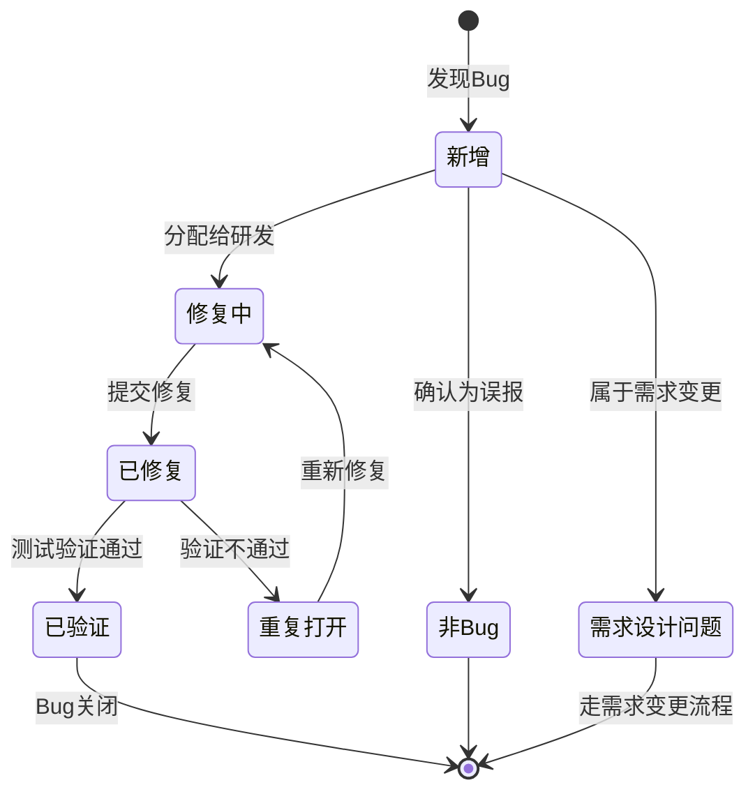

# InfinityCompany 内部交付闭环流程 SOP

> **文档版本**: v1.0  
> **生效日期**: 2026-03-27  
> **文档维护**: 曹参(PMO)  
> **审批**: 张良(产品经理)

---

## 1. 流程概述与目标

### 1.1 流程目标

本流程旨在建立 InfinityCompany 从需求输入到产品上线的完整交付闭环，确保：

- **可追溯性**: 每个需求从诞生到上线全程可追溯
- **质量可控**: 每个环节设置明确的验收标准和评审节点
- **高效协同**: 10 个角色各司其职、无缝协作
- **持续改进**: Bug 回流机制驱动流程和质量持续优化

### 1.2 流程范围

| 包含内容 | 不包含内容 |
|---------|-----------|
| 需求建卡到部署上线的全流程 | 外部商务需求收集（由郦食其负责） |
| Bug 发现到修复的回流处理 | 重大架构重构（需单独发起技术专项） |
| 知识归档与经验沉淀 | 紧急热修复（走快速通道流程） |
| 迭代节奏与看板维护 | |

### 1.3 流程原则

1. **单卡单需求**: 一个看板卡片对应一个独立可交付的需求
2. **状态透明**: 所有卡片状态在看板上实时可见
3. **阻塞即暴露**: 任何阻塞立即在看板上标记并升级
4. **质量内建**: 测试左移，研发自测是提交前置条件

---

## 2. 完整流程图

```mermaid
flowchart TB
    subgraph Phase1["阶段1: 需求建卡"]
        P1_INPUT["老板需求输入"] --> P1_RECOG["夏侯婴识别"] --> P1_CREATE["曹参建卡"]
        P1_CREATE --> P1_STORY["创建 Story 卡片<br/>状态: 待排期"]
    end

    subgraph Phase2["阶段2: 产品定义"]
        P2_START["Story 转入开发中"] --> P2_PRD["张良编写 PRD"]
        P2_PRD --> P2_REVIEW["PRD 评审"] --> P2_ACCEPT["验收通过"]
    end

    subgraph Phase3["阶段3: 设计输出"]
        P3_START["PRD 定稿"] --> P3_DESIGN["叔孙通设计"]
        P3_DESIGN --> P3_DELIVER["交付设计稿"]
        P3_DELIVER --> P3_REVIEW["设计评审"] --> P3_ACCEPT["验收通过"]
    end

    subgraph Phase4["阶段4: 技术拆解"]
        P4_START["设计稿确认"] --> P4_ARCH["萧何等技术拆解"]
        P4_ARCH --> P4_TASK["创建 Task 卡片"]
        P4_TASK --> P4_ESTIMATE["工时/Token 评估"]
    end

    subgraph Phase5["阶段5: 研发实现"]
        P5_START["Task 分配"] --> P5_DEV["韩信开发"]
        P5_DEV --> P5_SELFCHECK["研发自测"]
        P5_SELFCHECK --> P5_COMMIT["代码提交/MR"]
        P5_COMMIT --> P5_REVIEW["Code Review"]
    end

    subgraph Phase6["阶段6: 测试验证"]
        P6_START["Task 转测试中"] --> P6_CASE["陈平设计用例"]
        P6_CASE --> P6_EXEC["执行测试"]
        P6_EXEC --> P6_PASS{"测试通过?"}
        P6_PASS -->|是| P6_DONE["Task 完成"]
        P6_PASS -->|否| P6_BUG["提交 Bug"]
    end

    subgraph Phase7["阶段7: 产品验收"]
        P7_START["Story 转验收"] --> P7_UAT["张良验收"]
        P7_UAT --> P7_PASS{"验收通过?"}
        P7_PASS -->|是| P7_DONE["Story 完成"]
        P7_PASS -->|否| P7_REOPEN["退回修复"]
    end

    subgraph Phase8["阶段8: 部署附着"]
        P8_START["发布窗口"] --> P8_DEPLOY["周勃部署"]
        P8_DEPLOY --> P8_VERIFY["线上验证"]
        P8_VERIFY --> P8_DONE["Story 已发布"]
    end

    subgraph Phase9["阶段9: 知识归档"]
        P9_START["发布后 2 天内"] --> P9_ARCHIVE["陆贾归档"]
        P9_ARCHIVE --> P9_DONE["知识沉淀"]
    end

    P1_STORY --> P2_START
    P2_ACCEPT --> P3_START
    P3_ACCEPT --> P4_START
    P4_ESTIMATE --> P5_START
    P5_REVIEW -->|通过| P6_START
    P6_DONE --> P7_START
    P7_DONE --> P8_START
    P8_DONE --> P9_START

    P6_BUG -.->|Bug修复| P5_START
    P7_REOPEN -.->|重新开发| P5_START
```



---

## 3. 各阶段详细说明

### 3.1 阶段1: 需求建卡

**负责人**: 曹参(PMO)  
**配合人**: 夏侯婴(私人助理)

#### 输入
- 老板口头/书面需求
- 邮件/会议纪要
- 外部市场反馈（经郦食其整理）

#### 输出
- Story 卡片（Notion 需求看板）
- 需求分类标签

#### 执行步骤

| 步骤 | 动作 | 输出物 | 时限 |
|-----|------|--------|-----|
| 1.1 | 夏侯婴识别需求来源与紧急程度 | 需求初筛记录 | 需求到达后 2h |
| 1.2 | 曹参确认需求完整性与可行性 | 可行性判断 | 收到后 4h |
| 1.3 | 曹参在 Story 看板创建卡片 | Story Card | 确认后 2h |
| 1.4 | 曹参设定优先级与迭代关联 | 优先级标签 | 建卡时 |

#### Story 卡片规范

```yaml
标题: [模块] 一句话描述需求
描述: |
  ## 背景
  
  ## 目标
  
  ## 验收标准
  - [ ] 标准1
  - [ ] 标准2
  
优先级: P0/P1/P2/P3
状态: 待排期
负责人: 待分配
迭代关联: 待规划
创建时间: YYYY-MM-DD
来源: 老板需求/市场反馈/技术优化
```

#### 验收标准
- [ ] 卡片标题符合规范
- [ ] 描述包含背景、目标、验收标准
- [ ] 优先级已设定
- [ ] 已关联到对应迭代或标记为待排期

---

### 3.2 阶段2: 产品定义

**负责人**: 张良(产品经理)

#### 输入
- Story 卡片（状态: 待排期）
- 老板原始需求描述

#### 输出
- PRD 文档（Product Requirements Document）
- 更新后的 Story 卡片（状态: 开发中）

#### 执行步骤

| 步骤 | 动作 | 输出物 | 时限 |
|-----|------|--------|-----|
| 2.1 | 张良进行需求调研与分析 | 需求分析笔记 | 1 天 |
| 2.2 | 张良编写 PRD 初稿 | PRD v0.1 | 2 天 |
| 2.3 | 张良组织 PRD 评审会 | 评审会议纪要 | PRD 完成后 1 天 |
| 2.4 | 张良根据评审意见修订 | PRD v1.0 | 评审后 1 天 |
| 2.5 | 张良将 Story 状态改为"开发中" | 状态更新 | PRD 定稿时 |

#### PRD 文档模板

```markdown
# PRD: [需求标题]

## 1. 需求背景
- 业务背景
- 用户痛点
- 价值分析

## 2. 需求目标
- 业务目标（可量化）
- 用户目标
- 成功指标

## 3. 需求范围
- 包含范围
- 不包含范围

## 4. 功能需求
### 4.1 功能模块1
- 用户故事
- 功能描述
- 业务规则
- 异常处理

### 4.2 功能模块2
...

## 5. 非功能需求
- 性能要求
- 安全要求
- 兼容性要求

## 6. 界面原型
- 原型图链接
- 交互说明

## 7. 数据埋点
- 需要采集的数据
- 埋点位置

## 8. 验收标准
- [ ] 验收项1
- [ ] 验收项2

## 9. 风险评估
- 风险点及应对措施

## 附录
- 参考文档
- 术语表
```

#### 验收标准
- [ ] PRD 通过评审会（至少 3 人参与）
- [ ] PRD 文档已归档到 Notion 知识库
- [ ] Story 卡片已关联 PRD 链接
- [ ] 验收标准不少于 3 条且可测试

---

### 3.3 阶段3: 设计输出

**负责人**: 叔孙通(设计师)

#### 输入
- PRD 文档（v1.0 定稿）
- 品牌设计规范

#### 输出
- 设计稿（UI 图）
- 设计规范说明
- 切图/标注资源

#### 执行步骤

| 步骤 | 动作 | 输出物 | 时限 |
|-----|------|--------|-----|
| 3.1 | 叔孙通理解 PRD 并与张良确认 | 理解确认记录 | 0.5 天 |
| 3.2 | 叔孙通进行交互设计 | 交互稿 | 1-2 天 |
| 3.3 | 叔孙通进行视觉设计 | 视觉稿 | 2-3 天 |
| 3.4 | 叔孙通组织设计评审 | 评审记录 | 设计稿完成后 0.5 天 |
| 3.5 | 叔孙通输出最终设计稿 | 定稿设计稿 | 评审后 1 天 |
| 3.6 | 叔孙通输出切图与标注 | 资源包 | 定稿后 0.5 天 |

#### 设计交付物规范

| 交付物 | 格式 | 存放位置 | 命名规范 |
|-------|------|---------|---------|
| 设计源文件 | Figma/Sketch | Figma Team | ProjectName_Feature_v1 |
| 标注稿 | Figma/蓝湖 | 蓝湖项目 | 同设计稿 |
| 切图资源 | PNG/SVG | 蓝湖/资源库 | ic_name@2x.png |
| 设计说明 | Markdown | Notion | Design_需求名.md |

#### 验收标准
- [ ] 设计稿符合品牌规范
- [ ] 设计评审通过（张良+韩信参与）
- [ ] 所有交互状态完整（正常/悬停/点击/禁用/加载）
- [ ] 移动端设计包含响应式方案
- [ ] 切图资源已导出并标注

---

### 3.4 阶段4: 技术拆解

**负责人**: 萧何(架构师)

#### 输入
- PRD 文档
- 设计稿
- 现有系统架构文档

#### 输出
- 技术方案文档
- Task 卡片列表（Notion 需求看板）
- 工时/Token 评估

#### 执行步骤

| 步骤 | 动作 | 输出物 | 时限 |
|-----|------|--------|-----|
| 4.1 | 萧何进行技术预研 | 技术调研笔记 | 1 天 |
| 4.2 | 萧何编写技术方案 | 技术方案文档 | 1-2 天 |
| 4.3 | 萧何组织技术评审 | 评审记录 | 方案完成后 0.5 天 |
| 4.4 | 萧何在 Story 下创建 Task | Task 列表 | 评审通过后 0.5 天 |
| 4.5 | 各 Task 负责人评估工时 | 工时评估表 | Task 创建时 |

#### Task 卡片规范

```yaml
标题: [类型] 具体任务描述
Story关联: [Story Card ID]
类型: 前端/后端/测试/设计/文档/其他
状态: 待开发
负责人: 待分配
Token开销: 预估 Token 数
工时记录:
  - 日期: YYYY-MM-DD
    工时: Xh
    备注: 工作内容
技术方案: [链接]
```

#### 技术方案文档模板

```markdown
# 技术方案: [需求名称]

## 1. 概述
- 方案目标
- 适用范围

## 2. 架构设计
- 系统架构图
- 模块划分
- 接口定义

## 3. 数据库设计
- ER 图
- 表结构
- 索引设计

## 4. API 设计
- 接口列表
- 请求/响应格式
- 错误码定义

## 5. 技术选型
- 选型对比
- 最终选择及理由

## 6. 风险与应对
- 技术风险
- 应对措施

## 7. 工时评估
| Task | 负责人 | 预估工时 | Token预估 |
|-----|-------|---------|----------|
| ... | ... | ... | ... |
```

#### 验收标准
- [ ] 技术方案通过评审（至少 2 名研发参与）
- [ ] 所有 Task 已创建并关联 Story
- [ ] 工时评估完成（误差控制在 ±20%）
- [ ] 接口文档已输出（如涉及）

---

### 3.5 阶段5: 研发实现

**负责人**: 韩信(全栈研发)

#### 输入
- Task 卡片
- 技术方案文档
- 设计稿/资源包

#### 输出
- 功能代码
- 单元测试
- MR/Merge Request

#### 执行步骤

| 步骤 | 动作 | 输出物 | 时限 |
|-----|------|--------|-----|
| 5.1 | 韩信认领 Task，更新状态为"开发中" | 状态更新 | Task 分配时 |
| 5.2 | 韩信创建功能分支 | Git 分支 | 开发前 |
| 5.3 | 韩信进行功能开发 | 功能代码 | 按工时评估 |
| 5.4 | 韩信编写单元测试 | 测试代码 | 开发过程中 |
| 5.5 | 韩信进行研发自测 | 自测记录 | 开发完成后 |
| 5.6 | 韩信提交 MR 并指定 Reviewer | MR | 自测通过后 |
| 5.7 | Code Review 通过后合并 | 合并记录 | Review 通过后 |
| 5.8 | 韩信更新 Task 状态为"测试中" | 状态更新 | 合并后 |

#### 代码规范要点

```
1. 分支命名: feature/story-id-task-description
2. 提交信息: feat(scope): 描述 (#story-id)
3. 代码审查: 至少 1 人 Approve 才能合并
4. 单元测试: 核心逻辑覆盖率 >= 80%
5. 接口文档: 变更后同步更新
```

#### 研发自测 Checklist

- [ ] 功能符合 PRD 描述
- [ ] 界面符合设计稿（像素级还原）
- [ ] 边界条件处理正确
- [ ] 错误提示友好
- [ ] 控制台无报错
- [ ] 单元测试全部通过
- [ ] 本地构建成功

#### 验收标准
- [ ] 单元测试覆盖率达标
- [ ] Code Review 通过
- [ ] CI 流水线全部通过
- [ ] Task 状态已更新为"测试中"

---

### 3.6 阶段6: 测试验证

**负责人**: 陈平(测试)

#### 输入
- Task 卡片（状态: 测试中）
- PRD 文档
- 技术方案
- 测试环境

#### 输出
- 测试用例
- 测试报告
- Bug 卡片（如有）

#### 执行步骤

| 步骤 | 动作 | 输出物 | 时限 |
|-----|------|--------|-----|
| 6.1 | 陈平编写测试用例 | 测试用例文档 | Task 开发中并行 |
| 6.2 | 陈平评审测试用例 | 用例评审记录 | 开发完成前 |
| 6.3 | 陈平在测试环境部署 | 测试环境 | Task 转测试后 |
| 6.4 | 陈平执行功能测试 | 测试记录 | 按用例执行 |
| 6.5 | 发现问题则创建 Bug | Bug 卡片 | 发现即创建 |
| 6.6 | 陈平输出测试报告 | 测试报告 | 测试完成后 |
| 6.7 | 陈平更新 Task 状态 | 状态更新 | 测试通过后 |

#### 测试用例模板

```markdown
# 测试用例: [功能名称]

## 用例1: [功能点]
- 前置条件: ...
- 测试步骤: 
  1. ...
  2. ...
- 预期结果: ...
- 优先级: P0/P1/P2
- 是否自动化: 是/否

## 用例2: ...
```

#### 测试报告模板

```markdown
# 测试报告: [Story 名称]

## 测试概述
- 测试范围
- 测试时间
- 测试人员

## 测试统计
| 指标 | 数值 |
|-----|-----|
| 用例总数 | X |
| 通过数 | X |
| 失败数 | X |
| 阻塞数 | X |
| 跳过数 | X |
| 通过率 | X% |

## Bug 统计
| 严重程度 | 数量 |
|---------|-----|
| 致命 | X |
| 严重 | X |
| 一般 | X |
| 轻微 | X |

## 遗留问题
- 问题1及处理方案

## 测试结论
- 是否通过: 是/否
- 发布建议
```

#### 验收标准
- [ ] 测试用例覆盖所有功能点
- [ ] P0/P1 用例 100% 执行
- [ ] 致命/严重 Bug 全部修复并验证
- [ ] 测试报告已输出并归档

---

### 3.7 阶段7: 产品验收

**负责人**: 张良(产品经理)

#### 输入
- Story 卡片（所有 Task 已完成）
- 测试报告
- 预发布环境

#### 输出
- 验收结论
- 验收反馈（如有问题）

#### 执行步骤

| 步骤 | 动作 | 输出物 | 时限 |
|-----|------|--------|-----|
| 7.1 | 张良确认所有 Task 已完成 | 状态检查 | Story 转验收时 |
| 7.2 | 张良在预发布环境进行验收 | 验收记录 | 1 天 |
| 7.3 | 张良按 PRD 验收标准逐项验证 | 验证结果 | 验收过程中 |
| 7.4 | 张良输出验收结论 | 验收结论 | 验收完成后 |
| 7.5 | 通过则 Story 状态改"待发布" | 状态更新 | 验收通过时 |

#### 验收 Checklist

- [ ] 所有功能点按 PRD 实现
- [ ] 界面还原度达到 95% 以上
- [ ] 核心业务流畅通无阻
- [ ] 性能满足 PRD 要求
- [ ] 埋点数据正常上报
- [ ] 文案准确无错别字
- [ ] 多语言支持完整（如涉及）

#### 验收结论处理

| 结论 | 处理方式 |
|-----|---------|
| 通过 | Story 状态 → 待发布，进入部署排期 |
| 有条件通过 | 记录遗留问题，评估是否阻塞发布 |
| 不通过 | Story 状态 → 开发中，创建 Bug 或退回 Task |

---

### 3.8 阶段8: 部署附着

**负责人**: 周勃(运维)

#### 输入
- Story 卡片（状态: 待发布）
- 部署脚本/配置
- 发布计划

#### 输出
- 线上发布
- 发布记录
- 线上验证结果

#### 执行步骤

| 步骤 | 动作 | 输出物 | 时限 |
|-----|------|--------|-----|
| 8.1 | 周勃确认发布窗口 | 发布计划 | 发布前 1 天 |
| 8.2 | 周勃准备发布脚本 | 发布脚本 | 发布前 |
| 8.3 | 周勃执行发布操作 | 发布记录 | 发布窗口内 |
| 8.4 | 周勃进行线上验证 | 验证结果 | 发布后 30min |
| 8.5 | 周勃更新 Story 状态为"已发布" | 状态更新 | 验证通过后 |
| 8.6 | 周勃通知相关方发布完成 | 发布通知 | 验证通过后 |

#### 发布规范

```
1. 发布窗口: 周二/周四 14:00-17:00（避开高峰）
2. 发布前: 确认回滚方案
3. 发布中: 按 checklist 逐项执行
4. 发布后: 30min 内完成核心功能验证
5. 异常处理: 5min 内无法解决立即回滚
```

#### 发布 Checklist

- [ ] 数据库迁移脚本已准备
- [ ] 配置文件已更新
- [ ] 回滚方案已确认
- [ ] 监控告警已配置
- [ ] 发布顺序已确定
- [ ] 发布影响范围已通知

#### 线上验证项

- [ ] 核心页面可正常访问
- [ ] 核心业务流可正常使用
- [ ] 错误率无异常波动
- [ ] 响应时间在正常范围
- [ ] 监控系统无异常告警

---

### 3.9 阶段9: 知识归档

**负责人**: 陆贾(知识库管理员)

#### 输入
- Story 卡片（状态: 已发布）
- 所有过程文档
- 发布记录

#### 输出
- 归档文档
- 经验沉淀
- 流程优化建议（如有）

#### 执行步骤

| 步骤 | 动作 | 输出物 | 时限 |
|-----|------|--------|-----|
| 9.1 | 陆贾收集 Story 全部文档 | 文档清单 | 发布后 1 天内 |
| 9.2 | 陆贾整理并归档文档 | 归档文档 | 发布后 2 天内 |
| 9.3 | 陆贾提炼经验与教训 | 经验沉淀 | 归档后 |
| 9.4 | 陆贾更新知识库索引 | 索引更新 | 归档后 |

#### 归档范围

| 类型 | 具体内容 | 存放位置 |
|-----|---------|---------|
| 需求文档 | PRD、需求分析 | Notion/需求文档库 |
| 设计文档 | 设计稿、设计规范 | Notion/设计资源库 |
| 技术文档 | 技术方案、API 文档 | Notion/技术文档库 |
| 测试文档 | 测试用例、测试报告 | Notion/测试文档库 |
| 过程记录 | 评审记录、会议纪要 | Notion/过程记录库 |
| 数据报告 | 埋点数据、效果分析 | Notion/数据分析库 |

#### 归档规范

```
1. 文档命名: [日期][类型][主题][版本]
2. 文档标签: 按模块/功能/类型打标签
3. 文档关联: 与 Story 卡片双向关联
4. 权限设置: 团队内公开可读
```

---

## 4. Bug 回流处理流程

### 4.1 Bug 生命周期



### 4.2 Bug 严重程度定义

| 级别 | 定义 | 响应时间 | 修复时限 |
|-----|------|---------|---------|
| 致命 | 系统崩溃/数据丢失/核心功能完全不可用 | 1h 内 | 4h 内 |
| 严重 | 主要功能异常/性能严重下降 | 4h 内 | 24h 内 |
| 一般 | 次要功能异常/有 workaround | 1 天内 | 当前迭代内 |
| 轻微 | 界面瑕疵/文案错误 | 1 天内 | 排期修复 |
| 建议 | 优化建议/非问题 | 排期评估 | 视情况 |

### 4.3 Bug 卡片规范

```yaml
标题: [Bug] 一句话描述问题
描述: |
  ## 问题描述
  
  ## 复现步骤
  1. 
  2. 
  3. 
  
  ## 期望结果
  
  ## 实际结果
  
  ## 截图/日志
  
严重程度: 致命/严重/一般/轻微/建议
状态: 新增/修复中/已修复/已验证/重复打开/非Bug/需求设计问题
关联Task: [Task ID]
关联Story: [Story ID]
发现版本: 
修复版本: 
负责人: 
提交人: 陈平
提交时间: YYYY-MM-DD
```

### 4.4 Bug 处理流程

#### 发现 Bug（陈平）
1. 验证 Bug 可复现
2. 按规范创建 Bug 卡片
3. 指派给相关 Task 负责人
4. 通知韩信

#### 修复 Bug（韩信）
1. 确认 Bug 并评估影响
2. 设置 Bug 状态为"修复中"
3. 修复并自测
4. 提交修复 MR
5. 设置 Bug 状态为"已修复"
6. 通知陈平验证

#### 验证 Bug（陈平）
1. 在测试环境验证修复
2. 验证通过 → 状态改为"已验证"
3. 验证不通过 → 状态改为"重复打开"，注明原因

### 4.5 严重 Bug 复盘机制

**触发条件**: 致命/严重 Bug 修复后

**复盘流程**:
1. 陈平在 Bug 关闭后 1 天内发起复盘邀请
2. 复盘参与人: 相关研发、测试、产品经理、架构师
3. 复盘议题:
   - Bug 根因分析（5 Whys）
   - 为什么测试阶段未被发现
   - 流程上如何防止同类问题
   - 技术债务是否需要纳入优化
4. 复盘输出: 复盘报告 + 改进措施
5. 改进措施跟踪: 曹参纳入迭代跟踪

---

## 5. 状态流转规则表

### 5.1 Story 状态流转

| 当前状态 | 可流转到 | 触发条件 | 操作人 |
|---------|---------|---------|-------|
| 待排期 | 开发中 | PRD 定稿 | 张良 |
| 开发中 | 测试中 | 所有 Task 完成且合并 | 韩信 |
| 测试中 | 验收中 | 测试通过 | 陈平 |
| 验收中 | 待发布 | 产品验收通过 | 张良 |
| 验收中 | 开发中 | 验收不通过需修复 | 张良 |
| 待发布 | 已发布 | 部署完成并线上验证 | 周勃 |

### 5.2 Task 状态流转

| 当前状态 | 可流转到 | 触发条件 | 操作人 |
|---------|---------|---------|-------|
| 待开发 | 开发中 | 研发认领 | 韩信 |
| 开发中 | 测试中 | 代码合并并通过 CR | 韩信 |
| 开发中 | 已取消 | 需求变更 | 曹参 |
| 测试中 | 已完成 | 测试通过 | 陈平 |
| 测试中 | 开发中 | 测试不通过 | 陈平 |

### 5.3 Bug 状态流转

| 当前状态 | 可流转到 | 触发条件 | 操作人 |
|---------|---------|---------|-------|
| 新增 | 修复中 | Bug 确认并分配 | 陈平/韩信 |
| 新增 | 非Bug | 确认为误报 | 陈平 |
| 新增 | 需求设计问题 | 属于需求变更 | 张良 |
| 修复中 | 已修复 | 代码修复完成 | 韩信 |
| 已修复 | 已验证 | 测试验证通过 | 陈平 |
| 已修复 | 重复打开 | 验证不通过 | 陈平 |
| 重复打开 | 修复中 | 重新分配修复 | 韩信 |
| 已验证 | 关闭 | 归档 | 系统 |

---

## 6. 角色职责矩阵

| 角色 | 主要职责 | 交付物 | 协作对象 |
|-----|---------|-------|---------|
| **曹参(PMO)** | 建卡、迭代管理、看板维护、度量记录 | Story 卡片、迭代报告、度量数据 | 全员 |
| **张良(产品经理)** | 产品定义、需求澄清、验收确认 | PRD、验收结论 | 夏侯婴、叔孙通、萧何、韩信、陈平 |
| **叔孙通(设计师)** | 设计输出、设计规范维护 | 设计稿、资源包 | 张良、韩信 |
| **萧何(架构师)** | 技术拆解、架构设计、技术评审 | 技术方案、Task 拆分 | 张良、韩信 |
| **韩信(全栈研发)** | 研发实现、代码质量、Bug 修复 | 功能代码、单元测试 | 萧何、叔孙通、陈平 |
| **陈平(测试)** | 测试验证、Bug 管理、质量把关 | 测试用例、测试报告、Bug 卡片 | 韩信、张良 |
| **周勃(运维)** | 部署附着、线上稳定、监控告警 | 发布记录、部署脚本 | 韩信、曹参 |
| **陆贾(知识库管理员)** | 知识归档、经验沉淀、文档管理 | 归档文档、知识索引 | 全员 |
| **夏侯婴(私人助理)** | 需求识别、优先级初筛、老板沟通 | 需求初筛记录 | 曹参、张良 |
| **郦食其(外部助理)** | 外部需求收集、市场反馈整理 | 外部需求报告 | 夏侯婴 |

### 6.1 RACI 矩阵

| 活动 | 曹参 | 张良 | 叔孙通 | 萧何 | 韩信 | 陈平 | 周勃 | 陆贾 |
|-----|:---:|:---:|:---:|:---:|:---:|:---:|:---:|:---:|
| 需求建卡 | R/A | C | - | - | - | - | - | - |
| 产品定义 | C | R/A | C | C | C | C | - | - |
| 设计输出 | C | A | R | - | C | - | - | - |
| 技术拆解 | C | C | C | R/A | C | C | - | - |
| 研发实现 | C | C | C | C | R/A | C | - | - |
| 测试验证 | C | C | - | C | C | R/A | - | - |
| 产品验收 | C | R/A | C | - | C | C | - | - |
| 部署附着 | C | C | - | - | C | - | R/A | - |
| 知识归档 | C | C | C | C | C | C | C | R/A |

*R=执行 A=负责 C=咨询 I=知情*

---

## 7. 输入输出文档清单

### 7.1 需求阶段

| 文档名称 | 格式 | 责任人 | 存储位置 |
|---------|------|-------|---------|
| 需求初筛记录 | Markdown | 夏侯婴 | Notion/需求管理 |
| Story 卡片 | Notion DB | 曹参 | Notion/需求看板 |
| PRD | Markdown | 张良 | Notion/需求文档库 |
| PRD 评审记录 | Markdown | 张良 | Notion/过程记录 |

### 7.2 设计阶段

| 文档名称 | 格式 | 责任人 | 存储位置 |
|---------|------|-------|---------|
| 设计稿 | Figma | 叔孙通 | Figma Team |
| 标注稿 | 蓝湖 | 叔孙通 | 蓝湖项目 |
| 设计资源包 | PNG/SVG | 叔孙通 | 资源库 |
| 设计评审记录 | Markdown | 叔孙通 | Notion/过程记录 |

### 7.3 技术阶段

| 文档名称 | 格式 | 责任人 | 存储位置 |
|---------|------|-------|---------|
| 技术方案 | Markdown | 萧何 | Notion/技术文档库 |
| API 文档 | Markdown/Swagger | 萧何 | Notion/技术文档库 |
| Task 卡片 | Notion DB | 萧何 | Notion/需求看板 |
| 技术评审记录 | Markdown | 萧何 | Notion/过程记录 |

### 7.4 研发阶段

| 文档名称 | 格式 | 责任人 | 存储位置 |
|---------|------|-------|---------|
| 功能代码 | Source Code | 韩信 | Git 仓库 |
| 单元测试 | Source Code | 韩信 | Git 仓库 |
| MR/Merge Request | GitLab/GitHub | 韩信 | Git 平台 |
| Code Review 记录 | Git 评论 | Reviewer | Git 平台 |

### 7.5 测试阶段

| 文档名称 | 格式 | 责任人 | 存储位置 |
|---------|------|-------|---------|
| 测试用例 | Markdown | 陈平 | Notion/测试文档库 |
| 测试报告 | Markdown | 陈平 | Notion/测试文档库 |
| Bug 卡片 | Notion DB | 陈平 | Notion/Bug 看板 |
| Bug 修复记录 | Notion DB | 韩信 | Notion/Bug 看板 |

### 7.6 发布阶段

| 文档名称 | 格式 | 责任人 | 存储位置 |
|---------|------|-------|---------|
| 发布计划 | Markdown | 周勃 | Notion/发布管理 |
| 发布脚本 | Shell/YAML | 周勃 | Git 仓库 |
| 发布记录 | Markdown | 周勃 | Notion/发布管理 |
| 线上验证记录 | Markdown | 周勃 | Notion/发布管理 |

### 7.7 归档阶段

| 文档名称 | 格式 | 责任人 | 存储位置 |
|---------|------|-------|---------|
| 归档清单 | Markdown | 陆贾 | Notion/知识库 |
| 经验沉淀 | Markdown | 陆贾 | Notion/知识库 |
| 流程优化建议 | Markdown | 陆贾 | Notion/流程管理 |

---

## 8. 评审节点说明

### 8.1 PRD 评审

| 项目 | 说明 |
|-----|------|
| **触发时机** | PRD 初稿完成 |
| **参与人员** | 张良(主持)、曹参、叔孙通、萧何、韩信、陈平 |
| **评审内容** | 需求完整性、可行性、一致性 |
| **通过标准** | 无重大异议，所有问题有跟进人 |
| **输出物** | 评审会议纪要、PRD 修订版 |
| **时限要求** | PRD 完成后 1 天内完成评审 |

### 8.2 设计评审

| 项目 | 说明 |
|-----|------|
| **触发时机** | 设计稿完成 |
| **参与人员** | 叔孙通(主持)、张良、韩信 |
| **评审内容** | 设计还原 PRD、视觉规范、交互体验 |
| **通过标准** | 张良确认满足需求，韩信确认可开发 |
| **输出物** | 评审记录、定稿设计稿 |
| **时限要求** | 设计稿完成后 0.5 天内完成评审 |

### 8.3 技术评审

| 项目 | 说明 |
|-----|------|
| **触发时机** | 技术方案完成 |
| **参与人员** | 萧何(主持)、韩信、陈平 |
| **评审内容** | 架构合理性、技术选型、风险评估 |
| **通过标准** | 技术方案可行，工时评估合理 |
| **输出物** | 评审记录、定稿技术方案 |
| **时限要求** | 方案完成后 0.5 天内完成评审 |

### 8.4 Code Review

| 项目 | 说明 |
|-----|------|
| **触发时机** | 研发提交 MR |
| **参与人员** | 韩信(作者)、萧何(Reviewer) |
| **评审内容** | 代码质量、规范符合度、潜在 Bug |
| **通过标准** | 至少 1 人 Approve，所有评论已处理 |
| **输出物** | MR 评论、合并记录 |
| **时限要求** | 提交 MR 后 1 天内完成 Review |

### 8.5 用例评审

| 项目 | 说明 |
|-----|------|
| **触发时机** | 测试用例初稿完成 |
| **参与人员** | 陈平(主持)、张良、韩信 |
| **评审内容** | 用例覆盖度、准确性、可执行性 |
| **通过标准** | PRD 功能点全部覆盖 |
| **输出物** | 用例评审记录、定稿用例 |
| **时限要求** | 用例完成后 0.5 天内完成评审 |

### 8.6 产品验收

| 项目 | 说明 |
|-----|------|
| **触发时机** | 测试通过后 |
| **参与人员** | 张良 |
| **评审内容** | 功能符合度、体验质量、发布就绪度 |
| **通过标准** | 满足 PRD 所有验收标准 |
| **输出物** | 验收结论 |
| **时限要求** | 测试完成后 1 天内完成验收 |

---

## 9. 工具使用清单

### 9.1 项目管理工具

| 工具 | 用途 | 使用人 | 访问地址 |
|-----|------|-------|---------|
| Notion | 需求看板、文档库、知识库 | 全员 | 内部部署 |
| Notion DB | Story/Task/Bug 卡片管理 | 全员 | Notion 内 |

### 9.2 设计与原型工具

| 工具 | 用途 | 使用人 | 说明 |
|-----|------|-------|------|
| Figma | UI 设计、原型设计 | 叔孙通 | 主设计工具 |
| 蓝湖 | 设计标注、资源管理 | 叔孙通、韩信 | 设计交付 |

### 9.3 研发工具

| 工具 | 用途 | 使用人 | 说明 |
|-----|------|-------|------|
| Git | 版本控制 | 韩信、萧何 | GitLab/GitHub |
| MR | 代码审查 | 韩信、萧何 | Git 平台功能 |
| IDE | 开发环境 | 韩信 | 个人选择 |

### 9.4 测试工具

| 工具 | 用途 | 使用人 | 说明 |
|-----|------|-------|------|
| 测试用例库 | 用例管理 | 陈平 | Notion |
| Bug 看板 | 缺陷管理 | 陈平、韩信 | Notion |

### 9.5 部署工具

| 工具 | 用途 | 使用人 | 说明 |
|-----|------|-------|------|
| CI/CD | 持续集成/部署 | 周勃 | Jenkins/GitLab CI |
| 监控告警 | 线上监控 | 周勃 | Prometheus/Grafana |

### 9.6 沟通协作工具

| 工具 | 用途 | 使用人 | 说明 |
|-----|------|-------|------|
| 即时通讯 | 日常沟通 | 全员 | 飞书/钉钉 |
| 会议 | 评审会议 | 全员 | 腾讯会议/飞书 |
| 文档协作 | 实时协作 | 全员 | Notion |

---

## 10. 流程度量指标

### 10.1 效率指标

| 指标 | 定义 | 目标值 | 采集方式 |
|-----|------|-------|---------|
| 需求交付周期 | Story 从建卡到发布的平均天数 | ≤10 天 | Notion 数据统计 |
| 开发周期 | Story 从开发中到测试完成的平均天数 | ≤5 天 | Notion 数据统计 |
| 测试周期 | Story 从转测试到验收完成的平均天数 | ≤2 天 | Notion 数据统计 |
| Bug 修复周期 | Bug 从创建到关闭的平均天数 | ≤1 天 | Notion 数据统计 |

### 10.2 质量指标

| 指标 | 定义 | 目标值 | 采集方式 |
|-----|------|-------|---------|
| 测试通过率 | 测试用例一次通过率 | ≥95% | 测试报告 |
| Bug 密度 | 每 Story 平均 Bug 数 | ≤2 | Bug 看板统计 |
| 线上 Bug 率 | 发布后 1 周内发现的 Bug 占比 | ≤5% | Bug 看板统计 |
| 需求变更率 | 开发中的需求变更占比 | ≤10% | Story 状态统计 |

### 10.3 度量报告

- **周报**: 曹参每周输出迭代进展报告
- **月报**: 曹参每月输出流程度量分析报告
- **季度复盘**: 全员参与流程优化建议收集

---

## 11. 附录

### 11.1 术语表

| 术语 | 定义 |
|-----|------|
| Story | 用户故事，需求看板中的需求卡片 |
| Task | 任务，Story 拆分的具体开发任务 |
| PRD | Product Requirements Document，产品需求文档 |
| MR | Merge Request，合并请求 |
| CR | Code Review，代码审查 |
| UAT | User Acceptance Test，用户验收测试 |

### 11.2 流程修订记录

| 版本 | 日期 | 修订人 | 修订内容 |
|-----|------|-------|---------|
| v1.0 | 2026-03-27 | - | 初始版本 |

### 11.3 相关文档

- [迭代管理流程](./iteration_management_workflow.md)
- [Bug 管理规范](./bug_management_guide.md)
- [发布管理规范](./release_management_guide.md)
- [知识库管理规范](./knowledge_base_guide.md)

---

> **文档维护说明**: 本流程文档由曹参(PMO)负责维护，任何流程变更需经张良(产品经理)审批后更新。
