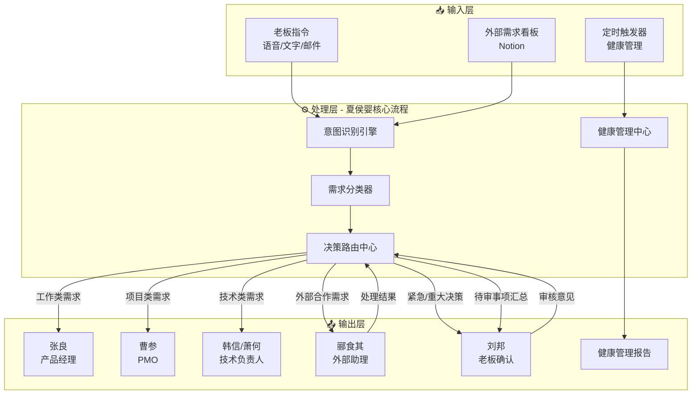
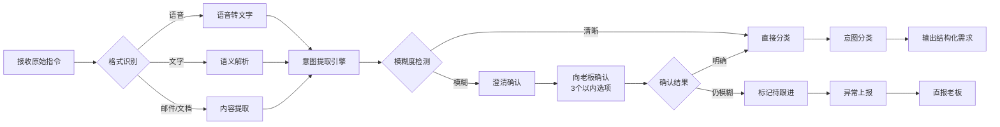
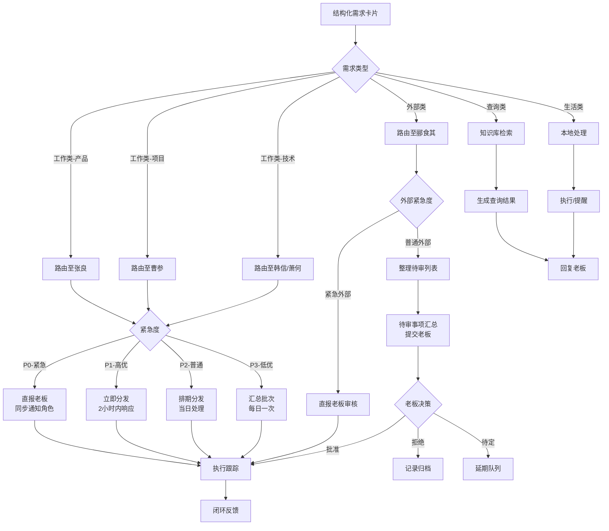
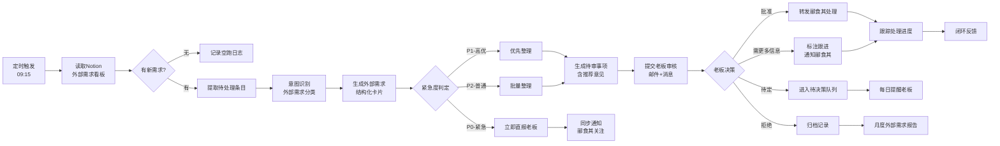
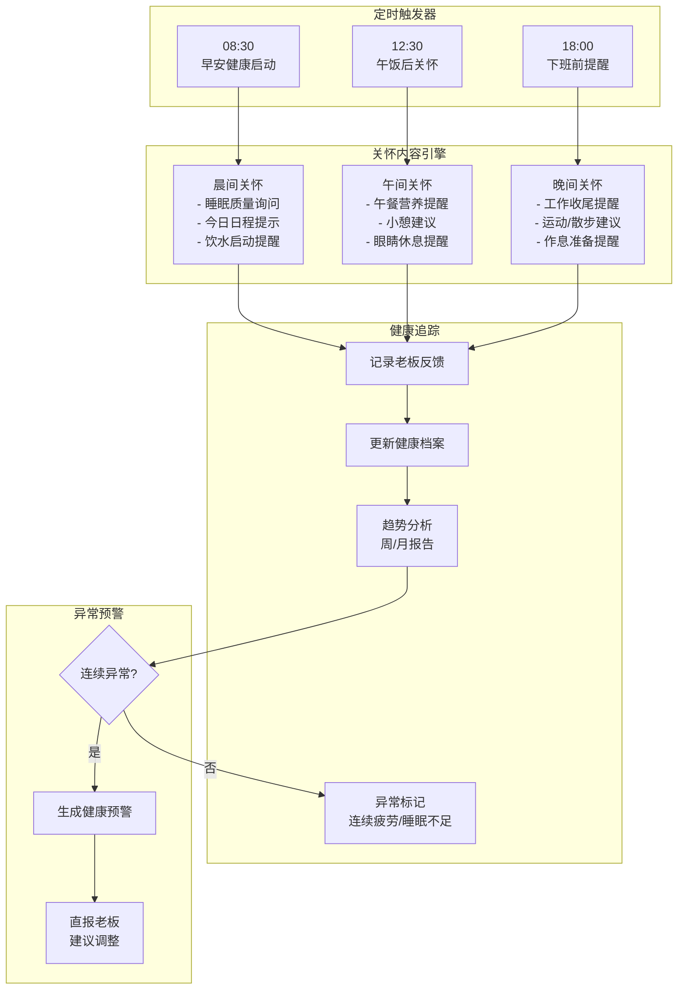
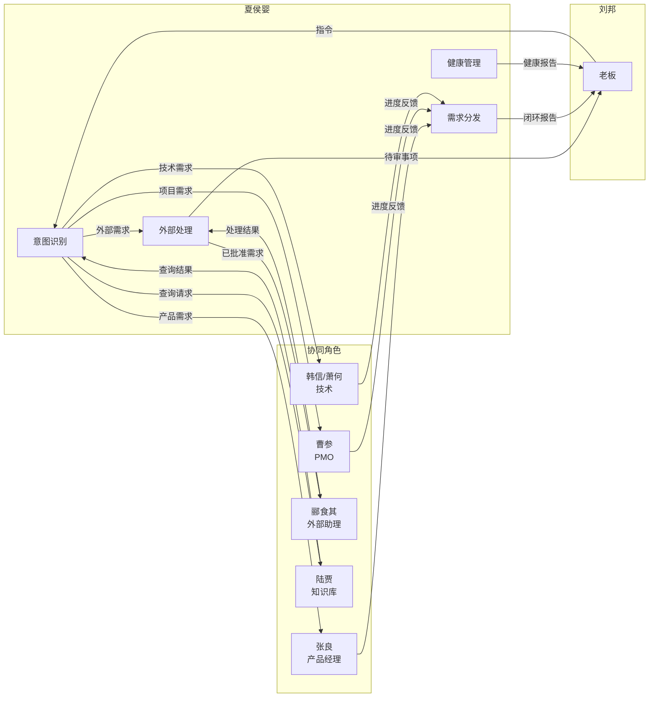
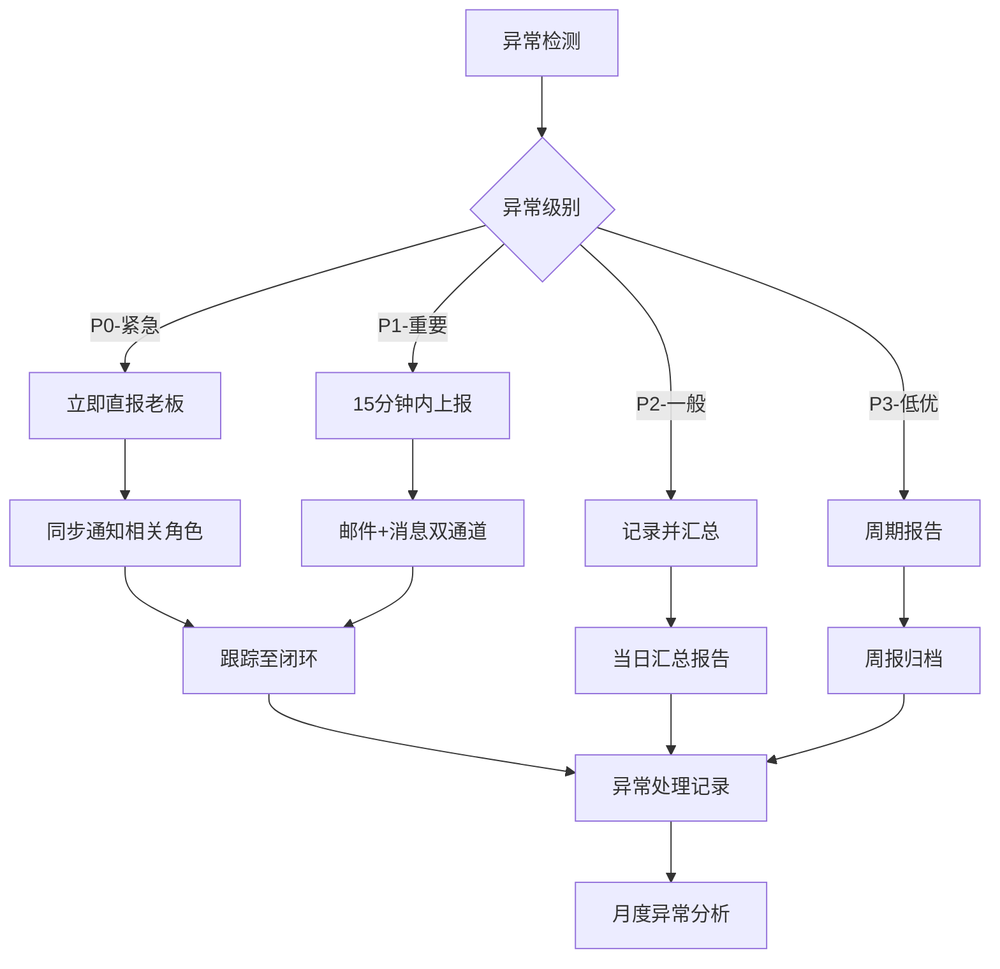

# 夏侯婴（私人助理）工作流程文档

## 文档信息

| 项目 | 内容 |
|------|------|
| 文档编号 | WF-XY-001 |
| 版本 | v1.0 |
| 角色 | 夏侯婴（Personal Assistant） |
| 汇报对象 | 刘邦（Owner） |
| 生效日期 | 2026-03-27 |

---

## 1. 流程概述与目标

### 1.1 角色使命
夏侯婴作为 InfinityCompany 的私人助理，是老板（刘邦）与团队之间的核心枢纽，负责高效转化老板意图、智能分发各类需求、管理老板身心健康，并妥善处理外部合作关系。

### 1.2 核心目标

| 目标编号 | 目标描述 | 关键指标 |
|----------|----------|----------|
| G1 | 意图识别准确率 | ≥ 95% |
| G2 | 需求分发时效 | 工作类 ≤ 5分钟，外部类 ≤ 30分钟 |
| G3 | 健康提醒执行率 | 100%（定时触发） |
| G4 | 外部需求响应 | 每日 09:15 前完成读取与分类 |
| G5 | 紧急情况上报 | ≤ 2分钟直达老板 |

### 1.3 核心权责

```
┌─────────────────────────────────────────────────────────────┐
│                    夏侯婴（私人助理）核心权责                    │
├─────────────────────────────────────────────────────────────┤
│  ┌──────────┐  ┌──────────┐  ┌──────────┐  ┌──────────┐    │
│  │ 意图识别权 │  │ 需求分发权 │  │ 健康管理权 │  │ 外部处理权 │    │
│  └──────────┘  └──────────┘  └──────────┘  └──────────┘    │
├─────────────────────────────────────────────────────────────┤
│ • 接收并解析老板指令       • 定时健康提醒与关怀                │
│ • 从模糊描述提炼真实需求   • 长期健康趋势跟踪                │
│ • 需求分类与优先级判定     • 外部需求看板管理                │
│ • 智能路由分发至各角色     • 合作方意向预处理                │
└─────────────────────────────────────────────────────────────┘
```

---

## 2. 整体流程图



---

## 3. 意图识别子流程

### 3.1 流程图



### 3.2 输入/处理/输出

| 阶段 | 说明 |
|------|------|
| **输入** | 老板指令（语音消息、即时文字、邮件、会议纪要、随手记） |
| **处理** | 1. 多模态输入统一化为文本<br>2. 语义解析提取关键要素（Who/What/When/Why/How）<br>3. 模糊度评分（0-10分，≥7分视为清晰）<br>4. 意图分类判定 |
| **输出** | 结构化需求卡片：`{需求ID, 类型, 优先级, 截止时间, 内容摘要, 关联角色, 备注}` |

### 3.3 需求分类标准

```
┌─────────────────────────────────────────────────────────────────────┐
│                        需求分类决策树                                  │
├─────────────────────────────────────────────────────────────────────┤
│                                                                     │
│  ┌─────────────────┐                                                │
│  │   接收指令内容   │                                                │
│  └────────┬────────┘                                                │
│           │                                                         │
│      ┌────┴────┬────────────┬────────────┐                         │
│      ▼         ▼            ▼            ▼                         │
│   ┌─────┐  ┌─────┐    ┌─────────┐   ┌─────────┐                  │
│   │工作类│  │生活类│    │ 查询类   │   │ 外部类   │                  │
│   └──┬──┘  └──┬──┘    └────┬────┘   └────┬────┘                  │
│      │        │            │             │                         │
│  ┌───┴───┐ ┌──┴────┐  ┌────┴────┐   ┌────┴────┐                  │
│  │•产品需求│ │•日程安排│  │•资料查询  │   │•合作意向  │                  │
│  │•技术任务│ │•出行规划│  │•数据检索  │   │•外部提案  │                  │
│  │•项目跟进│ │•健康管理│  │•历史记录  │   │•资源对接  │                  │
│  │•会议安排│ │•生活服务│  │•知识问答  │   │•商务邀约  │                  │
│  └───────┘ └───────┘  └─────────┘   └─────────┘                  │
│                                                                     │
└─────────────────────────────────────────────────────────────────────┘
```

#### 3.3.1 分类判定标准

| 分类 | 判定关键词 | 示例指令 |
|------|-----------|----------|
| **工作类-产品** | 功能、需求、用户、设计、原型、PRD | "这个按钮位置不太对，需要调整" |
| **工作类-技术** | 开发、代码、Bug、部署、架构、性能 | "上线前再压测一下" |
| **工作类-项目** | 进度、排期、里程碑、风险、资源 | "下周三前能完成吗" |
| **生活类-日程** | 会议、约会、行程、提醒、闹钟 | "明天上午有个会" |
| **生活类-健康** | 休息、喝水、运动、吃药、睡眠 | —（由系统定时触发） |
| **查询类** | 查一下、看看、找一下、多少、数据 | "查一下上个月的活跃数据" |
| **外部类** | 合作、投资方、客户、供应商、媒体 | "某某公司想谈合作" |

---

## 4. 需求分发子流程

### 4.1 流程图



### 4.2 决策矩阵（需求路由规则）

| 需求类型 | 子类型 | 目标角色 | 分发方式 | 响应时效 | 升级条件 |
|----------|--------|----------|----------|----------|----------|
| 工作类 | 产品需求/功能调整 | 张良（产品经理） | 创建任务卡片 | 2h | 24h无响应升级 |
| 工作类 | 技术实现/Bug修复 | 韩信（全栈研发） | 创建Issue | 2h | 阻塞问题升级 |
| 工作类 | 架构调整/技术选型 | 萧何（架构师） | 邮件+即时通知 | 4h | 影响上线升级 |
| 工作类 | 项目排期/资源协调 | 曹参（PMO） | 项目看板更新 | 2h | 里程碑风险升级 |
| 工作类 | 测试相关 | 陈平（测试） | 测试任务队列 | 4h | 阻塞发布升级 |
| 外部类 | 合作意向/商务谈判 | 郦食其（外部助理） | 外部需求看板 | 24h | 重大合作直报 |
| 外部类 | 媒体/PR | 郦食其（外部助理） | 邮件通知 | 24h | 负面舆情直报 |
| 查询类 | 数据/文档查询 | 陆贾（知识库） | 即时检索 | 5min | 检索失败上报 |
| 生活类 | 日程/提醒 | 夏侯婴（本地） | 本地执行 | 即时 | — |

### 4.3 输入/处理/输出

| 阶段 | 说明 |
|------|------|
| **输入** | 结构化需求卡片（来自意图识别子流程输出） |
| **处理** | 1. 查询决策矩阵确定目标角色<br>2. 根据紧急度选择分发方式（即时/排期/汇总）<br>3. 创建对应格式的任务/通知<br>4. 建立跟踪记录 |
| **输出** | 分发确认回执：`{需求ID, 接收角色, 分发时间, 期望完成时间, 跟踪状态}` |

---

## 5. 外部需求处理子流程

### 5.1 流程图



### 5.2 外部需求分类标准

| 类别 | 定义 | 处理优先级 | 典型场景 |
|------|------|-----------|----------|
| **战略合作** | 可能对公司产生重大影响的合作 | P0/P1 | 投资意向、并购提案、战略合作 |
| **商务合作** | 商业机会与客户合作 | P1/P2 | 客户签约、渠道合作、供应商对接 |
| **媒体PR** | 媒体采访与公关事宜 | P2 | 采访邀请、演讲邀约、奖项申报 |
| **行政事务** | 法律、财务、行政相关 | P2 | 合同审核、资质申请、政府事务 |
| **其他** | 不属于以上类别 | P3 | 一般咨询、求职简历、推销邮件 |

### 5.3 Notion看板读取规范

```yaml
看板地址: "https://www.notion.so/.../External-Requests"
读取字段:
  - 需求标题
  - 来源方
  - 提交时间
  - 需求描述
  - 联系方式
  - 紧急度标记（如有）
  - 附件链接

处理标记:
  - 待分类: 新读取未处理
  - 已分类: 已完成意图识别
  - 待审核: 已提交老板
  - 已批准: 老板批准处理
  - 已拒绝: 老板拒绝或搁置
  - 处理中: 郦食其正在处理
  - 已完成: 闭环归档
```

### 5.4 输入/处理/输出

| 阶段 | 说明 |
|------|------|
| **输入** | Notion外部需求看板数据（定时触发 09:15） |
| **处理** | 1. API读取看板新增条目<br>2. 外部需求意图识别与分类<br>3. 紧急度判定（结合来源方重要性）<br>4. 生成推荐处理意见<br>5. 打包待审事项 |
| **输出** | 待审事项报告：`{日期, 需求清单[数组], 推荐意见, 需决策事项, 紧急事项}` |

---

## 6. 健康管理子流程

### 6.1 流程图



### 6.2 定时触发机制

| 时间 | 触发场景 | 关怀主题 | 消息模板 |
|------|----------|----------|----------|
| **08:30** | 工作日早晨 | 早安启动 | "老板早安！昨日休息如何？今日有X个会议，记得先喝一杯水开启元气满满的一天☀️" |
| **12:30** | 午饭后 | 午间调整 | "老板午饭吃了吗？建议饭后站立10分钟，让眼睛也休息一下，看看窗外绿植🌿" |
| **18:00** | 下班前 | 晚间过渡 | "老板，工作收尾时间到～今天辛苦了！建议晚饭后散步20分钟，准备开启个人时间🌆" |

### 6.3 健康关怀内容清单

| 类别 | 具体内容 | 频率 | 方式 |
|------|----------|------|------|
| **饮水提醒** | 每日8杯水目标追踪 | 每2小时 | 消息提醒 |
| **饮食关怀** | 规律用餐提醒、营养建议 | 三餐时间 | 消息+建议 |
| **运动促进** | 久坐提醒、运动建议 | 每小时/每日 | 消息提醒 |
| **作息管理** | 就寝准备提醒、睡眠追踪 | 每晚 | 消息+记录 |
| **压力监测** | 会议密度提醒、休息建议 | 实时监测 | 智能提醒 |

### 6.4 长期健康趋势跟踪

```yaml
追踪指标:
  - 每日睡眠时长与质量自评
  - 工作时长与休息间隔
  - 运动频率与类型
  - 饮食规律程度
  - 主观疲劳度评分（1-10）

报告周期:
  - 周报: 每周一上午生成上周健康摘要
  - 月报: 每月1日生成月度健康趋势分析

预警规则:
  - 连续3天睡眠 < 6小时 → 黄色预警
  - 连续5天疲劳度 ≥ 7分 → 橙色预警  
  - 连续7天无运动记录 → 蓝色提醒
  - 单日工作 > 12小时 → 当日红色提醒
```

### 6.5 输入/处理/输出

| 阶段 | 说明 |
|------|------|
| **输入** | 定时触发信号（08:30/12:30/18:00）、老板反馈信息、日程数据 |
| **处理** | 1. 触发关怀消息生成<br>2. 结合当日日程个性化内容<br>3. 发送关怀消息<br>4. 记录交互数据<br>5. 更新健康档案<br>6. 趋势分析与预警检测 |
| **输出** | 关怀消息、健康周报/月报、异常预警通知 |

---

## 7. 与相关角色的协作接口

### 7.1 协作关系图



### 7.2 接口定义

#### 与张良（产品经理）接口

```yaml
输入:
  - 产品需求卡片
  - 功能调整请求
  - 用户反馈转达

输出:
  - 需求确认回执
  - PRD排期反馈
  - 评审时间预约

协作方式:
  - 即时通讯: 紧急需求
  - 任务系统: 正式需求卡片
  - 日历同步: 评审会议安排
```

#### 与曹参（PMO）接口

```yaml
输入:
  - 项目进度询问
  - 资源协调需求
  - 里程碑变更请求

输出:
  - 项目状态报告
  - 风险预警通知
  - 排期调整确认

协作方式:
  - 项目管理看板: 实时同步
  - 日报: 每日项目摘要
  - 周会: 重点项目对齐
```

#### 与郦食其（外部助理）接口

```yaml
输入:
  - 已批准的外部需求
  - 合作方联系信息
  - 处理要求与注意事项

输出:
  - 处理进度更新
  - 合作方反馈汇总
  - 结果报告与归档

协作方式:
  - Notion看板: 需求流转
  - 每日同步: 外部事项对齐
  - 即时通知: 重大进展
```

#### 与陆贾（知识库管理员）接口

```yaml
输入:
  - 知识查询请求
  - 文档检索需求
  - 历史数据调取

输出:
  - 查询结果
  - 相关文档链接
  - 数据报表

协作方式:
  - 知识库系统: 自助检索
  - 异步请求: 复杂查询
  - 文档归档: 老板指令记录
```

---

## 8. 工具使用清单

### 8.1 核心工具矩阵

| 工具类型 | 工具名称 | 使用场景 | 使用角色 |
|----------|----------|----------|----------|
| **通讯** | 钉钉/飞书/企业微信 | 即时消息、指令接收 | 主通道 |
| **邮件** | Gmail/企业邮箱 | 正式通知、日报/周报 | 正式通信 |
| **语音** | 语音识别API | 语音指令转文字 | 意图识别 |
| **文档** | Notion | 外部需求看板、健康档案 | 外部处理/健康管理 |
| **任务** | Linear/Jira | 工作类需求分发跟踪 | 需求分发 |
| **日历** | Google Calendar | 日程管理、提醒触发 | 日程/健康 |
| **知识** | 内部Wiki/知识库 | 查询类需求处理 | 查询处理 |
| **提醒** | 系统定时器/Cron | 健康提醒定时触发 | 健康管理 |

### 8.2 工具使用规范

```yaml
即时通讯:
  - 老板消息: 5分钟内响应
  - 紧急标记: 使用【紧急】前缀
  - 重要标记: 使用【重要】前缀

邮件规范:
  - 主题格式: [类型] 内容摘要 - 日期
  - 类型标记: [待审][通知][提醒][报告]
  - 外部需求报告: 每日09:30发送
  - 健康周报: 每周一09:00发送

Notion看板:
  - 外部需求看板: 每日09:15读取
  - 健康档案: 实时更新
  - 权限: 仅老板和夏侯婴可写
```

---

## 9. 异常上报机制

### 9.1 异常分级

| 级别 | 定义 | 响应时效 | 上报路径 |
|------|------|----------|----------|
| **P0-紧急** | 影响公司运营/老板健康/重大风险 | ≤ 2分钟 | 直报老板（电话/即时消息） |
| **P1-重要** | 需要老板决策/超出权限范围 | ≤ 15分钟 | 消息+邮件双通道 |
| **P2-一般** | 异常情况但可延后处理 | ≤ 2小时 | 邮件汇总 |
| **P3-低优** | 信息记录，定期汇总 | 日报/周报 | 周期报告 |

### 9.2 异常场景与处理

| 异常场景 | 级别 | 处理方式 |
|----------|------|----------|
| 意图识别失败（连续3次无法确认） | P1 | 向老板呈现选项，请求确认 |
| 需求分发失败（目标角色24h无响应） | P1 | 升级至老板，建议更换处理人 |
| 外部紧急合作（CEO级别/大投资方） | P0 | 立即直报老板，同步通知郦食其 |
| 健康异常预警（连续疲劳/睡眠不足） | P1 | 生成健康建议，直报老板 |
| Notion看板读取失败 | P2 | 重试3次，邮件通知管理员 |
| 定时提醒未触发 | P2 | 手动补发，排查原因 |
| 系统工具不可用 | P1 | 切换备用通道，上报老板 |

### 9.3 异常上报流程图



---

## 10. 关键绩效指标（KPI）

| 指标类别 | 指标名称 | 目标值 | 测量方式 |
|----------|----------|--------|----------|
| **意图识别** | 识别准确率 | ≥ 95% | 老板确认反馈 |
| **意图识别** | 平均识别时间 | ≤ 3分钟 | 系统计时 |
| **需求分发** | 分发完成率 | 100% | 分发记录 |
| **需求分发** | 平均分发延迟 | 工作类≤5min，外部类≤30min | 系统计时 |
| **外部处理** | 看板读取及时率 | 100% | 定时检查 |
| **外部处理** | 待审事项完整度 | 100% | 老板满意度 |
| **健康管理** | 提醒执行率 | 100% | 定时触发记录 |
| **健康管理** | 健康报告生成 | 周报/月报准时率100% | 报告记录 |
| **异常处理** | P0响应时效 | ≤ 2分钟 | 响应记录 |
| **协作满意度** | 相关角色评分 | ≥ 4.5/5 | 季度调研 |

---

## 11. 附录

### 11.1 文档修订记录

| 版本 | 日期 | 修订内容 | 修订人 |
|------|------|----------|--------|
| v1.0 | 2026-03-27 | 初始版本 | 夏侯婴 |

### 11.2 参考文档

- InfinityCompany 组织架构图
- 角色职责说明书
- Notion 外部需求看板使用规范
- 健康管理档案模板

### 11.3 联系方式

| 角色 | 联系方式 | 用途 |
|------|----------|------|
| 刘邦（老板） | 主通道 | 日常指令、异常上报 |
| 张良（产品） | 工作通道 | 产品需求分发 |
| 曹参（PMO） | 工作通道 | 项目需求分发 |
| 郦食其（外部） | 工作通道 | 外部需求协同 |
| 陆贾（知识库） | 工作通道 | 查询请求 |

---

**文档结束**

*本流程文档由夏侯婴（私人助理）执行，向刘邦（Owner）直接汇报。*
